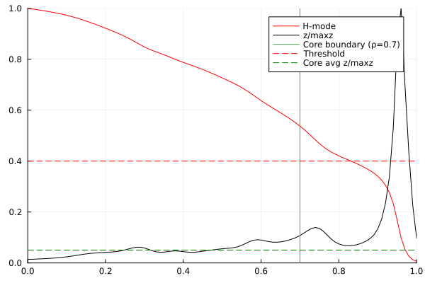
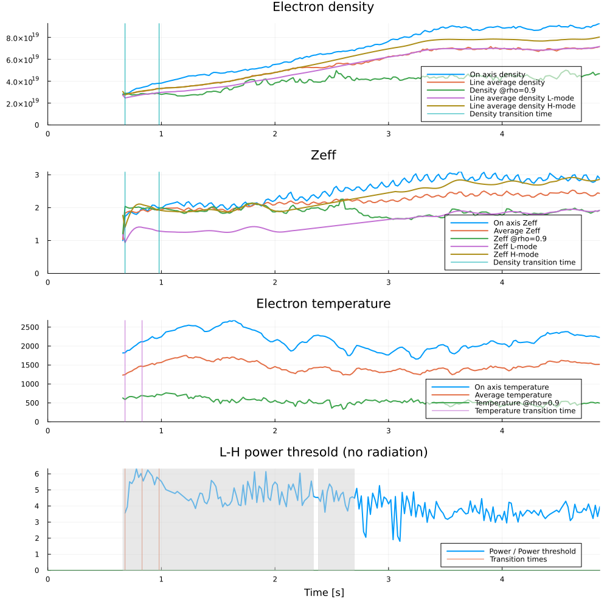
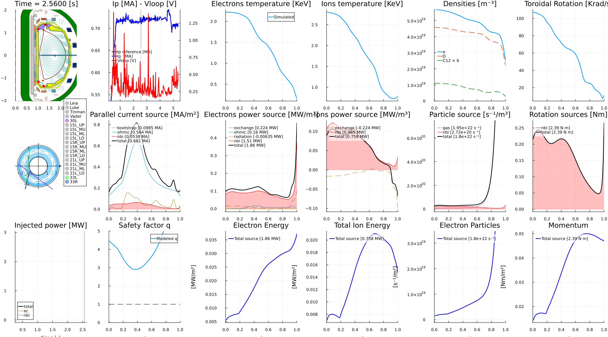

# DIII-D Postdictive Time-Dependent Simulation — FUSE Summer School

This tutorial walks through a complete **postdictive** workflow in FUSE: starting from
experimental data for a real DIII-D discharge, we initialize the plasma state, analyze the
L→H transition, and evolve the plasma forward in time with self-consistent physics models.
We then explore a **counterfactual** scenario by adding extra electron-cyclotron heating (ECH).

*Postdictive* means we take the measured inputs (kinetic profiles, equilibrium, actuator
waveforms) from an experiment and let FUSE's physics models evolve the plasma — so we can
validate the models against what actually happened, and then ask *"what if?"* questions by
changing the actuators.

## What you'll learn
- Fetch experimental data for a DIII-D shot into `ini` / `act`
- Initialize `dd` and checkpoint progress with `@checkin` / `@checkout`
- Detect the L–H transition and extract pedestal parameters from experiment
- Configure and run a time-dependent simulation with `ActorDynamicPlasma`
- Apply synthetic diagnostics
- Visualize the evolving plasma and build an animation
- Run a counterfactual case with extra ECH

## Prerequisites
- A working FUSE install — see the [installation guide](https://fuse.help/dev/install.html),
  or use the [GA Omega server](https://fuse.help/dev/install_omega.html)
- **Access to the DIII-D data system** — this notebook fetches shot 200000. If you don't have
  data access you can still read along: the outputs on this page are pre-rendered.

> Companion page: [DIII-D Time-Dependent workflows](https://fuse.help/dev/d3d_study_workflows.html).


## 1. Load FUSE

We load FUSE together with `Plots` for figures and `Interact` for interactive widgets.
`Revise` lets you edit FUSE source and pick up changes without restarting Julia.

The first `using FUSE` triggers Julia's just-in-time compilation, so it takes a while —
every subsequent call is fast.


```@julia
#
using Revise
using Plots;
@time using FUSE
using Interact
FUSE.ProgressMeter.ijulia_behavior(:clear);
```

    [ Info: Precompiling FUSE [e64856f0-3bb8-4376-b4b7-c03396503992] (cache misses: include_dependency fsize change (2), wrong dep version loaded (6), incompatible header (8), mismatched flags (2))


     69.581240 seconds (58.28 M allocations: 3.523 GiB, 1.46% gc time, 15 lock conflicts, 6.81% compilation time: 95% of which was recompilation)


<div style="padding: 1em; background-color: #f8d6da; border: 1px solid #f5c6cb; font-weight: bold;">
<p>The WebIO Jupyter extension was not detected. See the
<a href="https://juliagizmos.github.io/WebIO.jl/latest/providers/ijulia/" target="_blank">
    WebIO Jupyter integration documentation
</a>
for more information.
</div>


## 2. Fetch the experiment

`FUSE.case_parameters(:D3D, shot)` pulls experimental data for a DIII-D shot and returns the
0D initialization parameters (`ini`) and the actor controls (`act`). Here we use shot **200000**.

We `@checkin` the result under the tag `:fetch`, so we can restore this exact starting point
later without re-fetching.

> Fetching requires access to the DIII-D data system. Set `use_local_cache=true` to reuse a
> previously cached fetch instead of hitting the server.


```@julia


use_local_cache = true

shot = 200000; @time ini, act = FUSE.case_parameters(:D3D, shot; use_local_cache=false)#,pull_gslite_min=true, omas_root="/home/mcclenaghanj/omas")

@checkin :fetch ini act;
     

```

    [ Info: Connecting to mcclenaghanj@somega.gat.com
    [ Info: Remote D3D data fetching for shot 190904
    [ Info: Path on mcclenaghanj@somega.gat.com: /cscratch/mcclenaghanj/d3d_data/190904
    [ Info: Path on Localhost: /var/folders/xw/fh54dglx5h3_mxz2y46jqv9h0000gq/T/mcclenaghanj_D3D_190904
    Starting parallel tasks...
    - Fetching ec_launcher data
    - Fetching core_profiles data
    - Fetching wall data
    - Fetching coils data
    - Fetching magnetic hardware data
    - Fetching flux loops data
    - Fetching magnetic probes data
    - Fetching Thomson scattering data
    - Fetching interferometer data
    - Fetching charge exchange data
    - Fetching summary data
    - Fetching equilibrium data
    Data fetched via OMAS in 64.84 [s]
    Saving ODS to /cscratch/mcclenaghanj/d3d_data/190904/D3D_190904_5000167971831672853.h5 Done in 9.31 [s]
    Waiting for OMFIT D3D BEAMS data fetching to complete...
    Transfering data from remote
    [ Info: Loading files: D3D_machine.json ; D3D_190904_5000167971831672853.h5 ; nbi_ods_190904.h5
    actors: FitProfiles
    [ Info: Thomson subsystems scaled to match interferometer measurements: TS_core=1.050, TS_tangential=1.050


    163.588908 seconds (27.93 M allocations: 5.227 GiB, 0.46% gc time, 24 lock conflicts, 0.41% compilation time: 16% of which was recompilation)


## 3. Initialize the data structure

`FUSE.init!(dd, ini, act)` populates a fresh `dd` from the experimental data in `ini`:
equilibrium, kinetic profiles, sources, and the actuator pulse schedules. This is our plausible
starting state — not yet a self-consistent physics solution.

We checkpoint the initialized state as `:init`, and keep a reference copy `dd1` so we can compare
against the untouched initialization later.


```@julia
@checkout :fetch ini act
dd = IMAS.dd()
@time FUSE.init!(dd, ini, act);


@checkin :init dd act;
dd1 = FUSE.checkpoint[:init].dd;
     
```

    actors: CXbuild
    actors: Sources
    actors:  SimpleEC
    actors:  SimpleNB
    actors:  NeutralFueling


      4.738294 seconds (6.62 M allocations: 3.361 GiB, 3.20% gc time)


## 4. Analyze the L–H transition

Before evolving the plasma we characterize the pedestal dynamics from the experiment.
`FUSE.LH_analysis` detects the L→H (and H→L) transition times and extracts the quantities the
pedestal model needs:

- `tau_n`, `tau_t` — density and temperature pedestal build-up timescales
- `W_ped_to_core_fraction` — how the pedestal stored energy relates to the core
- `mode_transitions` — the times of confinement-mode changes

With `do_plot=true`, the detected transitions are overlaid on the experimental traces.


```@julia

@checkout :init dd act;
experiment_LH = FUSE.LH_analysis(dd; do_plot=true);
```

    ┌ Warning: First time slice detected as a H-mode!
    └ @ FUSE ~/.julia/dev/FUSE/src/experiments.jl:83


    

    


    

    


## 5. Configure and run the time-dependent simulation

This is the heart of the postdictive workflow: we configure the actors, then evolve the plasma
through the shot with `ActorDynamicPlasma`.

Key choices:
- **Pedestal** (`ActorPedestal`) — a `:dynamic` model seeded with the L–H timescales from step 4.
  For the kinetic-equilibrium case it runs in `:replay` mode, using the experimental profiles as
  boundary conditions.
- **Equilibrium** (`ActorEquilibrium` → `:FRESCO`) — fixed-boundary Grad–Shafranov solver on a
  129×129 grid.
- **Transport** (`ActorFluxMatcher` with `ActorTGLF` as a `:TGLFNN` neural-net surrogate) —
  flux-matches Tₑ, Tᵢ, densities, and rotation.
- **Time stepping** (`ActorDynamicPlasma`) — steps of δt = 0.1 s from t = 1.8 s to the end of the
  equilibrium time base, evolving current, equilibrium, transport, sources, pedestal, and sawteeth.

Setting `kinetic_equilibrium = true` replays the experimental kinetic profiles and constrains the
equilibrium with the magnetic diagnostics (probes, flux loops, boundary, X-points).

After the run we apply **synthetic diagnostics** (`ActorMagnetics`, `ActorInterferometer`) so the
predicted signals can be compared against the real measurements. Result checkpointed as `:exp_ec`.

> ⏱️ This is the most expensive cell — it runs the full time-dependent simulation.


```@julia


@checkout :init dd act;

act.ActorPedestal.model = :dynamic
act.ActorPedestal.tau_n = experiment_LH.tau_n
act.ActorPedestal.tau_t = experiment_LH.tau_t
act.ActorWPED.ped_to_core_fraction = experiment_LH.W_ped_to_core_fraction
act.ActorEPED.ped_factor = 0.8
act.ActorPedestal.T_ratio_pedestal = 1.0 # Ti/Te in the pedestal

if true
    # density and Zeff from experiment
    act.ActorPedestal.density_ratio_L_over_H = 1.0
    act.ActorPedestal.zeff_ratio_L_over_H = 1.0
else
    # pulse_schedule.density and zeff will contain information about the H-mode time-traces
    # The L-mode density and Zeff are set based on a fixed ratio
    act.ActorPedestal.density_ratio_L_over_H = experiment_LH.ne_L_over_H
    act.ActorPedestal.zeff_ratio_L_over_H = experiment_LH.zeff_L_over_H
    dd.pulse_schedule.density_control.n_e_line.reference = experiment_LH.ne_H
    dd.pulse_schedule.density_control.zeff_pedestal.reference = experiment_LH.zeff_H
end

if false
    # LH-transition from LH scaling law
    act.ActorPedestal.mode_transitions = missing
else
    # LH-transition at user-defined times
    act.ActorPedestal.mode_transitions = experiment_LH.mode_transitions
end

# equilibrium model setting
act.ActorEquilibrium.model = :FRESCO #:EGGO or FRESCO
act.ActorFRESCO.nR = act.ActorFRESCO.nZ = 129

act.ActorNeutralFueling.τp_over_τe = 0.5

act.ActorFluxMatcher.evolve_plasma_sources = true # necessary if large exchange term
# act.ActorFluxMatcher.rho_transport = 0.3:0.05:0.85
act.ActorFluxMatcher.algorithm = :simple#_dfsane
act.ActorFluxMatcher.max_iterations = -300 # negative to avoid print of warnings
act.ActorFluxMatcher.evolve_pedestal = false
act.ActorFluxMatcher.evolve_Te = :flux_match
act.ActorFluxMatcher.evolve_Ti = :flux_match
act.ActorFluxMatcher.evolve_densities = :flux_match
act.ActorFluxMatcher.evolve_rotation = :flux_match
act.ActorFluxMatcher.relax = 1.0

act.ActorPedestal.rotation_model = :replay # we don't have a good model for the rotation boundary condition

act.ActorSawteethSource.flat_factor = 1.0
act.ActorSawteethSource.period = 0.25 # turn off if no qmin<1 for 250 ms

act.ActorTGLF.tglfnn_model = "sat0quench_em_d3d+mastu_azf+1"#"sat0_em_d3d+mastu+nstx_azf-1"#"sat2_em_d3d_azf-1_withnegD"
#"sat3_em_d3d+mastu+nstx_azf-1"
#"sat2_em_d3d+mastu+nstx_azf-1"


act.ActorTGLF.sat_rule = :sat0quench
act.ActorTGLF.model = :TGLFNN
# act.ActorTGLF.tglfnn_model = "sat3_em_d3d_azf-1"

# setup time
δt = 0.1
dd.global_time = 1.8#ini.time.simulation_start # start_time should be early in the shot, otherwise ohmic current will be wrong
final_time = ini.general.dd.equilibrium.time[end]
act.ActorDynamicPlasma.Nt = Int(ceil((final_time - dd.global_time) / δt))
act.ActorDynamicPlasma.Δt = final_time - dd.global_time

# choose what to evolve
act.ActorDynamicPlasma.evolve_current = true
act.ActorDynamicPlasma.evolve_equilibrium = true
act.ActorDynamicPlasma.evolve_transport = true
act.ActorDynamicPlasma.evolve_sources = true
act.ActorDynamicPlasma.evolve_pf_active = false
act.ActorDynamicPlasma.evolve_pedestal = true
act.ActorDynamicPlasma.evolve_sawteeth = true


# kinetic equilibrium mode ==> ActorCoreTransport and ActorPedestal model as replay
# ie. use kinetic profiles from experiment
kinetic_equilibrium = true
if kinetic_equilibrium
    act.ActorCoreTransport.model = :replay
    act.ActorPedestal.model = :replay
    act.ActorPFactive.boundary_weight = 1.0
    act.ActorPFactive.magnetic_probe_weight = 1.0
    act.ActorPFactive.flux_loop_weight = 1.0
    act.ActorPFactive.strike_points_weight = 0.0
    act.ActorPFactive.x_points_weight = 1.0
else
    act.ActorPFactive.boundary_weight = 1.0
    act.ActorPFactive.magnetic_probe_weight = 0.0
    act.ActorPFactive.flux_loop_weight = 0.0
    act.ActorPFactive.strike_points_weight = 0.0
    act.ActorPFactive.x_points_weight = 1.0
    act.ActorPedestal.model = :replay    
    # it's best to start from a transport simulation that is flux-matched
    #ped_mod = act.ActorPedestal.model
    #act.ActorPedestal.model = :WPED
    #FUSE.ActorFluxMatcher(dd, act; verbose=true, evolve_plasma_sources=true, evolve_pedestal=true, max_iterations=1000, do_plot=false);
    #act.ActorPedestal.model = ped_mod
end


# run time-dependent simulation
@time actor = FUSE.ActorDynamicPlasma(dd, act; verbose=true);
# synthetic diagnostics
FUSE.ActorMagnetics(dd, act)
FUSE.ActorInterferometer(dd, act)
@checkin :exp_ec dd act;

```

    Progress: 100%|███████████████████████████| Time: 0:00:43 ( 0.13  s/it)
           start time: 1.8
             end time: 4.860000133514404
                 time: 4.860000133514404
                stage: PFactive (2/2)
              Ip [MA]: 0.7304375226862998
            Ti0 [keV]: 2.76482740766032
            Te0 [keV]: 2.2243839815439976
       ne0 [10²⁰ m⁻³]: 0.9278400011559231
            max(zeff): 3.021511139956082
          ω0 [krad/s]: 84.81284410069034


     47.986674 seconds (109.94 M allocations: 10.109 GiB, 2.01% gc time, 14.79% compilation time)


    actors: Magnetics
    actors: Interferometer


## 6. Inspect transport at a single time slice

To look more closely at the transport solution, we pull a single time slice (t = 3.5 s) with
`IMAS.get_timeslice` and run `ActorFluxMatcher` on it directly. This flux-matches Tₑ, Tᵢ, and the
D / C¹² densities on `rho = 0.2:0.05:0.85` using the TGLF-NN model (`sat0quench`) plus the
Hirshman–Sigmar neoclassical model. With `do_plot=true` you see the flux-matching convergence and
the resulting profiles.


```@julia
dd0 = IMAS.get_timeslice(dd, 3.5);
act.ActorFluxMatcher.algorithm = :simple
act.ActorFluxMatcher.evolve_densities = act.ActorFluxMatcher.evolve_densities = Dict(
    :electrons => :quasi_neutrality,
    :electrons_fast => :fixed,
    :D => :flux_match,
    :D_fast => :fixed,
    :C12 => :flux_match,
    :C12_fast => :fixed
)
act.ActorFluxMatcher.evolve_densities = :flux_match
act.ActorFluxMatcher.max_iterations = 80
act.ActorFluxMatcher.step_size = 0.25
act.ActorFluxMatcher.evolve_rotation = :fixed

act.ActorFluxCalculator.turbulence_model = :TGLF
act.ActorNeoclassical.model = :hirshmansigmar

act.ActorTGLF.sat_rule = :sat0quench

act.ActorTGLF.model = :TGLFNN
act.ActorTGLF.lump_ions = false
#act.ActorFluxMatcher.

act.ActorFluxMatcher.rho_transport = collect(0.2:0.05:0.85)

FUSE.ActorFluxMatcher(dd0,act,verbose=true,do_plot=true)

```

    Calls: 80    Time: 0:00:00
                error: 0.17756153243065576
            Ti0 [keV]: 3.3144886541154337
            Te0 [keV]: 4.2358556740256175
    4m   ne0 [10²⁰ m⁻³]: 0.6055855744779346

    z_scaled_history = Any[[-25.772436632352523, -27.66693753213543, -33.98846110848254, -40.385457762503876, -44.91905245410045, -65.19403871747275, -80.96785278995394, -104.15914315573225, -196.34667174346322, -589.6039900110223, -597.3156941411507, -229.0642541789729, -215.34594913868318, -239.4918072431318, -46.07656359212412, -53.16869761991613, -55.900195535970084, -48.744392860896816, -46.99535357419822, -46.81600102541946, -56.329288886797244, -84.86042850622663, -242.7715075655426, -481.8963969757945, -752.1986881253825, -303.61481427100915, -201.04228088008296, -296.68845240205434, -29.639684907138136, -45.42787420811681, -38.74755559884229, -27.157067119101725, -24.87130053403208, -28.041689490187526, -55.89845851902147, -104.50653026400718, -243.00021167852694, -608.5592274253106, -120.11960417130734, -18.76307717189044, -10.324204772841586, -16.940296329969843], [-29.77865141677315, -29.4784216910782, -32.633678660771686, -37.317039647991784, -42.2299901104597, -61.98874223739706, -77.76174779224267, -101.22162238418375, -195.8960140176125, -598.8326070668842, -595.0849864902782, -228.3555694847032, -218.09381408556527, -244.54426504477706, -44.29649355473732, -50.88725012725407, -52.534485806504264, -44.66255207426494, -43.14639118567251, -42.77625723717479, -52.23825435349021, -80.81610472253776, -238.8088825177295, -477.90483276513737, -737.5322199075591, -297.61345528851086, -199.94207754155624, -299.1294539359005, -28.759037789441216, -44.25735819614779, -36.657005265831145, -24.889098162182833, -22.641224588530115, -25.770573643372714, -53.605221747941314, -102.0626236099173, -237.96510396749602, -599.4763883796643, -117.46602583656293, -16.76939466578451, -8.974484033682453, -17.26468917447161], [-34.0023856392872, -31.377192028751022, -31.32531154748614, -34.37733412114687, -39.68646996410142, -58.82150569333362, -74.55758602596406, -98.23571413019742, -195.33754431735358, -607.9018591853219, -592.5405860999529, -227.60952266605946, -220.7387064943684, -249.5181917128285, -43.09772608489394, -49.06447006287795, -49.41577637442754, -40.77973561267076, -39.50343963176143, -38.87579322658416, -48.2794134978718, -76.87081981450386, -235.05867938373996, -474.74500936883703, -723.5065457632832, -291.91549152346784, -199.30283364199954, -302.0229525419569, -28.108983873040494, -43.220378226912516, -34.60034918599146, -22.647503763005062, -20.43640842055303, -23.514520064266947, -51.32577274180541, -99.62142906177135, -232.93539116387532, -590.4760308288892, -114.81997579495528, -14.795699279154457, -7.645357146566802, -17.556664500298304], [-38.397523543929594, -33.365278240884145, -30.145174721158092, -31.64207744892033, -37.37589858619235, -55.68579278027169, -71.36020867073567, -95.2168015812109, -194.71321528994565, -616.8342837205239, -589.7155479982702, -226.85241836372714, -223.28473560083702, -254.41124113866744, -42.439540711664165, -47.71333162405912, -46.60274678625695, -37.172359490157525, -36.14908030620777, -35.10835343327338, -44.45785583542815, -73.0264460411085, -231.4986117438212, -472.27151175919977, -710.0670060150461, -286.5201899234057, -199.03571977504663, -305.223236845214, -27.685892524635737, -42.31666875686506, -32.59832470106937, -20.44460580753442, -18.269288026296937, -21.271274606566422, -49.0611894786249, -97.18489684759341, -227.91633086938367, -581.5676590548903, -112.18126896910832, -12.840121289247222, -6.3356897454037195, -17.81342964948574], [-42.933905807059105, -35.4611609653823, -29.203500596601867, -29.227171199293807, -35.42778846373569, -52.594257686485044, -68.16313341373139, -92.17402877295726, -194.06076060964574, -625.6480538930514, -586.642825146759, -226.10457773362796, -225.73612094487996, -259.2215196288202, -42.27224546872598, -46.8513000540351, -44.19206290041318, -33.94776989661785, -33.24596069331013, -31.482166976752413, -40.76742605034929, -69.28841858871563, -228.1086670309056, -470.3698830962954, -697.1652677083217, -281.4253336479704, -199.07064223959136, -308.63627396663037, -27.47899877756354, -41.55424460368454, -30.68002790207382, -18.302580575822144, -16.158829836087012, -19.041187730552114, -46.81072830395344, -94.75446387796373, -222.9129534163531, -572.7599436295433, -109.55003203734739, -10.90162033090051, -5.044751872217118, -18.03394254950685], [-47.58340432741933, -37.67189725566627, -28.614132208257324, -27.22389601920104, -33.961916589727345, -49.57742658551314, -64.97355181802462, -89.11955989846092, -193.4126791151604, -634.3521625433505, -583.3494346189086, -225.3807379758261, -228.09705171414376, -263.9474052928251, -42.535069769248054, -46.48584628788981, -42.29171466156927, -31.207049947513344, -30.908061275683796, -28.02383522636211, -37.207053463093445, -65.6679611406464, -224.87375181818942, -468.9528959325993, -684.7569518147659, -276.6288929577245, -199.35214015073012, -312.1972106344579, -27.463256963130572, -40.94238648340906, -28.88111803365111, -16.242969295155476, -14.133938791354925, -16.827929210203802, -44.57496328692097, -92.33122221691258, -217.9298133166158, -564.0566522024061, -106.9263161764546, -8.979248369125239, -3.7720742654967747, -18.217859659664068], [-52.32245041490566, -39.99303566637255, -28.467431934423626, -25.60661985961733, -32.85571933809429, -46.66476262631095, -61.808031654037244, -86.06752105402407, -192.7984209720937, -642.9465604327426, -579.8575026719027, -224.68601178753028, -230.3715088362224, -268.5873256067603, -43.162661300694054, -46.59856229800415, -40.988776547302656, -28.97598775271662, -29.02676239598556, -24.76493080095296, -33.79086230107376, -62.17517589393508, -221.7847385411085, -467.95156928020515, -672.8019550454874, -272.1283495821393, -199.83588229720417, -315.8592386710016, -27.61329241461234, -40.48692796549374, -27.245037559445272, -14.272990441507199, -12.187350361363332, -14.638497576239127, -42.35532829577627, -89.91567741438095, -212.9709589670266, -555.456434845503, -104.31012858668242, -7.071917598252278, -2.517315999281935, -18.365249814422853], [-57.13143311142361, -42.407738872977184, -28.82318044256804, -24.32669490037042, -31.945140415704188, -43.91029394596945, -58.69233769565431, -83.03325032250787, -192.24160749706866, -651.4253767122188, -576.1923006712749, -224.02478043947386, -232.56361136709484, -273.13982758686024, -44.09173133097606, -47.14473126064049, -40.33453646525438, -27.237225684304377, -27.46265418120445, -21.77380353608106, -30.535015841295383, -58.81787606435856, -218.8331882267341, -467.3073201629339, -661.2671993706456, -267.9201731396788, -200.48637718959367, -319.58775894011416, -27.90498400885919, -40.188667998683485, -25.82378079532162, -12.394844126246591, -10.30218941161381, -12.486555898347893, -40.15399368483859, -87.50864376285973, -208.03901720655583, -546.9591088132776, -101.70181741030045, -5.178807976443202, -1.2802220887314597, -18.476988801675525], [-61.99687742269919, -44.8990058092707, -29.680610565148097, -23.361946207866, -31.147523258743355, -41.393629803521314, -55.6423050700401, -80.03593357357924, -191.75931252602285, -659.7848668578284, -572.379096116082, -223.39923794991762, -234.67757529650305, -277.6048307189781, -45.27007309628319, -48.06765686643413, -40.32287888680858, -25.960558078839018, -26.148280142808684, -19.19044901798924, -27.439402250220834, -55.61479791146758, -216.01181843063432, -466.97400303952276, -650.1241673671791, -263.9973532003151, -201.27494025960345, -323.35725928707484, -28.324014698635082, -40.04685169819651, -24.666074013669707, -10.611204055015268, -8.471729536998268, -10.392101729684601, -37.97209213239356, -85.11196871222266, -203.13654573905225, -538.567725874778, -99.10179585455062, -3.299236500694453, -0.06061258613197992, -18.554928059108963], [-66.91078431630665, -47.45112103763355, -31.004497620482795, -22.707127788531608, -30.46040606002184, -39.220914211407695, -52.651549676128504, -77.09692561375246, -191.35554870218044, -668.0190239321095, -568.440849304121, -222.81216967918846, -236.7176770837077, -281.9828764230615, -46.656883887902026, -49.30425491876881, -40.902920666394934, -25.12141769812332, -25.07916061025146, -17.199564534923145, -24.485035740679674, -52.59257006956265, -213.31402251599533, -466.9116259282245, -639.346133537763, -260.3507085460532, -202.17812501730995, -327.1484824925904, -28.865817452159487, -40.05782321194751, -23.81284386110204, -8.925939578720596, -6.697843171867664, -8.38197250810748, -35.80745844157068, -82.72887330506674, -198.2650551357703, -530.2810449158104, -96.51034397280273, -1.432770276347021, 1.1416143836258648, -18.601191865363393], [-71.8655420686467, -50.047329942471144, -32.74585365085798, -22.37695795121327, -29.899718501604518, -37.460027003316384, -49.71759782931729, -74.23914534640862, -191.02265358817817, -676.1293448692808, -564.3977405814394, -222.2659590021388, -238.68819408595377, -286.27479946817346, -48.21755605983537, -50.79592125316125, -42.000853826553616, -24.713835486604147, -24.247318459052885, -15.808867891226441, -21.67749920879773, -49.796805816689336, -210.73231724781647, -467.0875311926486, -628.908198966193, -256.9693226080715, -203.1765675297357, -330.9461092488654, -29.526294697945062, -40.21962413417979, -23.29361573753287, -7.348186413328439, -4.978040795415064, -6.484138842836004, -33.65948314911419, -80.36395354321577, -193.4247075703919, -522.100213944871, -93.92769082659315, 0.4209633291220368, 2.326499124346397, -18.618256309084018], [-76.85302362513653, -52.67323819829364, -34.846477348956185, -22.393111130468927, -29.48792061690376, -36.07509363748858, -46.85198883903949, -71.47015475606719, -190.74782923247807, -684.1215368879369, -560.2635184168198, -221.7605560722152, -240.5932031280271, -290.4816402368955, -49.92217513754258, -52.49160046738839, -43.54116499142543, -24.7358145459818, -23.656939295739903, -14.875374576119746, -19.043896171064333, -47.25050028866529, -208.2580032969628, -467.47537830999846, -618.7837690009582, -253.84041828118148, -204.25426854264322, -334.73791449412886, -30.29907692933901, -40.53073395099507, -23.121526462701507, -5.892042074041493, -3.3125947023429423, -4.69072513733042, -31.530595411479545, -78.01923734658624, -188.61473098249536, -514.0290906550811, -91.3538371543969, 2.262416333848669, 3.4940551486323197, -18.609209480590902], [-81.86623967976024, -55.31859242601813, -37.243012693612904, -22.76132329716519, -29.24689167220335, -35.0352754495969, -44.083085658234204, -68.79775202239419, -190.52036323512894, -692.0022985513592, -556.0436262982788, -221.29563551438923, -242.43655265488817, -294.60474301526204, -51.74502642386911, -54.34935507467377, -45.45114617954634, -25.168746719814894, -23.31969676174991, -14.285504904718586, -16.638002755293567, -44.95869045198158, -205.88541709144818, -468.0554946927578, -608.9424345034483, -250.9508169370938, -205.39797183200815, -338.5139197995862, -31.176397924706762, -40.99592695380145, -23.281404271387974, -4.566769928059427, -1.7036486967898408, -2.993751772080171, -29.426648712211428, -75.69605450628325, -183.8349810410646, -506.07289341075904, -88.78857285107559, 4.092048599985287, 4.6442517584116, -18.577510967504406], [-86.89962366229452, -57.97534785839201, -39.875743374755764, -23.480751690057406, -29.184143612239062, -34.31927648632281, -41.44930599960974, -66.23224333692367, -190.3322306959695, -699.7818479886521, -551.7433913945872, -220.8712546446484, -244.2218557961654, -298.64554208664316, -53.664408833596575, -56.33344741424883, -47.66734838607548, -25.987300901307446, -23.240895065754334, -13.956487321349037, -14.543295652986199, -42.923450400068816, -203.61176900387127, -468.81397546939934, -599.3556455924157, -248.28901808822215, -206.5966087506502, -342.26590969319517, -32.14947144690857, -41.62088637236017, -23.735915778697343, -3.381083290213093, -0.15377542552016035, -1.3885427767175214, -27.35697417307928, -73.39530816959197, -179.08607277751844, -498.23503893070426, -86.23177085979856, 5.909753289761069, 5.777014325624307, -18.52649974472981], [-91.94985250167544, -60.63647327189917, -42.69200871393521, -24.54329072578425, -29.319542391061503, -33.907014997555365, -38.986247176650586, -63.7786129421489, -190.17606898282355, -707.4768128655127, -547.3719011108665, -220.48756432171191, -245.95250848299153, -302.605794337576, -55.662259921811106, -58.41316574232278, -50.13629034606544, -27.15887450137932, -23.4292794540503, -13.853810252049625, -12.845914651189974, -41.141203610608414, -201.43417002470252, -469.7401848439483, -589.9998609824618, -245.8448330873086, -207.8408320907208, -345.98764725226545, -33.20856521505867, -42.405080232019316, -24.44110240419539, -2.34378224822569, 1.3297613485620396, 0.12771279023065485, -25.329549742789187, -71.11763642613236, -174.36874076018373, -490.5173129014219, -83.68339681078196, 7.714879048200116, 6.8922232376431705, -18.458895598011647], [-97.01327552203443, -63.299071361368696, -45.650650399687066, -25.92633834542571, -29.676487425368148, -33.797774440710775, -36.72609383258322, -61.443409237443625, -190.04705284650348, -715.1027685216842, -542.9417090684453, -220.14542505608935, -247.63170067317617, -306.4873073244965, -57.72336768087354, -60.56373870914299, -52.81321106232806, -28.642465411387143, -23.891946736163952, -13.985822731743362, -11.606059304296066, -39.6213487091925, -199.3492944125976, -470.82340266019827, -580.8568261929256, -243.60912342110163, -209.12263095971218, -349.6737688616502, -34.34153111358118, -43.349915585127064, -25.35314551055189, -1.459424965415975, 2.7369118052489205, 1.5473628022672634, -23.352447690935392, -68.86424734136955, -169.68365297881664, -482.91944552747344, -81.14349453022622, 9.506439482328897, 7.989739671099376, -18.37722882834955], [-102.0861478239743, -65.96089102683648, -48.72146328120416, -27.595219287354055, -30.269435413396543, -34.00267078015392, -34.700484952632124, -59.234560938708505, -189.94105936962106, -722.6660065395566, -538.4632408113188, -219.8461724884363, -249.26240159127153, -310.2924059159251, -59.83307389295113, -62.764802606749846, -55.66199627661577, -30.387049500734577, -24.630711526223884, -14.369631368246383, -10.84810019845796, -38.38074023198488, -197.35441957072405, -472.0534121039667, -571.9096319304425, -241.573030313109, -210.43504443416526, -353.3199738659508, -35.53313980880749, -44.45482364793416, -26.435203777298916, -0.7268278623709417, 4.055691711459356, 2.855789356895113, -21.433864871921326, -66.63708223027403, -165.0315339650857, -475.439118862986, -78.61212783723629, 11.283416856909852, 9.069422284098328, -18.284483107974523], [-107.16565707114655, -68.61853245640329, -51.88076404906313, -29.509699699180402, -31.098861690739298, -34.526794653475505, -32.92338492448568, -57.16076688636177, -189.8565974559196, -730.1680811563239, -533.9448731741285, -219.59106806666634, -250.84732532688471, -314.0240435609613, -61.97839154688695, -64.99887313765255, -58.65337451188674, -32.342953564381475, -25.635675538729263, -15.008374646963233, -10.541861681326898, -37.42736227692107, -195.44805205536315, -473.4203890956165, -563.1423032266412, -239.72716408266444, -211.77198819010385, -356.9231087119157, -36.76518612111119, -45.714820118481484, -27.656987112087748, -0.14438744894190353, 5.273970506113964, 4.039073916910506, -19.578272023445194, -64.43868866032155, -160.41438274892857, -468.07517971463125, -76.08934961929997, 13.04497559392504, 10.131152781951766, -18.183503123975335], [-112.24780715862302, -71.2700440571096, -55.11002310592449, -31.62730651191738, -32.15410960597686, -35.37002750683547, -31.40365994299134, -55.22096259293019, -189.7904239036114, -737.609730166813, -529.3935663869208, -219.38100017303194, -252.38890575438106, -317.68520930645656, -64.1491901616183, -67.25140145777314, -61.76278964664961, -34.46867180582409, -26.887637520125658, -15.895395237253124, -10.639249580205941, -36.73823283435139, -193.6303323995932, -474.9157407766248, -554.540150367835, -238.0626426637329, -213.12821660471596, -360.4806783392879, -38.022096114306954, -47.12430899353943, -28.994883428305634, 0.2892952986233912, 6.379579296504327, 5.083589957303222, -17.788659283457683, -62.26942547712508, -155.83502116852122, -460.83039630095277, -73.57523322380877, 14.79028183689671, 11.174801813269129, -18.076366125750287], [-117.32448680680754, -73.91453270098111, -58.39416993608643, -33.90856445257477, -33.4191299981918, -36.51184772415204, -30.141673928054256, -53.40764502618873, -189.7405207808633, -744.9905092292857, -524.8135971274179, -219.21710544259403, -253.8892734645349, -321.27873996838076, -66.33644877776817, -69.5104949357784, -64.96821706337539, -36.73054817744678, -28.363208097634075, -17.006825581365856, -11.082743980976733, -36.27725457280187, -191.90358899974683, -476.5306691797954, -546.0890158456558, -236.57211743338107, -214.4992190332784, -363.9906825116513, -39.28390122617749, -48.67845917427462, -30.430771195364002, 0.574811692892594, 7.360161039456828, 5.984826710702331, -16.065897685053642, -60.128108243215635, -151.2976106312099, -453.70903680717225, -71.0697774159728, 16.51823269443481, 12.200208592981138, -17.964959792090614], [-122.37607548735399, -76.54970626241982, -61.71946846561184, -36.318893658699, -34.87070581431041, -37.9232154280527, -29.14390535066432, -51.72135256649523, -189.70794200718498, -752.3041584896251, -520.2066977542956, -219.1005677643145, -255.35027492505665, -324.80812430637445, -68.52994539331308, -71.76572190085776, -68.24765673324964, -39.10004274922675, -30.036853991011963, -18.315495028872864, -11.83166282620264, -36.030832847590666, -190.27146332325097, -478.2560127066664, -537.7753322303843, -235.2492233499321, -215.8811294777276, -367.45223443029164, -40.52502253246706, -50.36989723790304, -31.94826877884132, 0.713491837721406, 8.205372220701964, 6.742871613782804, -14.41696681036083, -58.015290964994925, -146.80744757632635, -446.71422927103276, -68.57281492210502, 18.22752734924204, 13.207196601423526, -17.851263850837725], [-127.37202830077412, -79.1711206039275, -65.07432072067635, -38.828277332481825, -36.483292833281176, -39.56775800620833, -28.419116306997317, -50.163082693757474, -189.6951092159984, -759.5380667965175, -515.5748902977302, -219.0326105726642, -256.7735575837146, -328.2770143987586, -70.71994118886603, -74.00681715755998, -71.58067236774677, -41.55419230484324, -31.882681753275083, -19.794063056794393, -12.867724533160738, -35.987165258573526, -188.7377852632476, -480.08299219330956, -529.586702499024, -234.08871151975168, -217.2705705276789, -370.8652444194548, -41.72161300729284, -52.18776011663277, -33.534055653910634, 0.7056197184328291, 8.906529557031122, 7.3607262071846, -12.854516200915752, -55.931841117339886, -142.36966913648286, -439.84615485695826, -66.08423250058986, 19.916630246903306, 14.195568234052235, -17.737079662036123], [-132.27088363938262, -81.77177910138246, -68.4498733108279, -41.41080695811716, -38.232367679883694, -41.402228640749335, -27.96914279403666, -48.73368345527748, -189.70473820355892, -766.6819750137524, -510.92090048371006, -219.01476998267023, -258.1606224023214, -331.68845785747413, -72.89207320296406, -76.22384501332763, -74.94950108218116, -44.07365399312152, -33.87877775329473, -21.41593568087707, -14.171417088537547, -36.133329858625736, -187.3069499698986, -482.0041289326276, -521.5122266116706, -233.08669078990087, -218.66453344323963, -374.22945461674306, -42.84163869444048, -54.1178241236416, -35.178394822732514, 0.5513013233641044, 9.454344107358207, 7.845160242299549, -11.390464397401411, -53.8792332269968, -137.98866394820325, -433.10410480138967, -63.603959283425205, 21.58383320027904, 15.165110791671275, -17.623819256915745], [-137.02279474864864, -84.34065097073162, -71.84010246147648, -44.04403972106202, -40.09688601604862, -43.38692880825956, -27.77550507624825, -47.43852913263043, -189.74037999017216, -773.7288725842325, -506.2468247099725, -219.048414239457, -259.51282220178797, -335.0447856268226, -75.02846069295127, -78.40651307827267, -78.33964534731473, -46.641556999017496, -36.00796127017371, -23.158466727984788, -15.698410791726685, -36.45747154412868, -185.98375359627283, -484.013252882761, -513.5419179857256, -232.23959295599948, -220.0602983200876, -377.54464018301496, -43.84042036323256, -56.14218169335145, -36.87594285040909, 0.25424711851510684, 9.838769271858073, 8.204072832070088, -10.028618539709342, -51.86009339871853, -133.66830381611845, -426.48766128910654, -61.13188979577687, 23.22734261068156, 16.115598087468612, -17.512161260478297], [-141.56973829648769, -86.8617784780358, -75.2408126682193, -46.70856198053782, -42.06109136501578, -45.48650913318583, -27.82152477174236, -46.287011082837104, -189.8050672188165, -780.6722521717201, -501.5535038567377, -219.13469042943962, -260.83138017302196, -338.34782663138736, -77.10713477234994, -80.54334817535482, -81.74005506017247, -49.24381259396085, -38.25588276971831, -25.00230422353662, -17.413646895962582, -36.9491711916636, -184.76883778458821, -486.1053875748049, -505.666557799789, -231.54358893514248, -221.45541478291162, -380.81057615406877, -44.67484913440244, -58.236579848997025, -38.624775765831956, -0.17989617879225173, 10.04789621813503, 8.445943201060487, -8.772895341776556, -49.87816617838317, -129.41206558233293, -419.9933335329307, -58.66788382761576, 24.845203967440742, 17.046792613362154, -17.40228938055176], [-145.86112061034987, -89.31550220238059, -78.64902404853153, -49.389105053631404, -44.11325856119653, -47.67171921357934, -28.09105599417343, -45.29684343432813, -189.90092994515862, -787.5030125211879, -496.8410950613449, -219.27437162360837, -262.1173854156272, -341.5990325572273, -79.10731577946073, -82.62234869131596, -85.14215405354965, -51.86822863113919, -40.60774016416527, -26.931638798417307, -19.289263804565753, -37.603012418707735, -183.65910236569587, -488.27384865394833, -497.87906338539767, -230.99260233992015, -222.8476682865769, -384.0270666769557, -45.33910642088554, -60.370885294014855, -40.423439746378136, -0.7434404649694066, 10.071197881269505, 8.577951759246524, -7.627376565774201, -47.93848922094074, -125.22335276324034, -413.6125190866889, -56.21186116246243, 26.435440035899717, 17.95845663725758, -17.29385854029371], [-149.85270678870276, -91.68268971046652, -82.06417530317815, -52.075646640545635, -46.24800034431199, -49.916833770434685, -28.56234749697663, -44.490544365245164, -190.027782529567, -794.2134467755142, -492.1086242624173, -219.46817601188408, -263.37178539307985, -344.79966769440796, -81.0098546014565, -84.63395223951647, -88.53969738956495, -54.505523436729675, -43.04959369451181, -28.932736387786495, -21.300103504176843, -38.420727866771095, -182.64848493481364, -490.5117965409704, -490.17423803927517, -230.57915373017477, -224.23505637401044, -387.1939547709966, -45.83827209058013, -62.5126224131212, -42.2715533095116, -1.4289913255506779, 9.900333836350866, 8.60687743554173, -6.597705675681527, -46.04683973002268, -121.10463467731198, -407.3354471304495, -53.763817775710585, 27.99596883432425, 18.850360081667187, -17.186505417379152], [-153.51059591008092, -93.94133253711006, -85.48683124956814, -54.762132547289546, -48.46138207571969, -52.20136376656968, -29.210324607922306, -43.89133089228503, -190.183620541831, -800.7986678487482, -487.35651951267124, -219.7159700493169, -264.5954365085463, -347.95084324548486, -82.79967475083073, -86.56856331889871, -91.92770906181723, -57.14929812362677, -45.56600642893778, -30.99424455675027, -23.422383899235136, -39.40375333932372, -181.72936789343086, -492.8144814592075, -482.5499121865695, -230.29520939856965, -225.6157812412673, -390.31135818383115, -46.184895633338506, -64.62549562364575, -44.16836531909771, -2.2303368343013013, 9.533740433696726, 8.538665610460544, -5.688324900693992, -44.209601847939155, -117.05724605160785, -401.1549804011074, -51.32385713986349, 29.525582826996562, 19.722271537941285, -17.0796973296134], [-156.81883279395595, -96.0717890477057, -88.91845535654585, -57.44431851973123, -50.75145276776588, -54.509897553418696, -30.009021717113704, -43.50898446857253, -190.36668880483182, -807.2564357197194, -482.5873687587784, -220.01662040652744, -265.7891148347023, -351.0534002644341, -84.46836602459297, -88.41760353361529, -95.3012075129318, -59.79474274772094, -48.1456948951633, -33.1075440776231, -25.633295879524688, -40.53770489330795, -180.8932154548626, -495.1784822353078, -475.0072181776292, -230.1323868090986, -226.98822477681912, -393.37951347790766, -46.395869031996085, -66.67351155765331, -46.11343733542168, -3.140558522846088, 8.970757077854305, 8.377890303598958, -4.90007927209803, -42.43093800078782, -113.08168519715971, -395.06562275126737, -48.89224125726996, 31.02350492533363, 20.57398229141047, -16.972701531253513], [-159.77938288296238, -98.06058186382438, -92.36132865597581, -60.120037584921896, -53.11744910954602, -56.831374270963096, -30.934827107367003, -43.34199558007476, -190.58007352894995, -813.5881997232208, -477.8032243659403, -220.36837211943535, -266.95350844331375, -354.10792181886404, -86.01242111888833, -90.17337608941575, -98.65498740815804, -62.4391885215738, -50.7807248032181, -35.2657632072333, -27.914340327822007, -41.8014821364595, -180.1312662276797, -497.60176553818144, -467.5475601776523, -230.08235574810132, -228.35094023880464, -396.3985141216059, -46.49047605652091, -68.62289981379122, -48.10650221316234, -4.153975466907635, 8.21154427969056, 8.127378573256602, -4.23249297158685, -40.714181623518215, -109.1798715458253, -389.06304838238265, -46.46916600570945, 32.48920989484735, 21.405269633634006, -16.86471831974574], [-162.41005632308975, -99.89619592297147, -95.81892719619982, -62.78959255962585, -55.55817024920595, -59.15738720652589, -31.964698144917286, -43.38576244815938, -190.8269433776344, -819.7972749509354, -473.00789308081085, -220.76879034159526, -268.08922035040274, -357.1147932200774, -87.43523245713544, -91.82817976367006, -101.98564251282359, -65.08243622248344, -53.463829827865084, -37.463157658810196, -30.25056159209749, -43.17604983755551, -179.43566420432822, -500.08327945849, -460.17355204966145, -230.13702603520238, -229.7026422950195, -399.3683677099092, -46.49041181348961, -70.44075789975844, -50.14637094826144, -5.267614604233124, 7.261358010533481, 7.78896847693697, -3.6831253223513847, -39.062261521627065, -105.35410608340744, -383.14141447948134, -44.05496500959975, 33.92238920092129, 22.21590289332723, -16.754784497559477], [-164.7400855280309, -101.57195669974703, -99.293411299943, -65.45369119589559, -58.069099827891336, -61.48135108839833, -33.080167474234926, -43.63302074821633, -191.10904200853685, -825.8854020365119, -468.2075421236301, -221.21404832912265, -269.1967543156504, -360.0741324290159, -88.74411905516202, -93.3763176172882, -105.2894094837493, -67.7258669591986, -56.1861937210157, -39.69527840134803, -32.632032555559995, -44.645226309260025, -178.7986198557973, -502.62151294117984, -452.8902882007451, -230.2879705998292, -231.04217768657173, -402.28899764472476, -46.41713119042419, -72.10155694755007, -52.226455074462606, -6.478153717068705, 6.137977353997898, 7.3640966810715565, -3.25022940881481, -37.476340116317516, -101.60715483647782, -377.29329339841894, -41.6501942777366, 35.32353397475501, 23.005680073653302, -16.64170047965625], [-166.80583684523097, -103.08639332560405, -102.78450038710926, -68.11367915462196, -60.643100360392744, -63.798761371912384, -34.266236798334056, -44.07597893161366, -191.42733491920734, -831.8519417883699, -463.4097309170489, -221.70010767587246, -270.2765828836201, -362.9863279942124, -89.9496782850261, -94.81527407458196, -108.56089535573174, -70.3726309006795, -58.9377535657389, -41.958416388656175, -35.051601886577835, -46.197181661153586, -178.213375535625, -505.2155940000529, -445.70514287870617, -230.52720850423083, -232.3685431345025, -405.1605200275628, -46.291159002427754, -73.58985337387284, -54.33480119465545, -7.781757681924069, 4.865384623100708, 6.854512562626016, -2.932244576228749, -35.95718059886339, -97.9419351942813, -371.51005865720117, -39.25560916509052, 36.69349315208862, 23.774399430238017, -16.524662213979084], [-168.64441864096852, -104.44475960645671, -106.28957465909643, -70.772759620256, -63.2678172340222, -66.1061915159629, -35.510255511256915, -44.703657472110464, -191.78116864483698, -837.6923138253636, -458.6246188687408, -222.22302439303988, -271.32916512829826, -365.85201295925816, -91.06326567175043, -96.146736814179, -111.79356375910108, -73.02677070819128, -61.704707374535936, -44.24780583298667, -37.503187552352806, -47.821353976020156, -177.6738903113538, -507.86352001834274, -438.62790833965335, -230.84728997337365, -233.6808500454797, -407.983352351101, -46.130607799233324, -74.90327567088033, -56.45650188125057, -9.174432195991367, 3.4700306252675546, 6.263505716824964, -2.7265487036236418, -34.505903209779646, -94.3604989300742, -365.7871429061738, -36.872359905613614, 38.0332046014468, 24.521854737296003, -16.40345316230429], [-170.28935264650943, -105.65579383806849, -109.80337965110105, -73.43534039280675, -65.92429108339415, -68.40071051339493, -36.80176681252053, -45.50314644961547, -192.16736268834774, -843.4019805533594, -453.8643025730085, -222.77914866276967, -272.35494583256366, -368.67175804633257, -92.09490381015571, -97.37382839112388, -114.98056378906449, -75.69213470236129, -64.46928507227562, -46.558178974457476, -39.98084991901641, -49.50797267365939, -177.17299050392035, -510.56231040476075, -431.6692630439784, -231.24130509653344, -234.9782923485605, -410.7578643071035, -45.95085134732519, -76.04778536618683, -58.573856412265414, -10.653031241078322, 1.9823440167381758, 5.594075762856786, -2.629369575141196, -33.124041045774725, -90.86371069383672, -360.1214250716621, -34.501989223647584, 39.34362810107726, 25.247836638843026, -16.27786129742738], [-171.76966252903708, -106.73037715899929, -113.31929384672404, -76.10740560159176, -68.59965485654317, -70.6806081808239, -38.132160334252916, -46.46043293521084, -192.5823529890301, -848.9823508692385, -449.14026518614696, -223.36500689543303, -273.35435779958874, -371.4461248667069, -93.05359808199064, -98.5010416432766, -118.11507836316115, -78.37378535533601, -67.22068959179107, -48.88620546793632, -42.47873591637961, -51.24664327276973, -176.7034600671972, -513.3096557959747, -424.83827225562203, -231.70279670735354, -236.26012832491736, -413.484334806395, -45.764469575829594, -77.03578167799311, -60.67087876051712, -12.218113400971651, 0.42262637657778446, 4.846053575529638, -2.635928428129307, -31.81062311637046, -87.45133354812944, -354.51586601942415, -32.1460252875615, 40.62581363015478, 25.952139000383795, -16.14772241702686], [-173.10951132321392, -107.68039415929127, -116.83005053814237, -78.79614554254573, -71.28452134416409, -72.9437630417757, -39.49414110481426, -47.56225409890012, -193.0222951970408, -854.4363329668631, -444.46330325285055, -223.97740948661706, -274.3278056277721, -374.1755137353962, -93.94661682989735, -99.53356340699402, -121.18896354605037, -81.07878473323956, -69.95244986472625, -51.22688340765686, -44.99098727502686, -53.02791914388171, -176.2588642729758, -516.1040284631216, -418.14392906201283, -232.2258279181356, -237.52568052434003, -416.1628800689224, -45.58137058680327, -77.88282063182803, -62.733607468679395, -13.873431929035915, -1.1960645083101578, 4.020738726380026, -2.7401528506935904, -30.56384026175298, -84.12196301028797, -348.974088824031, -29.805938479653086, 41.880797004128404, 26.634561327240075, -16.012933640932154], [-174.32664635087625, -108.51837458516466, -120.32763881599297, -81.50656618442305, -73.97005998433927, -75.18827480540479, -40.88162296706303, -48.79629981270017, -193.48312102826745, -859.7640653257994, -439.8433597579589, -224.61339020895736, -275.2756923151412, -376.86024395541375, -94.77885668239271, -100.47678737088208, -124.19409318503129, -83.81172998222168, -72.66086925605299, -53.57429249055576, -47.512290306388564, -54.84381162297722, -175.83357844201228, -518.9412534644692, -411.59532097240145, -232.80467946472808, -238.77435880710308, -418.79347091700333, -45.40816193344433, -78.60581460415337, -64.74964796604705, -15.618914960436884, -2.8639141165213275, 3.1213944803571145, -2.9353874700443776, -29.381623747225472, -80.87332322576557, -343.4944704611383, -27.483238860434433, 43.109640538678875, 27.294948314257088, -15.873556408128014], [-175.43417873572594, -109.25677009841463, -123.803290778455, -84.24036015309679, -76.64796792202878, -77.4135276013523, -42.29036188619848, -50.15046599852414, -193.96027985055332, -864.9643908634646, -435.289773192052, -225.2700260762836, -276.19844723880095, -379.50035470513353, -95.55334527788659, -101.33549250061532, -127.12263316178729, -86.57437467472752, -75.3432770185199, -55.92358937558588, -50.03844255074391, -56.687654951618995, -175.42327163288664, -521.8159992007811, -405.2027770049105, -233.43382780181167, -240.00568300179944, -421.3758692803834, -45.24896753664137, -79.220585240748, -66.70784899859548, -17.447936299188385, -4.5741364789029895, 2.150435137523195, -3.2159140870985405, -28.261958626613076, -77.7027582003116, -338.0754229423368, -25.179619364141924, 44.31348381726903, 27.933156009674935, -15.730025868911346], [-176.4423462046133, -109.90771541461638, -127.24866261516145, -86.99557273956313, -79.31052841238574, -79.61877900498403, -43.716355917702245, -51.61341397917061, -194.45097458689818, -870.0374107858277, -430.8074621599811, -225.94452943691437, -277.0964823561146, -382.096066524515, -96.27223342195255, -102.11432906176631, -129.96743622916574, -89.36539037989007, -77.99734282581149, -58.26952911173827, -52.56501094613015, -58.5536809101231, -175.02573997018493, -524.7232060446696, -398.97342627055855, -234.10795563710752, -241.21921453053884, -423.91001357437216, -45.10660856801547, -79.74140960208095, -68.59914991861842, -19.34920454943251, -6.323578817438416, 1.111237167725254, -3.575868388876603, -27.203159622788846, -74.60646040084963, -332.71858467936283, -22.89636442093553, 45.49351667774252, 28.549074038965195, -15.58293951431233], [-177.3595024488617, -110.48246036091673, -130.65607830706526, -89.76516803765941, -81.9497909986036, -81.80243709427431, -45.1547185638177, -53.17519888002183, -194.95477408912728, -874.984633206382, -426.4014789445998, -226.63441910446548, -277.97022105608363, -384.6477243330019, -96.93714638254316, -102.81779877876495, -132.72278628711229, -92.17842488624493, -80.62065424825664, -60.60738406620507, -55.08738449428356, -60.43676658780177, -174.64114400173955, -527.657579254814, -392.91471221219837, -234.82219724595606, -242.41456507915342, -426.39595983874017, -44.98323270760674, -80.18009820478959, -70.41553604207196, -21.306767269643338, -8.109702848933086, 0.009607077893877304, -4.008210404586692, -26.203673186722675, -71.58079210094675, -327.4292586228834, -20.634837516703588, 46.65082267196862, 29.14259426405138, -15.432788144565086], [-178.19204034318443, -110.99152103664305, -134.0193245260336, -92.53874099024297, -84.55889189566513, -83.96121319185814, -46.60114017998861, -54.82637363673767, -195.4713927997447, -879.8097350095862, -422.076858368978, -227.3374883158724, -278.82008376587765, -387.1557019015324, -97.54908228420966, -103.45049357874503, -135.38519295709978, -95.00438730291576, -83.21188600260648, -62.93241840620277, -57.601271806421515, -62.332197657699155, -174.27001461168373, -530.6146055087615, -387.034025587108, -235.5722391831188, -243.59137731775058, -428.8338449567669, -44.87997856541715, -80.54701010539364, -72.14745225965251, -23.303324429307594, -9.925633752311706, -1.1463414867232615, -4.506262914655616, -25.26181843894767, -68.62314542222111, -322.2188620463567, -18.396690549179308, 47.78635782219098, 29.713605019404532, -15.280033852504427], [-178.94541085468057, -111.44460126270972, -137.33365037108155, -95.31069214395309, -87.13304303780275, -86.09157069983394, -48.0519330118753, -56.55796767928898, -196.00127957370415, -884.5166626373052, -417.8378181404778, -228.05201510933517, -279.6464556670952, -389.62043287812105, -98.1089281845459, -104.0169477355344, -137.9540363517583, -97.83576398987084, -85.7707685973416, -65.24008449419622, -60.10265279785919, -64.2357161206132, -173.91292822560325, -533.5903677506603, -381.33832256484357, -236.35433874818008, -244.749290218325, -431.22393630428155, -44.7977014495674, -80.85131073353857, -73.78667506450807, -25.327298141269427, -11.762405518090521, -2.3465273710913914, -5.063707783233682, -24.375915294392435, -65.73175571131053, -317.0997530638272, -16.18371316397304, 48.900758162757256, 30.262037890862096, -15.125193693529566], [-179.62471638911205, -111.85062671179399, -140.59637569606124, -98.07759327647186, -89.66783319533471, -88.19055974455502, -49.503730208271875, -58.36157667204148, -196.54551953898334, -889.1114394838035, -413.6893839244697, -228.776771559661, -280.4497070979706, -392.042386921889, -98.61753572723214, -104.52161018494405, -140.42968881046585, -100.66623010096485, -88.29630715342074, -67.52695221355023, -62.58736940295453, -66.14355096727631, -173.57095535663055, -536.5821753082588, -375.8355113792595, -237.16537953858432, -245.8879476132757, -433.56656656368983, -44.73706981717939, -81.10114262998898, -75.32846217664519, -27.371189800971017, -13.604654964685018, -3.5807878209329416, -5.673642905034068, -23.544314162177614, -62.90480646054021, -312.08533697914527, -13.998041183161044, 49.99436188074929, 30.78785725130932, -14.968724255459401], [-180.23522443742286, -112.21770335938682, -143.80613463588392, -100.8375419823941, -92.15967822799867, -90.25600862406118, -50.95341357101504, -60.22896854584472, -197.10569092693822, -893.6005429114848, -409.636160119016, -229.51065411512138, -281.2301879139112, -394.4221028189957, -99.07557033653535, -104.96872091295553, -142.81237771244662, -103.49018428709367, -90.78799990562463, -69.79037008775046, -65.05115397524146, -68.05214207501136, -173.2451221383534, -539.5869227527398, -370.5324467067096, -238.00258208169546, -247.00700841517684, -435.86216356314986, -44.698614454987144, -81.30392752343394, -76.76965135708942, -29.429709470358702, -15.435281833341897, -4.840560386737497, -6.328952491260533, -22.765235013206038, -60.13997771403604, -307.18815323398945, -11.842191622054015, 51.06746600285367, 31.291049196008213, -14.811065443644667], [-180.78167002121222, -112.55277710407705, -146.96236087077745, -103.59006125158518, -94.60490590404584, -92.28599149492214, -52.39810998296098, -62.15169454375137, -197.6824630235732, -897.9900635404417, -405.6819484087367, -230.25254791908822, -281.9882367262414, -396.76011181399883, -99.48344709552778, -105.36217945716746, -145.1023156034409, -106.30418748031254, -93.24405346177032, -72.02806428535182, -67.48988660434992, -69.95792665486617, -172.93573669075667, -542.6006306592743, -365.43632506630905, -238.86330623302032, -248.10616061126547, -438.1111827355614, -44.68241410632599, -81.46634991061697, -78.10805507930755, -31.50064801455521, -17.236817580284214, -6.118074680086747, -7.0220988842189, -22.036876894814075, -57.43526695154741, -302.41970022500556, -9.719216493885508, 52.12035998861004, 31.77161124062497, -14.652645559391608], [-181.2676128957529, -112.862105059535, -150.06474651125424, -106.33545315312803, -96.99853449932296, -94.2782359815364, -53.83576971659958, -64.12134138008044, -198.27569426040387, -902.2855394612782, -401.83009782440183, -231.00134128171095, -282.7241901430494, -399.05691974113154, -99.8409185969757, -105.70551373397012, -147.30041350240145, -109.1063976408353, -95.66093367272795, -74.23786686496648, -69.89935693148709, -71.85730569323572, -172.64283296386188, -545.6199109726273, -360.5505518388339, -239.74500197882668, -249.18511979797756, -440.3140924632596, -44.68724498853083, -81.59425449197315, -79.34288699997529, -33.58238988917317, -18.989246449541692, -7.406902568079827, -7.745272775155337, -21.357204632489438, -54.78889335267034, -297.7907537709473, -7.631849832350077, 53.15333712958953, 32.229538689939425, -14.493860873863781], [-181.69789640214705, -113.15143139597394, -153.11377530337293, -109.07585753557308, -99.33788521687067, -96.22834684139394, -55.26524363892149, -66.13008571492334, -198.88568152139717, -906.4919278797177, -398.08401202972874, -231.75592598688218, -283.43836128287296, -401.31307896725116, -100.14840958547575, -106.00206520596929, -149.40866796755915, -111.89618592356454, -98.03631706667561, -76.41596934086408, -72.27561469904764, -73.74686200174881, -172.3665157067642, -548.6418455194753, -355.87705679064146, -240.64517410272924, -250.24361148530332, -442.4713644069606, -44.713022813203224, -81.6929511228081, -80.4756724096005, -35.67518570207233, -20.680102298425396, -8.699379300802471, -8.49102867828681, -20.724133904461358, -52.199151478903495, -293.30861124704745, -5.582544021797303, 54.1666981944965, 32.664879144080885, -14.335056629604637], [-182.07708787990885, -113.42600651867025, -156.11149702275725, -111.81768695288629, -101.62183089490628, -98.13147687913187, -56.684663098542885, -68.1707059613728, -199.51318481248597, -910.6140366531262, -394.44520667593287, -232.51519628412348, -284.13106007631995, -403.52914324090204, -100.40640475639687, -106.25500105591021, -151.4289950268182, -114.67523622264126, -100.36887627817788, -78.55903613913524, -74.61415908966659, -75.62358259096584, -172.10667081065657, -551.6638677519679, -351.41587098290137, -241.56140754093173, -251.28138697928821, -444.58346713665094, -44.75963631076079, -81.76717947806927, -81.51011213924065, -37.78449277462819, -22.302882061801046, -9.987300043363186, -9.25109386254493, -20.13564572712591, -49.665443484457704, -288.9796454994416, -3.5733287051534766, 55.160758122692975, 33.07770784978022, -14.176486147709566], [-182.40959465486034, -113.69050387531301, -159.06200721186514, -114.56856540684366, -103.84957051186127, -99.9831917647456, -58.09150999793754, -70.23628197086892, -200.15959637558018, -914.656484526124, -390.9151413674365, -233.27806741642823, -284.8025934225415, -405.70562226208864, -100.61510122302546, -106.46718611171917, -153.36463608420414, -117.44530502430928, -102.65843218414348, -80.66484346847443, -76.91024460175045, -77.48498811736859, -171.86376721699318, -554.6838190076684, -347.1681287605145, -242.49135808843155, -252.29822858400027, -446.65085524588017, -44.82646558302923, -81.82097123898075, -82.45191219495193, -39.917214585892076, -23.853897054179672, -11.262340317169361, -10.016722765221894, -19.58964223644749, -47.1890701875132, -284.8098225892032, -1.6054037763209252, 56.13584269577909, 33.46808455327429, -14.018252508491738], [-182.6992658697672, -113.94884132803686, -161.96995644850963, -117.3321491939374, -106.02077267986954, -101.78078390191291, -59.48345939204053, -72.32020617613775, -200.82667368936234, -918.6236608646832, -387.49464076652214, -234.04349341589867, -285.45325762258517, -407.8429908046407, -100.77409349668814, -106.64089485024952, -155.21932897975373, -120.20481214281888, -104.90615623975272, -82.73246613314943, -79.16017106790099, -79.32902956176464, -171.6389619958327, -557.6992279994898, -343.13307678848156, -243.43275956388277, -253.29393810279544, -448.6739458703802, -44.91202174406684, -81.8573190153293, -83.30755471807507, -42.07360607877517, -25.33243560525663, -12.517293460463696, -10.780065294967436, -19.083996334891378, -44.77375349544806, -280.7978043510089, 0.32026374936388463, 57.092290073640825, 33.83606758316873, -13.86043015361436], [-182.94953741705336, -114.2047896535946, -164.8393463281245, -120.1095543393813, -108.13564729958571, -103.52254913398349, -60.857564935913445, -74.416584093148, -201.51638109531177, -922.5194455458566, -384.1845843286004, -234.8104630020575, -286.083332043398, -409.9417237046563, -100.8830253396356, -106.77819626736324, -156.996465994753, -122.9507422319379, -107.11475615970652, -84.76137309261608, -81.36080799982254, -81.1540448926728, -171.43340515760949, -560.7075742055129, -339.30635316157213, -244.3834561412941, -254.26832535169538, -450.65323156223025, -45.014311090841, -81.87875058126485, -84.08362316220177, -44.248910802431, -26.740204907427202, -13.746793150439343, -11.53395296286731, -18.616688309226152, -42.42386496100525, -276.9399067670023, 2.202890466941222, 58.03043052169482, 34.181741338373875, -13.703155830349361], [-183.16430867016118, -114.46230622894176, -167.6743966607376, -122.90073806637476, -110.19595699763612, -105.20891623795865, -62.211116316110335, -76.51989583201691, -202.2302568304, -926.3475162373954, -380.9850876685283, -235.57800082572075, -286.69308858132905, -412.0022988569974, -100.94236218709109, -106.88120168645226, -158.7003897651317, -125.67910063181009, -109.28747731207564, -86.75217525781477, -83.51029830043517, -82.95852681342359, -171.24810310419684, -563.7063438716466, -335.6814318115676, -245.34141727338744, -255.22122227564643, -452.5892605783164, -45.1314710080061, -81.88787893393747, -84.7874086076414, -46.435499497850444, -28.081170544361672, -14.947608833657199, -12.27291058802971, -18.185802372580586, -40.143237673715944, -273.2324717551323, 4.042026050770225, 58.95056928504946, 34.50519098326836, -13.546570752491407], [-183.34729341795227, -114.72502143877806, -170.47874892342588, -125.70781047607053, -112.20386387036048, -106.84115170758552, -63.54202655248674, -78.62487500195348, -202.96950106635987, -930.1116960244817, -377.89466882430213, -236.34520380705465, -287.282785210966, -414.0252148670518, -100.95277742309803, -106.95169863308347, -160.33523644214208, -128.38666625703596, -111.42683063315586, -88.7061594940761, -85.60787770970539, -84.74109369538783, -171.084097387568, -566.6932954206347, -332.25153700706403, -246.30471856664423, -256.1524995975487, -454.48263669682456, -45.26123050824008, -81.88689993982692, -85.42535370091332, -48.62565020586443, -29.358956141263665, -16.117076901712707, -12.993030918692131, -17.789611565866725, -37.93613723989489, -269.67334933958875, 5.837754390839395, 59.85297141941975, 34.80652518478205, -13.390893255640584], [-183.50206860074292, -114.99616795574275, -173.2559148900011, -128.53286215245333, -114.16136001291154, -108.42102587178404, -64.84885975334626, -80.7265616927957, -203.735450222402, -933.8157593396418, -374.9118539001495, -237.1112478954738, -287.85265262911446, -416.01100297539733, -100.91488186316148, -106.99116185741477, -161.90496796277893, -131.0704757432252, -113.53435917613585, -90.62495889277126, -87.65381180933565, -86.50034797189223, -170.94247990875922, -569.6663761375904, -329.01076329036306, -247.2715535597676, -257.062029777484, -456.33403637125883, -45.40077616926297, -81.87750002512195, -86.00313283856366, -50.81047350217671, -30.575418802709915, -17.253398971914024, -13.691377060963886, -17.426379588433736, -35.80705070380966, -266.260262731913, 7.590490895115634, 60.73786461510038, 35.085908551191274, -13.23638033887965], [-183.63230305071147, -115.27870417873002, -176.00969294342087, -131.37789728929184, -116.07073456165675, -109.95032661372667, -66.1303559324312, -82.82033856834082, -204.52892158430242, -937.4633390182005, -372.03507646967535, -237.87546985822354, -288.40294506047456, -417.9602070917146, -100.82944086165402, -107.00082908109762, -163.4135387356098, -133.7275009589107, -115.61042792085034, -92.50993249020732, -89.64865936649021, -88.23482012823987, -170.82398801980847, -572.6236752505291, -325.9532445670731, -248.24034181250826, -257.94973926813117, -458.1441302409508, -45.547591135492674, -81.86105384408717, -86.5258602232555, -52.97997926706534, -31.731286461261384, -18.355173151854046, -14.365580440826726, -17.094214944510927, -33.75972768905105, -262.990965892602, 9.30083843660032, 61.60536854168631, 35.343505966633195, -13.083274437347866], [-183.7411738266012, -115.57574393633203, -178.74418985361373, -134.24544197612747, -117.93646245890929, -111.43079928493881, -67.38511044491317, -84.90206783351137, -205.3497602914936, -941.0588573580021, -369.2623912168594, -238.63730458794686, -288.93390216787316, -419.8733715221465, -100.69729194138162, -106.98196990856272, -164.86505737351786, -136.3547306534965, -117.65535232444688, -94.36239108198568, -91.59292188891354, -89.94314071666449, -170.72918867560793, -575.5637190968946, -323.0719556854122, -249.20966239392374, -258.8155796360361, -459.91358623044596, -45.69896631808205, -81.83901600907365, -86.99819371131923, -55.127317587149506, -32.82956514651721, -19.421780142605982, -15.013818667627113, -16.79123635407415, -31.796816235663943, -259.8642637250816, 10.969579057873178, 62.45554147993321, 35.57952349416665, -12.931807895012751], [-183.8314566960229, -115.88995597818712, -181.46293131909675, -137.1362281852584, -119.76381195720525, -112.86496668450043, -68.61201388937694, -86.96758984330756, -206.19733506571905, -944.6065894032664, -366.5921380309567, -239.39618071811347, -289.4457584146686, -421.7510506583049, -100.51937172714622, -106.93501643363265, -166.26346035532166, -138.94804632382937, -119.66945157328419, -96.18429428795214, -93.48653952638817, -91.62424157379235, -170.65841541951136, -578.4854282930589, -320.3604955075879, -250.17818298161686, -259.65955295360584, -461.643138117525, -45.85210688977641, -81.8120939182915, -87.42450467817908, -57.24693300735956, -33.87418067673737, -20.45429008941587, -15.634742449072672, -16.515610609412228, -29.92066474915609, -256.8789834151682, 12.597845444665785, 63.288436026530725, 35.7942192341143, -12.7822070904962], [-183.90606602436327, -116.22379417132336, -184.16890276393767, -140.0487507496908, -121.55799968593983, -114.25560614847885, -69.80997975798117, -89.01313204053648, -207.07050634005842, -948.1102287521426, -364.02300816790853, -240.15153234423144, -289.93873643325543, -423.59378354256904, -100.29708605095635, -106.86012476530415, -167.61212132775202, -141.5029983849782, -121.65299107122993, -97.97777074351355, -95.32952223501928, -93.27722347239745, -170.6118112955719, -581.3880585492026, -317.8128116416735, -251.1446649744084, -260.48169361706186, -463.3335999933496, -46.00547894359679, -81.78074533306085, -87.80887500308097, -59.33385033372423, -34.86974281041116, -21.454213620050407, -16.227539685839773, -16.265306084313373, -28.132754381945098, -254.03313902406083, 14.18709703543187, 64.10408725602082, 35.98783422255231, -12.634714451378201], [-183.9681979732916, -116.57939735430065, -186.86417633273106, -142.97969600616565, -123.32276101697761, -115.60489105771711, -70.97791650636293, -91.03537266382695, -207.9675363165883, -951.5730964715702, -361.5540528360849, -240.902794912081, -290.41304565772015, -425.40209086866685, -100.03212070737186, -106.75728723950719, -168.91390208640172, -144.01494377372742, -123.60467533388409, -99.74451591473084, -97.12175913993829, -94.90120113626728, -170.58914491102237, -584.2715541878122, -315.42318334608757, -252.10794876488518, -261.2820486103945, -464.98579319525044, -46.15853761401032, -81.74518814843275, -88.1550927885021, -61.3835197622857, -35.820174428668494, -22.422285186262307, -16.791922779189274, -16.038127858729634, -26.433498599837037, -251.32455490033445, 15.73888349409979, 64.90251315553294, 36.160627701371816, -12.48957825263408], [-184.02042836552795, -116.95859247856377, -189.55021620009646, -145.92513092758216, -125.06091783321239, -116.9148077191712, -72.11507980384627, -93.03152967074465, -208.88632206299857, -954.9982176650007, -359.18471699737984, -241.64940703349856, -290.86888966292895, -427.1764535099569, -99.72574978723225, -106.62638428782722, -170.17113633109392, -146.48076117373697, -125.52268940921014, -101.48617096682277, -98.86318677606548, -96.49544658793725, -170.58989808003983, -587.1363771137995, -313.18619885813155, -253.06694601940865, -262.06068026882485, -466.6005144891484, -46.31004268507631, -81.70545783976448, -88.46689051161663, -63.39062780098923, -36.72935059064046, -23.359196808787463, -17.327938324047352, -15.832187101172272, -24.82253844141274, -248.7516452789439, 17.25478083909239, 65.68372119135894, 36.31288517398383, -12.347036999744027], [-184.06521024709812, -117.3628573625942, -192.2281073235834, -148.88090888132135, -126.7746631634912, -118.18702422106477, -73.22072921235635, -94.99923989516205, -209.82447251451165, -958.3861689624624, -356.9144280361772, -242.39082630995546, -291.3064865883641, -428.9173312904007, -99.37902306402565, -106.46709064391568, -171.38601927931833, -148.89871300326752, -127.40544122069966, -103.20415185354055, -100.55362531581002, -98.05931182472756, -170.61324296095935, -589.9824065995317, -311.0968017794258, -254.0206459224522, -262.81763000355687, -468.1785256262112, -46.45882293307961, -81.661403657743, -88.74783825310062, -65.34836067959849, -37.60086307161959, -24.265644300328663, -17.835781359663848, -15.64579105770289, -23.298896037622683, -246.3118527084382, 18.736329557441998, 66.44769936322564, 36.44490497243504, -12.207288471194087], [-184.10496556170276, -117.79353877005533, -194.89843195539606, -151.84293172488012, -128.46612469749974, -119.42303344105092, -74.29446283173651, -96.93624836876498, -210.7794727129951, -961.7368589614116, -354.74159786521864, -243.12653385919495, -291.72606563743904, -430.62518423353964, -98.9928344852518, -106.27901496042386, -172.56042936980938, -151.2679749569932, -129.251698975649, -104.89959696449208, -102.19323381980851, -99.59216721706929, -170.65807706233878, -592.8093523670191, -309.1487795152834, -254.96810943774037, -263.55291506901165, -469.72062057649947, -46.60377434066227, -81.61284800199749, -89.00092483122761, -67.25001061545036, -38.438994586604494, -25.14218167927917, -18.315976622084722, -15.477259311665021, -21.861042467745477, -244.0019354997513, 20.185321681489683, 67.19441263169792, 36.557009103734536, -12.070504297779513], [-184.14182706039728, -118.2520574709368, -197.56162538590593, -154.80792348124425, -130.13769442906127, -120.62488536018161, -75.33609437982017, -98.84049829877247, -211.7489028960295, -965.0500181671132, -352.664383323871, -243.85604664517348, -292.12785002561554, -432.30048900542374, -98.56798889254897, -106.0618665908156, -173.69607187466343, -153.58819802504337, -131.06048172087685, -106.57373508856149, -103.78224712627325, -101.09343896841021, -170.72324728302965, -595.6167165828152, -307.33585499495246, -255.90848533292893, -264.2665629066631, -471.22763006640173, -46.74409206445675, -81.5597875891966, -89.2289839728822, -69.08948390029515, -39.248956404612535, -25.99009824696416, -18.76939296005304, -15.325035776980824, -20.507226272340702, -241.81845639330416, 21.603329980832367, 67.92380528604663, 36.64956231627639, -11.936789173039893], [-184.17785265441756, -118.73965293747104, -200.21851065366764, -157.77333629014453, -131.7914216302206, -121.79526195807814, -76.34568901041328, -100.71027110753693, -212.73041253747937, -968.3252494379925, -350.67970845946786, -244.57890624764235, -292.5120605486871, -433.94375852119407, -98.10517095236486, -105.81548652766205, -174.79443469144263, -155.8608297071391, -132.83142506091878, -108.22801390283439, -105.3209315672181, -102.56267858286665, -170.8074377499122, -598.4038159943904, -305.65137145585896, -256.840996646672, -264.95861736441884, -472.70044319877115, -46.87962254483033, -81.50235407630056, -89.43471009984914, -70.86366448291204, -40.035867257503185, -26.811415551628347, -19.197339447746998, -15.187663512691726, -19.235389283263576, -239.75707537711125, 22.99161740299762, 68.63580419722815, 36.72295919592391, -11.806198846454116], [-184.21439703050058, -119.25755537382166, -202.8699015614328, -160.73559005467678, -133.42916925508246, -122.93645410521918, -77.32359439951736, -102.5441285070974, -213.72164254045458, -971.5620418332852, -348.7839416665957, -245.2946661718594, -292.87891253784596, -435.55551973429533, -97.60511968483094, -105.53974737141884, -175.85684227653488, -158.08733798930336, -134.564729669268, -109.86341133458646, -106.8097950369476, -103.9995514115371, -170.9092204839673, -601.16988710041, -304.0888981349577, -257.7649135037144, -265.62913488289854, -474.1399480334599, -47.0100080245577, -81.44062263648175, -89.62036169692034, -72.57249599368294, -40.80579433795113, -27.607351973434923, -19.601560255034798, -15.06372435203265, -18.04303201501197, -237.81300884402268, 24.351216502812186, 69.33032589597674, 36.77762846198592, -11.678826736304208], [-184.2523313567274, -119.8069370929304, -205.51641572744052, -163.68978244967943, -135.05250318585524, -124.05040939687568, -78.27037809521319, -104.34090303143326, -214.72040470126728, -974.7600922204011, -346.9737218783405, -246.00289091841043, -293.2286149220897, -437.13628721777627, -97.0686016098326, -105.23448859160747, -176.88451540723204, -160.26789682147623, -136.2605525739571, -111.48067941918198, -108.24957788927809, -105.40389493221016, -171.02718883199466, -603.9146103442047, -302.64255275271535, -258.67954353728106, -266.2781874540356, -475.5469957856319, -47.13467703751995, -81.37465285931603, -89.78757212709709, -74.21513425964342, -41.56471361243393, -28.37898729725224, -19.98391045640505, -14.951722216310278, -16.9274159073683, -235.9829712669313, 25.682749876685296, 70.00727547588372, 36.814017614492066, -11.554754308183364], [-184.2920438180249, -120.38885867109015, -208.1587939062783, -166.63130506997007, -136.66271891921542, -125.13844133199285, -79.18655845782624, -106.0993971500847, -215.72457312231998, -977.919468575469, -345.2450696719224, -246.70316876075887, -293.56136326092155, -438.6865597956141, -96.49632203454233, -104.89955067337003, -177.87835932615695, -162.40224290268048, -137.91914842678733, -113.07974092803926, -109.64102700684903, -106.77559040529363, -171.15992608502935, -606.6379701524061, -301.30590107751766, -259.58424016746363, -266.9058622506642, -476.9224066827931, -47.25295976801122, -81.30444939365479, -89.93765044414556, -75.79160418283763, -42.317541781751025, -29.12725046024489, -20.345976647147943, -14.850051424951335, -15.885514864465083, -234.26522308549323, 26.98719799376222, 70.6665596923216, 36.832601311427005, -11.434035314760436], [-184.33374056822868, -121.00422215081905, -210.79747591480788, -169.55614788180654, -138.2609547631419, -126.2016729543141, -80.07270298639646, -107.81833516629308, -216.7320987550549, -981.0403642091321, -343.5948029057401, -247.39510975736275, -293.87734887037857, -440.2068196439098, -95.88888848795543, -104.53468322481714, -178.83892250087553, -164.49019182506356, -139.54110398260187, -114.66012593872573, -110.98503869998602, -108.11457329448324, -171.30602847066757, -609.3400075368656, -300.0729121707765, -260.4784005081932, -267.5122659869679, -478.2669789610185, -47.36427949535787, -81.22996009966653, -90.0717813401652, -77.30289086807643, -43.067795087300745, -29.85292162795654, -20.68928842912654, -14.75708348216019, -14.914050779923313, -232.65817765428838, 28.265181673122036, 71.308083621083, 36.83388546498962, -11.316695555010435], [-184.3772950827752, -121.65365297912348, -213.43255169635302, -172.46183078269468, -139.84794959235657, -127.24129968368709, -80.92945779579799, -109.49659629465896, -217.74109748487086, -984.1230872050584, -342.02066687605077, -248.07833942191445, -294.176760286571, -441.697536853685, -95.24712620724219, -104.13951972765749, -179.76630484510906, -166.53187338174868, -141.12702055780676, -116.22133480628032, -112.28262398608777, -109.42083766314512, -171.4641418468379, -612.0207610667896, -298.93774113155854, -261.3614549720902, -268.0975231635456, -479.58148039075155, -47.46790985304465, -81.15103623030718, -90.19096252255986, -78.74968042289957, -43.817670178004484, -30.556852787352174, -21.015300642479733, -14.671199880609368, -14.009592143701138, -231.1604221640521, 29.517095960459933, 71.93174849490343, 36.81840973309594, -11.202737346470094], [-184.42208181946756, -122.33755060757763, -216.06389685788807, -175.34714988709914, -141.4239182598921, -128.2585335341793, -81.75753668652649, -111.13311247211072, -218.74987786145596, -987.1679828721925, -340.520164315677, -248.7525000611649, -294.4597712119694, -443.1591800229842, -94.57191720968204, -103.71365327548843, -180.6605369735929, -168.52817694882827, -142.67748645709267, -117.7627742017741, -113.53488678780666, -110.69442707287745, -171.63298606289865, -614.6802281485934, -297.894299385141, -262.2328718826998, -268.661799417489, -480.86664838856734, -47.56280317323333, -81.06740968124208, -90.29620270722481, -80.13257712395787, -44.56868274246675, -31.239919140383204, -21.325385130260273, -14.590755045337056, -13.168648050602489, -229.77047689906547, 30.74343931839471, 72.53745243789957, 36.786780943119, -11.092147240067218], [-184.46790409039681, -123.05638597536279, -218.6917987856258, -178.2108468947031, -142.98916443322207, -129.25478228216815, -82.55767479109674, -112.72692799571034, -219.7568855031184, -990.1754575687688, -339.0903589084244, -249.41725123959992, -294.72653045390547, -444.5922115405927, -93.86436935139464, -103.2567316697597, -181.5219057804918, -170.4803956449084, -144.19330818619616, -119.2836594485903, -114.7430115342714, -111.93537722033864, -171.81129208998757, -617.3183570428077, -296.9365861338446, -263.09215660322064, -269.20533104797545, -482.12318010639825, -47.64858861619249, -80.97914058967889, -90.38883518336903, -81.45278574399649, -45.3221616709875, -31.903156964722513, -21.62083550876555, -14.514192964876187, -12.387623197768166, -228.4867545314508, 31.94462814909567, 73.12509290433262, 36.7396731897275, -10.984920286565604], [-184.51462062915195, -123.8106127063152, -221.3169522224427, -181.05156131643292, -144.5437726371462, -130.2320800558474, -83.33028591245726, -114.27718848909281, -220.7606922827943, -993.1460433301197, -337.72796513680305, -250.0722703525181, -294.97718989634194, -445.99708311046544, -93.12557474804797, -102.76836339520369, -182.35104363211295, -172.39019918100325, -145.67519639047168, -120.78326337554253, -115.90807314233254, -113.14370711904955, -171.99777807126725, -619.935089618797, -296.0584267511782, -263.9388515862218, -269.7283677902423, -483.3517486896497, -47.724999252742144, -80.8863622006305, -90.47064966577247, -82.71172560838728, -46.07901738980746, -32.54825465744647, -21.9027438700888, -14.439986116696668, -11.662725974078642, -227.30748803212376, 33.12093452257113, 73.69456240114269, 36.67778575389788, -10.881067563978425], [-184.56239522472984, -124.6005360526845, -223.94020657728387, -183.86879802198132, -146.0877180052902, -131.19261616018122, -84.07545455072135, -115.78315284389713, -221.76002133350278, -996.0803892420149, -336.42988698819875, -250.71725816052424, -295.21190629581827, -447.3742510450438, -92.35664543506141, -102.2481158948529, -183.14844403419178, -174.26013626327267, -147.1236709023132, -122.26075605642104, -117.03118625926953, -114.31948172487911, -172.19120951982558, -622.5303376642092, -295.2538895063105, -264.77254276176086, -270.2311721298956, -484.55302049995294, -47.7921336601926, -80.78923784846677, -90.54308266802151, -83.91069754118045, -46.8397825850151, -33.177060210853746, -22.172181323146166, -14.366682131235606, -10.99015401476497, -226.23077182868002, 34.27243589403272, 74.24575317726352, 36.60182950146646, -10.780617630838623], [-184.61116533768381, -125.42609026084759, -226.56170067456375, -186.66190469298715, -147.62087667474526, -132.13761475683324, -84.79334392734499, -117.24417326232646, -222.75374830967846, -998.9785616333293, -335.19281949224677, -251.35194777657887, -295.430844322151, -448.72416467701186, -91.55870762068527, -101.6954664498068, -183.91398947610023, -176.09204733634368, -148.53916912299354, -123.71502064570674, -118.11346069306694, -115.46278836178467, -172.39041400476566, -625.1039078583858, -294.5172257911041, -265.59286028750483, -270.71402056744824, -485.7276386680185, -47.850192807572355, -80.68787991063826, -90.606916580186, -85.05043495829457, -47.60469833058449, -33.79053085028314, -22.430091685918867, -14.292924695222013, -10.366232993776457, -225.25356026764763, 35.39919203972565, 74.77856190007671, 36.51252709732263, -10.683591984557905], [-184.66050782852452, -126.2871772461486, -229.1805726492028, -189.42921668196456, -149.1429602768896, -133.06780614957407, -85.48434952788948, -118.65967150505912, -223.74087889115174, -1001.8396991475321, -334.01274019852946, -251.976096630208, -295.6341762428894, -450.0472654615611, -90.73291062073177, -101.11004513053055, -184.64701092379096, -177.8871490244543, -149.92206578775853, -125.14499942429165, -119.15607263927912, -116.57373754753806, -172.59430150614975, -627.6555606774035, -293.84207443989226, -266.3994584217354, -271.1772008756605, -486.8762217062903, -47.899145061764266, -80.58265570952328, -90.66236017835477, -86.13089244404375, -48.37384778866267, -34.38908567299494, -22.67743385012921, -14.217476080224134, -9.78749724083756, -224.37157118550576, 36.501492410856066, 75.29290447373026, 36.410614428546815, -10.590008052277756], [-184.71559511825478, -127.18693418736855, -231.79387525224894, -192.1696112490925, -150.65597516590498, -133.98869066822684, -86.15812364553534, -120.03317408665977, -224.72766055989882, -1004.6933757035315, -332.89671921814625, -252.59176222446573, -295.8241699963288, -451.34609650756306, -89.88661272348682, -100.49712385791416, -185.34754482891614, -179.64884098176955, -151.2720292054198, -126.55018983901437, -120.16581352454648, -117.65546173771271, -172.80422474036914, -630.1805746811518, -293.2181988042588, -267.1894878812987, -271.61931094500574, -487.996876013452, -47.93700691067545, -80.47974705155296, -90.71061876302285, -87.15288896919273, -49.14595242949954, -34.97258535082909, -22.918346479409855, -14.140135199265448, -9.251989724000177, -223.5450898605253, 37.580396307168364, 75.78870701124873, 36.29684280830891, -10.499903539577033], [-184.77998923570993, -128.12623843543756, -234.39912154732176, -194.88155984653744, -152.1611607573957, -134.9029401033066, -86.81972862801261, -121.36674541254064, -225.71695145800032, -1007.5545872934363, -331.84680064348936, -253.19990149445894, -296.00206718942894, -452.62213294507393, -89.02467213784466, -99.85930556398775, -186.01494400902274, -181.3796133336614, -152.58924884801425, -127.92981592009683, -121.14657268883273, -118.70979981160706, -173.0204647046689, -632.6763173930848, -292.63835799053, -267.96144650636893, -272.0398548050605, -489.08893247025986, -47.96441534330905, -80.38193291071633, -90.7523138417432, -88.11781604325239, -49.92041172788359, -35.54102677696466, -23.155115008967122, -14.060452032027552, -8.75675202871193, -222.75076441847887, 38.63633522458137, 76.26586824457912, 36.171985281588064, -10.41326038672961], [-184.85428815945812, -129.1040451763989, -236.99470513752448, -197.56296234020755, -153.65833495435578, -135.81021031378597, -87.46907186313734, -122.66050005626656, -226.7077240299789, -1010.4211323588203, -330.85907946530443, -253.8002075539522, -296.1679325912367, -453.8756429242522, -88.14842930083731, -99.19636288546, -186.64764674151365, -183.08027765033563, -153.87400356023798, -129.2829691164432, -122.09904695051104, -119.73706914082484, -173.24209566705971, -635.1427793013119, -292.09874145191657, -268.7153278840409, -272.4393341267268, -490.15314305524475, -47.983362372558126, -80.28871484511698, -90.78764189944253, -89.027076404468, -50.69678408224127, -36.094709443653365, -23.38812000108569, -13.97762334256215, -8.298155085731628, -221.98576842901844, 39.669131459806536, 76.72428754120973, 36.03685681093863, -10.330039361321386], [-184.9384651122781, -130.11947215138287, -239.57939601844674, -200.21141780861836, -155.1471949344247, -136.71034092764626, -88.10615672714206, -123.91468627978641, -227.69908676523326, -1013.2908384728477, -329.92949797260945, -254.39239048460323, -296.3218503586378, -455.10696132265844, -87.2588295510038, -98.50828938328992, -187.24442594588476, -184.75096966721227, -155.1264712512403, -130.60892841117712, -123.0240157666729, -120.73758949518276, -173.46828771256762, -637.5799800359683, -291.5959618233778, -269.45112217866017, -272.8182516531314, -491.19025465992064, -47.994969129586934, -80.19981969952241, -90.8171089845649, -89.8820626632055, -51.47453436741706, -36.63406568431694, -23.617784015204574, -13.890895930469199, -7.872786282668676, -221.2472995019681, 40.67858153676905, 77.16388412961054, 35.89229068207961, -10.25018316535079], [-185.03261352698505, -131.17170398812473, -242.15208498406597, -202.82544122289866, -156.6271147853778, -137.60318418676167, -88.73105543516277, -125.129694431594, -228.6902636439795, -1016.1618064515143, -329.0539615646673, -254.97617021941986, -296.46392667500965, -456.31645208763064, -86.35686004945538, -97.79524923855597, -187.80432653849485, -186.3913311724734, -156.34696507774612, -131.90716153906982, -123.92229171288768, -121.71174268338152, -173.6983086704805, -639.988003813819, -291.1267913427498, -270.1688142628161, -273.1771287383327, -492.20099417144195, -48.000153512101875, -80.11508055377553, -90.84129501225705, -90.6857544432776, -52.25317916449983, -37.15968888676214, -23.844507740404907, -13.79967891226933, -7.477495053179947, -220.5328334655678, 41.664514681774165, 77.58461151105475, 35.73915132270004, -10.17362614777879]]


    InterruptException:

    

    Stacktrace:

      [1] sigatomic_end

        @ ./c.jl:146 [inlined]

      [2] uv_write(s::Base.PipeEndpoint, p::Ptr{UInt8}, n::UInt64)

        @ Base ./stream.jl:1077

      [3] unsafe_write(s::Base.PipeEndpoint, p::Ptr{UInt8}, n::UInt64)

        @ Base ./stream.jl:1154

      [4] unsafe_write

        @ ./io.jl:452 [inlined]

      [5] write

        @ ./strings/io.jl:248 [inlined]

      [6] print

        @ ./strings/io.jl:250 [inlined]

      [7] print(::IJulia.IJuliaStdio{Base.PipeEndpoint}, ::String, ::String, ::Vararg{String})

        @ Base ./strings/io.jl:46

      [8] println(::IJulia.IJuliaStdio{Base.PipeEndpoint}, ::String, ::Vararg{String})

        @ Base ./strings/io.jl:75

      [9] println(::String, ::String)

        @ Base ./coreio.jl:4

     [10] flux_match_simple(actor::FUSE.ActorFluxMatcher{…}, opt_parameters::Vector{…}, initial_cp1d::IMASdd.core_profiles__profiles_1d{…}, z_scaled_history::Vector{…}, err_history::Vector{…}, max_iterations::Int64, ftol::Float64, xtol::Float64, prog::ProgressMeter.ProgressUnknown)

        @ FUSE ~/.julia/dev/FUSE/src/actors/transport/flux_matcher_actor.jl:913

     [11] _step(actor::FUSE.ActorFluxMatcher{Float64, Float64})

        @ FUSE ~/.julia/dev/FUSE/src/actors/transport/flux_matcher_actor.jl:273

     [12] step(::FUSE.ActorFluxMatcher{Float64, Float64}; kw::@Kwargs{})

        @ FUSE ~/.julia/dev/FUSE/src/actors.jl:114

     [13] step

        @ ~/.julia/dev/FUSE/src/actors.jl:102 [inlined]

     [14] #ActorFluxMatcher#1694

        @ ~/.julia/dev/FUSE/src/actors/transport/flux_matcher_actor.jl:135 [inlined]

    Some type information was truncated. Use `show(err)` to see complete types.


## 7. Animate the plasma evolution

With the time-dependent solution in hand, we build an animation of the plasma overview — one frame
per `core_profiles` time slice — and save it as a GIF. `plot_plasma_overview` packs the
equilibrium, profiles, and heating into a single multi-panel figure.


```@julia
# Time basis to step through (one frame per core_profiles time slice).
times = dd.core_profiles.time
@info "Animating $(length(times)) frames" t_start=first(times) t_end=last(times)

fps = 10
anim = @animate for time0 in times
    FUSE.plot_plasma_overview(dd, Float64(time0); aggregate_hcd=true)
end

outfile = joinpath( "./plasma_overview.gif")
g = gif(anim, outfile; fps)

```

    ┌ Info: Animating 225 frames
    │   t_start = 0.30000001192092896
    └   t_end = 5.360000133514404
    [ Info: Saved animation to /Users/mcclenaghan/Dropbox/programming/jupyter_notebooks/plasma_overview.gif


    

    


## 8. Counterfactual — add extra ECH

Now the *"what if?"* question. Starting again from the `:init` checkpoint, we modify the **EC
launcher pulse schedule** to add 0.25 MW per gyrotron (5 beams) after t = 0.4 s, then rerun the
same time-dependent workflow. Comparing this against the baseline isolates the effect of the extra
electron-cyclotron heating.

The `convert_DIII_D_to_IMAS_launch_angles` helper converts DIII-D launcher angle conventions
(AZIANG / POLANG) into the IMAS toroidal / poloidal steering angles, in case you want to re-aim the
beams. Result checkpointed as `:mod_ec`.


```@julia
# Rerun simulation again with extra EC
function convert_DIII_D_to_IMAS_launch_angles(AZIANG, POLANG)
    phi_tor = deg2rad(AZIANG - 180.0)
    theta_pol = deg2rad(POLANG - 90.0)

    steering_angle_tor = -asin(cos(theta_pol) * sin(phi_tor))
    steering_angle_pol = atan(tan(theta_pol), cos(phi_tor))

    return steering_angle_tor, steering_angle_pol
end

@checkout :init dd act;

for i in 1:5
    # Change launch angles if desired.
    #alpha,beta = convert_DIII_D_to_IMAS_launch_angles(200.0, 120.)
    #dd.ec_launchers.beam[i].steering_angle_pol[:] .= beta
    #dd.ec_launchers.beam[i].steering_angle_tor[:] .= alpha
    
    #time = dd.ec_launchers.beam[i].power_launched.time
    time = dd.pulse_schedule.ec.time
    #power = dd.ec_launchers.beam[i].power_launched.data
    dd.pulse_schedule.ec.beam[i].power_launched.reference[time.<0.4] .= 0.0
    dd.pulse_schedule.ec.beam[i].power_launched.reference[time.>0.4] .= 0.25e6
end


act.ActorPedestal.model = :dynamic
act.ActorPedestal.tau_n = experiment_LH.tau_n
act.ActorPedestal.tau_t = experiment_LH.tau_t
act.ActorWPED.ped_to_core_fraction = experiment_LH.W_ped_to_core_fraction
act.ActorEPED.ped_factor = 0.8
act.ActorPedestal.T_ratio_pedestal = 1.0 # Ti/Te in the pedestal

if true
    # density and Zeff from experiment
    act.ActorPedestal.density_ratio_L_over_H = 1.0
    act.ActorPedestal.zeff_ratio_L_over_H = 1.0
else
    # pulse_schedule.density and zeff will contain information about the H-mode time-traces
    # The L-mode density and Zeff are set based on a fixed ratio
    act.ActorPedestal.density_ratio_L_over_H = experiment_LH.ne_L_over_H
    act.ActorPedestal.zeff_ratio_L_over_H = experiment_LH.zeff_L_over_H
    dd.pulse_schedule.density_control.n_e_line.reference = experiment_LH.ne_H
    dd.pulse_schedule.density_control.zeff_pedestal.reference = experiment_LH.zeff_H
end

if false
    # LH-transition from LH scaling law
    act.ActorPedestal.mode_transitions = missing
else
    # LH-transition at user-defined times
    act.ActorPedestal.mode_transitions = experiment_LH.mode_transitions
end

# equilibrium model setting
act.ActorEquilibrium.model = :FRESCO #:EGGO or FRESCO
act.ActorFRESCO.nR = act.ActorFRESCO.nZ = 65

act.ActorNeutralFueling.τp_over_τe = 0.25

act.ActorFluxMatcher.evolve_plasma_sources = true # necessary if large exchange term
# act.ActorFluxMatcher.rho_transport = 0.3:0.05:0.85
act.ActorFluxMatcher.algorithm = :default
act.ActorFluxMatcher.max_iterations = -100 # negative to avoid print of warnings
act.ActorFluxMatcher.evolve_pedestal = false
act.ActorFluxMatcher.evolve_Te = :flux_match
act.ActorFluxMatcher.evolve_Ti = :flux_match
act.ActorFluxMatcher.evolve_densities = :flux_match
act.ActorFluxMatcher.evolve_rotation = :replay
act.ActorFluxMatcher.relax = 1.0

act.ActorPedestal.rotation_model = :replay # we don't have a good model for the rotation boundary condition

act.ActorSawteethSource.flat_factor = 1.0
act.ActorSawteethSource.period = 0.25 # turn off if no qmin<1 for 250 ms

act.ActorTGLF.tglfnn_model = "sat3_em_d3d_azf-1_withnegD"
# act.ActorTGLF.model = :GKNN
# act.ActorTGLF.tglfnn_model = "sat3_em_d3d_azf-1"

# setup time
δt = 0.025
dd.global_time = ini.time.simulation_start # start_time should be early in the shot, otherwise ohmic current will be wrong
final_time = ini.general.dd.equilibrium.time[end]

act.ActorDynamicPlasma.Nt = Int(ceil((final_time - dd.global_time) / δt))
act.ActorDynamicPlasma.Δt = final_time - dd.global_time

# choose what to evolve
act.ActorDynamicPlasma.evolve_current = true
act.ActorDynamicPlasma.evolve_equilibrium = true
act.ActorDynamicPlasma.evolve_transport = true
act.ActorDynamicPlasma.evolve_sources = true
act.ActorDynamicPlasma.evolve_pf_active = false
act.ActorDynamicPlasma.evolve_pedestal = true
act.ActorDynamicPlasma.evolve_sawteeth = true


# kinetic equilibrium mode ==> ActorCoreTransport and ActorPedestal model as replay
# ie. use kinetic profiles from experiment
kinetic_equilibrium = true
if kinetic_equilibrium
    act.ActorCoreTransport.model = :replay
    act.ActorPedestal.model = :replay

    act.ActorPFactive.boundary_weight = 1.0
    act.ActorPFactive.magnetic_probe_weight = 1.0
    act.ActorPFactive.flux_loop_weight = 1.0
    act.ActorPFactive.strike_points_weight = 0.0
    act.ActorPFactive.x_points_weight = 1.0
else
    act.ActorPFactive.boundary_weight = 1.0
    act.ActorPFactive.magnetic_probe_weight = 0.0
    act.ActorPFactive.flux_loop_weight = 0.0
    act.ActorPFactive.strike_points_weight = 0.0
    act.ActorPFactive.x_points_weight = 1.0
    
    # it's best to start from a transport simulation that is flux-matched
    #ped_mod = act.ActorPedestal.model
    #act.ActorPedestal.model = :WPED
    #FUSE.ActorFluxMatcher(dd, act; verbose=true, evolve_plasma_sources=true, evolve_pedestal=true, max_iterations=1000, do_plot=false);
    #act.ActorPedestal.model = ped_mod
end

# # change pulse schedule
# for unit in dd.pulse_schedule.nbi.unit
#     unit.power.reference ./= 5.0
# end
# dd.pulse_schedule.flux_control.i_plasma.reference .*= 0.8

# run time-dependent simulation
@time actor = FUSE.ActorDynamicPlasma(dd, act; verbose=true);
@checkin :mod_ec dd act;
```

    Progress: 100%|███████████████████████████| Time: 0:03:01 ( 0.11  s/it)
           start time: 0.36000001430511475
             end time: 4.21999979019165
                 time: 4.21999979019165
                stage: PFactive (2/2)
              Ip [MA]: 0.5811297354606821
            Ti0 [keV]: 2.8307110596294676
            Te0 [keV]: 2.486818584918749
       ne0 [10²⁰ m⁻³]: 0.4369062209463488
            max(zeff): 2.539126555748395
          ω0 [krad/s]: 91.19535389174577


    182.772775 seconds (355.27 M allocations: 31.618 GiB, 3.92% gc time)


## 9. Compare the result

Finally we plot the plasma overview at t = 2.5 s for the modified-EC case, including the rotation
profile. Compare it against the baseline overview from step 7 to see how the extra heating changed
the plasma.


```@julia
FUSE.plot_plasma_overview(dd, 2.5;aggregate_hcd=true, rotation_quantity=:sonic)#, min_power=1E4)

```


    

    


## Next steps
- Swap the shot number to run your own DIII-D discharge
- Try the **predictive** workflow — see the
  [DIII-D Time-Dependent page](https://fuse.help/dev/d3d_study_workflows.html)
- Explore the individual physics/engineering models in the
  [Actors documentation](https://fuse.help/dev/actors.html)
- Learn the core data structures (`ini`, `act`, `dd`) in the
  [introductory tutorial](https://fuse.help/dev/tutorial.html)

