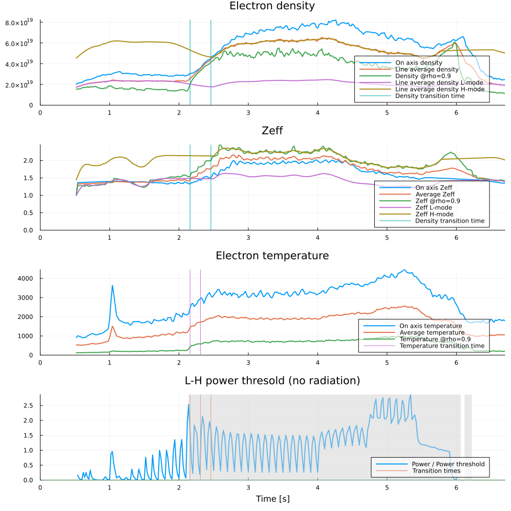
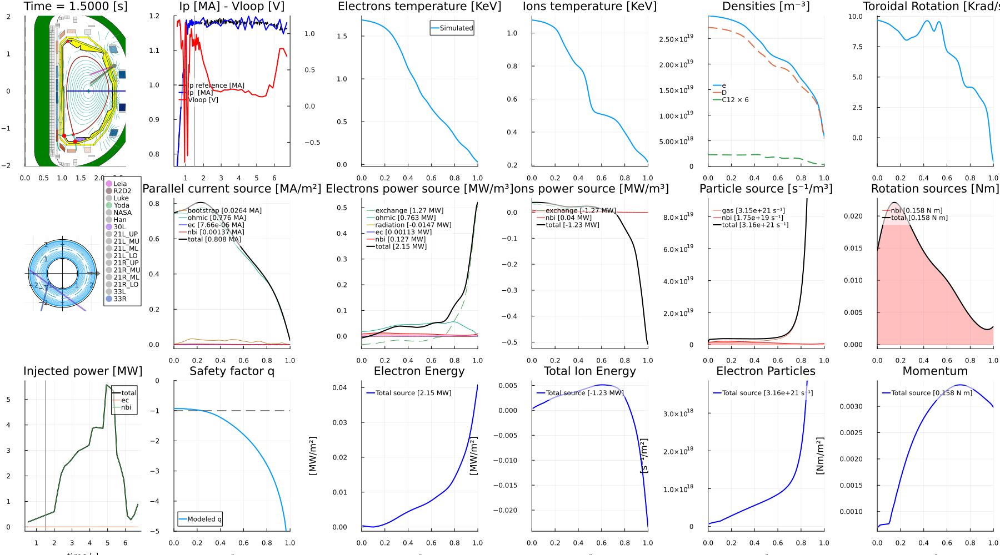
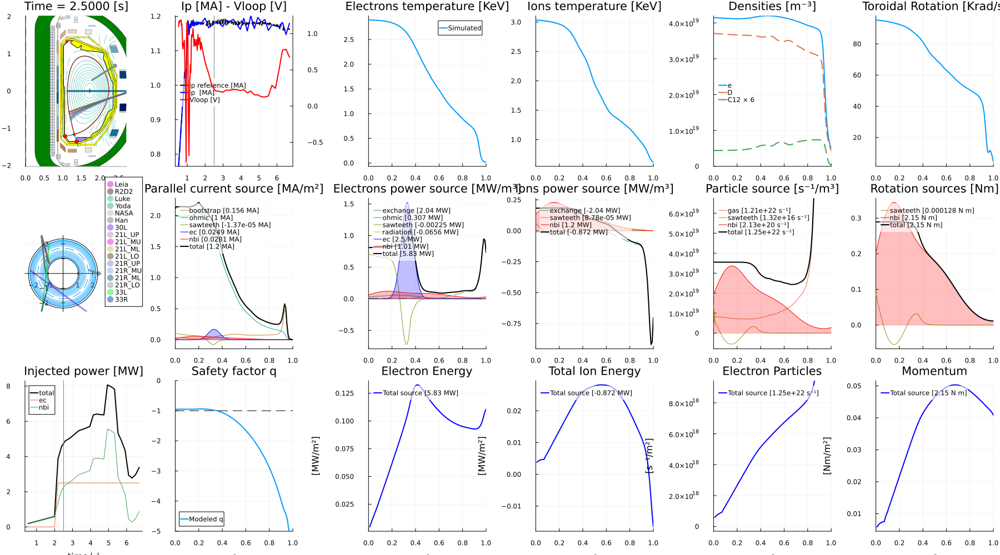

# DIII-D Time-Dependent Simulation — FUSE Summer School

This tutorial walks through a complete **time-dependent** workflow in FUSE for a real DIII-D
discharge (shot 200000). Starting from experimental data, we run three complementary cases:

1. **Replay**: follow the experimental kinetic profiles to reproduce the shot and validate FUSE against the measurements.
2. **Simulation**: let the physics models *predict* the profiles (dynamic pedestal + flux-matched transport).
3. **Modified simulation**: a *"what if?" example with extra electron-cyclotron heating (ECH).

All three share the same configured starting point (`:replay_init`), so their differences isolate
the effect of the modeling choices and the added heating.

## What you'll learn
- Fetch experimental data for a DIII-D shot into `ini` / `act`
- Initialize `dd` and checkpoint progress with `@checkin` / `@checkout`
- Detect the L–H transition and extract pedestal parameters from experiment
- Run a time-dependent simulation with `ActorDynamicPlasma` in replay and predictive modes
- Apply synthetic diagnostics and animate the plasma evolution
- Explore a counterfactual with extra ECH

## Prerequisites
- A working FUSE install — see the [installation guide](https://fuse.help/dev/install.html), or use the [GA Omega server](https://fuse.help/dev/install_omega.html)
- **Access to the DIII-D data system** — this notebook fetches shot 200000. If you don't have data access you can still read along: the outputs on this page are pre-rendered.

> Companion page: [DIII-D Time-Dependent workflows](https://fuse.help/dev/d3d_study_workflows.html).


## 1. Load FUSE

We load FUSE together with `Plots` for figures and `Interact` for interactive widgets.

The first `using FUSE` triggers Julia's just-in-time compilation, so it takes a while, while every
subsequent call is fast.


```@julia
# Import needed packages
using Plots;
using FUSE
using Interact
FUSE.ProgressMeter.ijulia_behavior(:clear);
```


<div style="padding: 1em; background-color: #f8d6da; border: 1px solid #f5c6cb; font-weight: bold;">
<p>The WebIO Jupyter extension was not detected. See the
<a href="https://juliagizmos.github.io/WebIO.jl/latest/providers/ijulia/" target="_blank">
    WebIO Jupyter integration documentation
</a>
for more information.
</div>


## 2. Fetch the experiment

`FUSE.case_parameters(:D3D, shot)` pulls experimental data for a DIII-D shot from the MDS+ data
system and returns the 0D initialization parameters (`ini`) and the actor controls (`act`). Here
we use shot **200000**.

We `@checkin` the result under the tag `:fetch`, so we can restore this exact starting point later
without re-fetching.

> `use_local_cache=true` reuses a previously cached fetch instead of hitting the server — handy
> when re-running the notebook.


```@julia
# setup ini, act from MDS+ data
shot = 200000; @time ini, act = FUSE.case_parameters(:D3D, shot; use_local_cache=true)

# save ini, act in case we want to view later
@checkin :fetch ini act;
```

    [ Info: Connecting to mcclenaghanj@somega.gat.com
    [ Info: Remote D3D data fetching for shot 200000
    [ Info: Path on mcclenaghanj@somega.gat.com: /cscratch/mcclenaghanj/d3d_data/200000
    [ Info: Path on Localhost: /var/folders/xw/fh54dglx5h3_mxz2y46jqv9h0000gq/T/mcclenaghanj_D3D_200000
    [ Info: Loading files: D3D_machine.json ; D3D_200000_5000167971831672853.h5 ; nbi_ods_200000.h5
    actors: FitProfiles
    [ Info: Thomson subsystems scaled to match interferometer measurements: TS_core=1.047, TS_tangential=0.958


     74.703604 seconds (371.96 M allocations: 22.948 GiB, 3.58% gc time, 19 lock conflicts, 231.39% compilation time: <1% of which was recompilation)


## 3. Initialize the data structure

`FUSE.init!(dd, ini, act)` populates a fresh `dd` from the experimental data in `ini`: equilibrium,
kinetic profiles, sources, and the actuator pulse schedules. This is our plausible starting state —
not yet a self-consistent physics solution.

We checkpoint it as `:init` so every case below can start from the same point.


```@julia
# Initialize dd
@checkout :fetch ini act
dd = IMAS.dd()
@time FUSE.init!(dd, ini, act);

# Checkin dd in case we want it for later
@checkin :init dd act;
```

    actors: CXbuild
    actors: Sources
    actors:  SimpleEC
    actors:  SimpleNB
    actors:  NeutralFueling


     58.298854 seconds (384.08 M allocations: 25.002 GiB, 3.87% gc time, 90.50% compilation time: <1% of which was recompilation)


## 4. Analyze the L–H transition

Before evolving the plasma we characterize the pedestal dynamics from the experiment.
`FUSE.LH_analysis` detects the L→H (and H→L) transition times and extracts the quantities the
pedestal model needs:

- `tau_n`, `tau_t` — density and temperature pedestal build-up timescales
- `W_ped_to_core_fraction` — how the pedestal stored energy relates to the core
- `mode_transitions` — the times of confinement-mode changes

With `do_plot=true`, the detected transitions are overlaid on the experimental traces.


```@julia

@checkout :init dd act;
experiment_LH = FUSE.LH_analysis(dd; do_plot=true);
```


    

    


## 5. Replay: reproduce the shot

In **replay** mode we follow the experiment: the transport and pedestal actors are set to
`:replay`, so FUSE uses the measured kinetic profiles as boundary conditions while still evolving
the current and equilibrium self-consistently. This reproduces the discharge and lets us validate
FUSE against the measurements.

Configuration highlights:
- **Time stepping** — δt = 0.2 s from t = 1.8 s to the end of the equilibrium time base.
- **What evolves** — current, equilibrium, transport, sources, pedestal, and sawteeth.
- **Transport & pedestal** — `:replay` (match experimental values); density and Zeff from experiment.
- **Equilibrium** — `ActorEquilibrium → :FRESCO` on a 129×129 grid, constrained by the magnetic diagnostics.

We checkpoint the configured starting state as **`:replay_init`** — the shared baseline that the
predictive and modified cases below both branch from — then run `ActorDynamicPlasma`, apply the
**synthetic diagnostics** (`ActorMagnetics`, `ActorInterferometer`), and checkpoint the result as `:replay`.

> ⏱️ This is one of the expensive cells — it runs a full time-dependent simulation.


```@julia
# Start from our init dd
@checkout :init dd act;

# setup time
δt = 0.2
dd.global_time = 1.8#ini.time.simulation_start # start_time should be early in the shot, otherwise ohmic current will be wrong
final_time = ini.general.dd.equilibrium.time[end]
act.ActorDynamicPlasma.Nt = Int(ceil((final_time - dd.global_time) / δt))
act.ActorDynamicPlasma.Δt = final_time - dd.global_time

# choose what to evolve
act.ActorDynamicPlasma.evolve_current = true
act.ActorDynamicPlasma.evolve_equilibrium = true
act.ActorDynamicPlasma.evolve_transport = true
act.ActorDynamicPlasma.evolve_sources = true
act.ActorDynamicPlasma.evolve_pf_active = false
act.ActorDynamicPlasma.evolve_pedestal = true
act.ActorDynamicPlasma.evolve_sawteeth = true

# density and Zeff from experiment
act.ActorPedestal.density_ratio_L_over_H = 1.0
act.ActorPedestal.zeff_ratio_L_over_H = 1.0

act.ActorPedestal.mode_transitions = experiment_LH.mode_transitions

# equilibrium model setting
act.ActorEquilibrium.model = :FRESCO 
act.ActorFRESCO.nR = act.ActorFRESCO.nZ = 129

# Particle fueling source rate
act.ActorNeutralFueling.τp_over_τe = 0.5

act.ActorPedestal.rotation_model = :replay # we don't have a good model for the rotation boundary condition

act.ActorSawteethSource.flat_factor = 1.0
act.ActorSawteethSource.period = 0.25 # turn off if no qmin<1 for 250 ms

# Set pedestal and transport to replay to match experimental values
act.ActorCoreTransport.model = :replay
act.ActorPedestal.model = :replay
act.ActorPFactive.boundary_weight = 1.0
act.ActorPFactive.magnetic_probe_weight = 1.0
act.ActorPFactive.flux_loop_weight = 1.0
act.ActorPFactive.strike_points_weight = 0.0
act.ActorPFactive.x_points_weight = 1.0


@checkin :replay_init dd act;

# run time-dependent simulation
@time actor = FUSE.ActorDynamicPlasma(dd, act; verbose=true);
# synthetic diagnostics
FUSE.ActorMagnetics(dd, act)
FUSE.ActorInterferometer(dd, act)
@checkin :replay dd act;

```

    Progress: 100%|███████████████████████████| Time: 0:00:45 ( 0.17  s/it)
           start time: 1.8
             end time: 6.699999809265137
                 time: 6.699999809265137
                stage: PFactive (2/2)
              Ip [MA]: 1.180137619570065
            Ti0 [keV]: 1.178052310398543
            Te0 [keV]: 1.7932763995578052
       ne0 [10²⁰ m⁻³]: 0.24647891062974975
            max(zeff): 1.5543193173501326
          ω0 [krad/s]: 21.585265207737137


     55.691934 seconds (167.32 M allocations: 12.802 GiB, 1.64% gc time, 49.14% compilation time: <1% of which was recompilation)


    actors: Magnetics
    actors: Interferometer


## 6. Animate the replay

We build an animation of the plasma overview as a GIF. `plot_plasma_overview` packs the equilibrium, profiles, and heating into a single
multi-panel figure. *(On this page the animation is shown as a single representative frame.)*


```@julia
# Time basis to step through (one frame per core_profiles time slice).
times = dd.core_profiles.time
@info "Animating $(length(times)) frames" t_start=first(times) t_end=last(times)

fps = 10
anim = @animate for time0 in times
    FUSE.plot_plasma_overview(dd, Float64(time0); aggregate_hcd=true)
end

outfile = joinpath( "./plasma_overview.gif")
g = gif(anim, outfile; fps)

```

    ┌ Info: Animating 82 frames
    │   t_start = 0.5199999809265137
    └   t_end = 6.699999809265137
    [ Info: Saved animation to /Users/mcclenaghan/Dropbox/programming/jupyter_notebooks/plasma_overview.gif


    

    


## 7. Predictive simulation

Now we let FUSE **predict** the profiles instead of replaying them. Starting again from
`:replay_init`, we switch:
- **Pedestal** → `:dynamic`, seeded with the L–H timescales (`tau_n`, `tau_t`, `W_ped_to_core_fraction`) from step 4.
- **Core transport** → `:FluxMatcher`, flux-matching Tₑ, Tᵢ, densities, and rotation with `ActorTGLF` as a `:TGLFNN` neural-net surrogate.

Running `ActorDynamicPlasma` now advances the plasma using these predictive models, so the result
is a genuine forward prediction rather than a replay of the measured profiles.


```@julia
@checkout :replay_init dd act;


# Set pedestal model
act.ActorPedestal.model = :dynamic
act.ActorPedestal.tau_n = experiment_LH.tau_n # particle confinement time for LH dynamics
act.ActorPedestal.tau_t = experiment_LH.tau_t # particle confinement time for LH dynamics
act.ActorWPED.ped_to_core_fraction = experiment_LH.W_ped_to_core_fraction
act.ActorEPED.ped_factor = 0.8 # Average pedestal height relative to EPED
act.ActorPedestal.T_ratio_pedestal = 1.0 # Ti/Te in the pedestal

# Set core_transport
act.ActorCoreTransport.model = :FluxMatcher
act.ActorFluxMatcher.evolve_plasma_sources = true 
act.ActorFluxMatcher.algorithm = :simple_dfsane
act.ActorFluxMatcher.max_iterations = -300 # negative to avoid print of warnings
act.ActorFluxMatcher.evolve_pedestal = false
act.ActorFluxMatcher.evolve_Te = :flux_match
act.ActorFluxMatcher.evolve_Ti = :flux_match
act.ActorFluxMatcher.evolve_densities = :flux_match
act.ActorFluxMatcher.evolve_rotation = :flux_match
act.ActorFluxMatcher.relax = 1.0

act.ActorTGLF.tglfnn_model = "sat0quench_em_d3d+mastu_azf+1"
act.ActorTGLF.model = :TGLFNN

@time actor = FUSE.ActorDynamicPlasma(dd, act; verbose=true);
# synthetic diagnostics
FUSE.ActorMagnetics(dd, act)
FUSE.ActorInterferometer(dd, act)

@checkin :predict dd act;
```

    Progress: 100%|███████████████████████████| Time: 0:01:08 ( 0.25  s/it)
           start time: 1.8
             end time: 6.699999809265137
                 time: 6.699999809265137
                stage: PFactive (2/2)
              Ip [MA]: 1.169753418712516
            Ti0 [keV]: 2.8721388943358592
            Te0 [keV]: 3.374922254240665
       ne0 [10²⁰ m⁻³]: 0.2725052083379953
            max(zeff): 1.394295077798294
          ω0 [krad/s]: 37.00975617192601


     70.360404 seconds (193.58 M allocations: 18.972 GiB, 2.08% gc time, 57.57% compilation time: <1% of which was recompilation)


    actors: Magnetics
    actors: Interferometer


    ActorInterferometer(dd, par)


## 8. Modified simulation with extra ECH

Finally, a *"what if?"*. Starting once more from `:replay_init`, we modify the **EC
launcher pulse schedule**: re-aim all five gyrotrons (via `convert_DIII_D_to_IMAS_launch_angles`,
which maps DIII-D AZIANG/POLANG conventions to IMAS steering angles) and add 0.5 MW per beam after
t = 2 s. Rerunning `ActorDynamicPlasma` shows how the extra electron-cyclotron heating changes the plasma.


```@julia
# Rerun simulation again with extra EC

@checkout :replay_init dd act;

function convert_DIII_D_to_IMAS_launch_angles(AZIANG, POLANG)
    phi_tor = deg2rad(AZIANG - 180.0)
    theta_pol = deg2rad(POLANG - 90.0)

    steering_angle_tor = -asin(cos(theta_pol) * sin(phi_tor))
    steering_angle_pol = atan(tan(theta_pol), cos(phi_tor))

    return steering_angle_tor, steering_angle_pol
end

for i in 1:5
    # Change launch angles if desired.
    alpha,beta = convert_DIII_D_to_IMAS_launch_angles(200.0, 120.)
    dd.ec_launchers.beam[i].steering_angle_pol[:] .= beta
    dd.ec_launchers.beam[i].steering_angle_tor[:] .= alpha
    
    # Change heating to 0.5 MW per gyrotron and to turn on at 2s
    time = dd.pulse_schedule.ec.time
    dd.pulse_schedule.ec.beam[i].power_launched.reference[time.<2.0] .= 0.0
    dd.pulse_schedule.ec.beam[i].power_launched.reference[time.>2.0] .= 0.5e6
end


# choose what to evolve
act.ActorDynamicPlasma.evolve_current = true
act.ActorDynamicPlasma.evolve_equilibrium = true
act.ActorDynamicPlasma.evolve_transport = true
act.ActorDynamicPlasma.evolve_sources = true
act.ActorDynamicPlasma.evolve_pf_active = false
act.ActorDynamicPlasma.evolve_pedestal = true
act.ActorDynamicPlasma.evolve_sawteeth = true


# run time-dependent simulation
@time actor = FUSE.ActorDynamicPlasma(dd, act; verbose=true);
# synthetic diagnostics
FUSE.ActorMagnetics(dd, act)
FUSE.ActorInterferometer(dd, act)

@checkin :predict_modify dd act;

```

    Progress: 100%|███████████████████████████| Time: 0:00:33 ( 0.12  s/it)
           start time: 1.8
             end time: 6.699999809265137
                 time: 6.699999809265137
                stage: PFactive (2/2)
              Ip [MA]: 1.179880257191097
            Ti0 [keV]: 1.178052310398543
            Te0 [keV]: 1.7932763995578052
       ne0 [10²⁰ m⁻³]: 0.24647891062974975
            max(zeff): 1.5543193173501326
          ω0 [krad/s]: 21.585265207737137


     35.631565 seconds (43.09 M allocations: 6.755 GiB, 2.14% gc time)


    actors: Magnetics
    actors: Interferometer


    ActorInterferometer(dd, par)


## 9. Compare

We plot the plasma overview at t = 2.5 s, including the rotation profile. Compare it against the
replay animation from step 6 to see the effect of the extra heating.


```@julia
FUSE.plot_plasma_overview(dd, 2.5;aggregate_hcd=true, rotation_quantity=:sonic)
```


    

    


## Next steps
- Swap the shot number to run your own DIII-D discharge
- Compare the replay, predictive, and modified runs using the `@checkout` checkpoints (`:replay`, `:replay_init`)
- Explore the individual physics/engineering models in the [Actors documentation](https://fuse.help/dev/actors.html)
- Learn the core data structures (`ini`, `act`, `dd`) in the [introductory tutorial](https://fuse.help/dev/tutorial.html)

