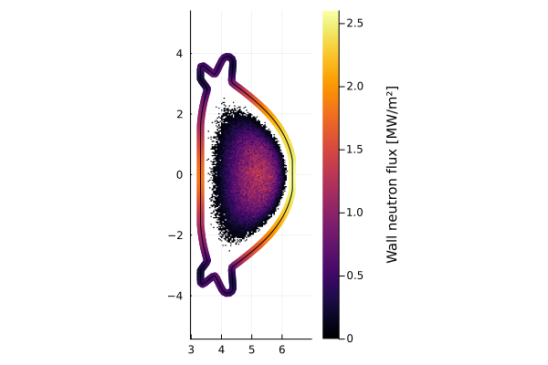

# Balance of plant


```@julia
using Revise
using FUSE
using Plots;
FUSE.logging(Logging.Info);
```


<div style="padding: 1em; background-color: #f8d6da; border: 1px solid #f5c6cb; font-weight: bold;">
<p>The WebIO Jupyter extension was not detected. See the
<a href="https://juliagizmos.github.io/WebIO.jl/latest/providers/ijulia/" target="_blank">
    WebIO Jupyter integration documentation
</a>
for more information.
</div>


### Initialize FPP v1_demount case
[FPP v1 demount case documentation](https://fuse.help/cases.html#FPP)


```@julia
dd, ini, act = FUSE.init(:FPP, version=:v1_demount, init_from=:ods, do_plot=false);
```

    WARNING: both ImageMetadata and ImageAxes export "data"; uses of it in module Images must be qualified
    ┌ Warning: dd.dataset_description was skipped in IMAS data dictionary
    └ @ IMASDD ~/.julia/packages/IMASDD/Fh2R9/src/data.jl:1160


### Run Actors that will be needed for balance of plant


```@julia
FUSE.ActorEquilibriumTransport(dd, act)
FUSE.ActorCXbuild(dd, act)
FUSE.ActorNeutronics(dd, act; do_plot=true);
```


    

    


### Running the simple blanket actor
[ActorBlanket documentation](https://fuse.help/actors.html#Blanket)


```@julia
dd.build.structure
FUSE.ActorBlanket(dd, act);
dd.blanket
```

    ┌ Warning: currently only using GAMBL materials in blanket and first wall.
    └ @ FUSE ~/work/FUSE.jl/FUSE.jl/src/actors/blanket_actors.jl:49


    blanket
    ├─ module
    │  ├─ 1
    │  │  ├─ layer
    │  │  │  ├─ 1
    │  │  │  │  ├─ material ➡ "Steel, Stainless 316"
    │  │  │  │  ├─ midplane_thickness ➡ 0.0202105 [m]
    │  │  │  │  └─ name ➡ "lfs first wall"
    │  │  │  ├─ 2
    │  │  │  │  ├─ material ➡ "lithium-lead: Li6/7=35.134"
    │  │  │  │  ├─ midplane_thickness ➡ 0.773458 [m]
    │  │  │  │  └─ name ➡ "lfs blanket"
    │  │  │  └─ 3
    │  │  │     ├─ material ➡ "Tungsten"
    │  │  │     ├─ midplane_thickness ➡ 0.208938 [m]
    │  │  │     └─ name ➡ "lfs high temp shield"
    │  │  ├─ name ➡ "LFS blanket"
    │  │  └─ time_slice
    │  │     └─ 1
    │  │        ├─ power_incident_neutrons ➡ 5.56996e+08 [W]
    │  │        ├─ power_incident_radiated ➡ 0 [W]
    │  │        ├─ power_thermal_extracted ➡ 6.68395e+08 [W]
    │  │        ├─ power_thermal_neutrons ➡ 6.68395e+08 [W]
    │  │        ├─ power_thermal_radiated ➡ 0 [W]
    │  │        └─ tritium_breeding_ratio ➡ 1.29926
    │  └─ 2
    │     ├─ layer
    │     │  ├─ 1
    │     │  │  ├─ material ➡ "Steel, Stainless 316"
    │     │  │  ├─ midplane_thickness ➡ 0.0202105 [m]
    │     │  │  └─ name ➡ "hfs first wall"
    │     │  ├─ 2
    │     │  │  ├─ material ➡ "lithium-lead: Li6/7=35.134"
    │     │  │  ├─ midplane_thickness ➡ 0.33511 [m]
    │     │  │  └─ name ➡ "hfs blanket"
    │     │  └─ 3
    │     │     ├─ material ➡ "Tungsten"
    │     │     ├─ midplane_thickness ➡ 0.208938 [m]
    │     │     └─ name ➡ "hfs high temp shield"
    │     ├─ name ➡ "HFS blanket"
    │     └─ time_slice
    │        └─ 1
    │           ├─ power_incident_neutrons ➡ 1.52962e+08 [W]
    │           ├─ power_incident_radiated ➡ 0 [W]
    │           ├─ power_thermal_extracted ➡ 1.83555e+08 [W]
    │           ├─ power_thermal_neutrons ➡ 1.83555e+08 [W]
    │           ├─ power_thermal_radiated ➡ 0 [W]
    │           └─ tritium_breeding_ratio ➡ 0.806251
    ├─ time ➡ [1] [s]
    └─ tritium_breeding_ratio ➡ [1.1]


### Running the divertors actor
[ActorDivertors documentation](https://fuse.help/actors.html#Divertors)


```@julia
FUSE.ActorDivertors(dd, act)
dd.divertors
```


    divertors
    ├─ divertor
    │  ├─ 1
    │  │  ├─ name ➡ "Upper divertor"
    │  │  ├─ power_incident
    │  │  │  ├─ data ➡ [1.13706e+08] [W]
    │  │  │  └─ time ➡ [1] [s]
    │  │  ├─ power_neutrals
    │  │  │  ├─ data ➡ [0] [W]
    │  │  │  └─ time ➡ [1] [s]
    │  │  ├─ power_radiated
    │  │  │  ├─ data ➡ [0] [W]
    │  │  │  └─ time ➡ [1] [s]
    │  │  ├─ power_recombination_neutrals
    │  │  │  ├─ data ➡ [0] [W]
    │  │  │  └─ time ➡ [1] [s]
    │  │  └─ power_thermal_extracted
    │  │     ├─ data ➡ [1.13706e+08] [W]
    │  │     └─ time ➡ [1] [s]
    │  └─ 2
    │     ├─ name ➡ "Lower divertor"
    │     ├─ power_incident
    │     │  ├─ data ➡ [1.13706e+08] [W]
    │     │  └─ time ➡ [1] [s]
    │     ├─ power_neutrals
    │     │  ├─ data ➡ [0] [W]
    │     │  └─ time ➡ [1] [s]
    │     ├─ power_radiated
    │     │  ├─ data ➡ [0] [W]
    │     │  └─ time ➡ [1] [s]
    │     ├─ power_recombination_neutrals
    │     │  ├─ data ➡ [0] [W]
    │     │  └─ time ➡ [1] [s]
    │     └─ power_thermal_extracted
    │        ├─ data ➡ [1.13706e+08] [W]
    │        └─ time ➡ [1] [s]
    └─ time ➡ [1] [s]


### Running the balance of plant actor
[ActorBalanceOfPlant documentation](https://fuse.help/actors.html#BalanceOfPlant)


```@julia
FUSE.ActorBalanceOfPlant(dd, act);

println("The net electrical power to the grid is $(round(dd.balance_of_plant.power_electric_net[end]/1e6,digits=1)) [MWe] \nWith Qplant = $(round(dd.balance_of_plant.Q_plant[end],digits=2)) \n")
display(dd.balance_of_plant)

```

    The net electrical power to the grid is 251.2 [MWe] 
    With Qplant = 2.39 
    


    balance_of_plant
    ├─ Q_plant ➡ Function
    ├─ power_electric_net ➡ Function [W]
    ├─ power_electric_plant_operation
    │  ├─ system
    │  │  ├─ 1
    │  │  │  ├─ index ➡ 1
    │  │  │  ├─ name ➡ "H&CD"
    │  │  │  ├─ power ➡ [5.55556e+07] [W]
    │  │  │  └─ subsystem
    │  │  │     └─ 1
    │  │  │        ├─ index ➡ 1
    │  │  │        ├─ name ➡ "ec_launchers"
    │  │  │        └─ power ➡ [5.55556e+07] [W]
    │  │  ├─ 2
    │  │  │  ├─ index ➡ 2
    │  │  │  ├─ name ➡ "cryostat"
    │  │  │  └─ power ➡ [3e+07] [W]
    │  │  ├─ 3
    │  │  │  ├─ index ➡ 3
    │  │  │  ├─ name ➡ "tritium_handling"
    │  │  │  └─ power ➡ [1.5e+07] [W]
    │  │  ├─ 4
    │  │  │  ├─ index ➡ 4
    │  │  │  ├─ name ➡ "pumping"
    │  │  │  └─ power ➡ [8e+07] [W]
    │  │  └─ 5
    │  │     ├─ index ➡ 5
    │  │     ├─ name ➡ "pf_active"
    │  │     └─ power ➡ [0] [W]
    │  └─ total_power ➡ Function [W]
    ├─ thermal_cycle
    │  ├─ power_electric_generated ➡ Function
    │  ├─ power_thermal_convertable_total ➡ Function [W]
    │  ├─ system
    │  │  ├─ 1
    │  │  │  ├─ index ➡ 1
    │  │  │  ├─ name ➡ "blanket"
    │  │  │  └─ power_in ➡ [8.5195e+08] [W]
    │  │  └─ 2
    │  │     ├─ index ➡ 2
    │  │     ├─ name ➡ "divertors"
    │  │     └─ power_in ➡ [2.27412e+08] [W]
    │  └─ thermal_electric_conversion_efficiency ➡ [0.4]
    └─ time ➡ [1] [s]


