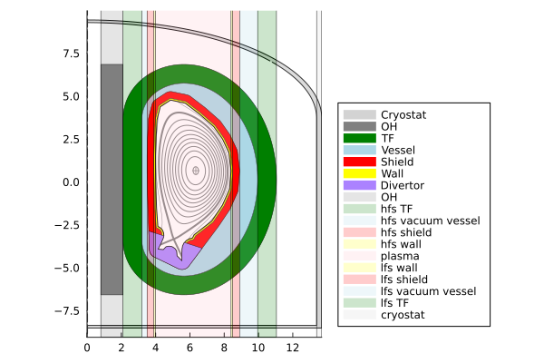

# Blanket


```@julia
using Revise
using FUSE
using Plots;
FUSE.logging(Logging.Info);
```


<div style="padding: 1em; background-color: #f8d6da; border: 1px solid #f5c6cb; font-weight: bold;">
<p>The WebIO Jupyter extension was not detected. See the
<a href="https://juliagizmos.github.io/WebIO.jl/latest/providers/ijulia/" target="_blank">
    WebIO Jupyter integration documentation
</a>
for more information.
</div>


### Initialize the ITER case case
[ITER case documentation](https://fuse.help/cases.html#ITER)


```@julia
dd, ini, act = FUSE.init(:ITER, init_from=:ods, do_plot=true);
```

    WARNING: both ImageMetadata and ImageAxes export "data"; uses of it in module Images must be qualified
    ┌ Warning: dd.dataset_description was skipped in IMAS data dictionary
    └ @ IMASDD ~/.julia/packages/IMASDD/Fh2R9/src/data.jl:1160


    

    


    

    


    

    


    13×8 DataFrame
     Row │ group   name           ΔR       R_start  R_end    material   area      volume    
         │ String  String         Float64  Float64  Float64  String     Float64   Float64   
    ─────┼──────────────────────────────────────────────────────────────────────────────────
       1 │ in                        0.8      0.0      0.8              10.7457     27.0068
       2 │ in      OH                1.3      0.8      2.1   Nb3Sn      17.4617    159.087
       3 │ hfs     TF                1.1      2.1      3.2   Nb3Sn      36.6332    483.363
       4 │ hfs     vacuum vessel     0.3      3.2      3.5   Water      20.8272    932.701
       5 │ hfs     shield            0.4      3.5      3.9   Tungsten   11.2249    406.304
       6 │ hfs     wall              0.1      3.9      4.0   Steel       2.37865    85.771
       7 │ lhfs    plasma            4.4      4.0      8.4   DT_plasma  28.8365   1070.04
       8 │ lfs     wall              0.1      8.4      8.5   Steel       2.37865    85.771
       9 │ lfs     shield            0.4      8.5      8.9   Tungsten   11.2249    406.304
      10 │ lfs     vacuum vessel     1.05     8.9      9.95  Water      20.8272    932.701
      11 │ lfs     TF                1.1      9.95    11.05  Nb3Sn      36.6332    483.363
      12 │ out                       2.34    11.05    13.39             91.9905   4777.91
      13 │ out     cryostat          0.3     13.39    13.69  Steel       8.88051   564.54


    

    


    

    


    

    


    

    


### Run Actors that will be needed for the blanket actor


```@julia
FUSE.ActorEquilibriumTransport(dd, act)
FUSE.ActorCXbuild(dd, act)
FUSE.ActorNeutronics(dd, act; do_plot=true);
```


    

    


### Running the simple blanket actor
[ActorBlanket documentation](https://fuse.help/actors.html#Blanket)


```@julia
dd.build.structure
FUSE.ActorBlanket(dd, act);
dd.blanket
```

    ┌ Warning: No blanket present for ActorBlanket to do anything
    └ @ FUSE ~/work/FUSE.jl/FUSE.jl/src/actors/blanket_actors.jl:53


    blanket


### Running the blanket actor
[ActorBlanket documentation](https://fuse.help/actors.html#Blanket)


```@julia
FUSE.ActorBlanket(dd, act)
dd.blanket
```

    ┌ Warning: No blanket present for ActorBlanket to do anything
    └ @ FUSE ~/work/FUSE.jl/FUSE.jl/src/actors/blanket_actors.jl:53


    blanket


```@julia
act
```


    act
    ├─ ActorBalanceOfPlant
    │  ├─ blanket_multiplier ➡ 1.2
    │  ├─ efficiency_reclaim ➡ 0.6
    │  ├─ model ➡ :EU_DEMO
    │  └─ thermal_electric_conversion_efficiency ➡ 0.4
    ├─ ActorBlanket
    │  ├─ blanket_multiplier ➡ 1.2
    │  └─ thermal_power_extraction_efficiency ➡ 1.0
    ├─ ActorCHEASE
    │  ├─ clear_workdir ➡ true
    │  ├─ free_boundary ➡ true
    │  └─ rescale_eq_to_ip ➡ false
    ├─ ActorCXbuild
    │  ├─ do_plot ➡ false
    │  └─ rebuild_wall ➡ false
    ├─ ActorCosting
    │  ├─ availability ➡ 0.803
    │  ├─ blanket_lifetime ➡ 6.8 [years]
    │  ├─ building_volume ➡ 140000.0 [m^3]
    │  ├─ escalation_fraction ➡ 0.05
    │  ├─ indirect_cost_rate ➡ 0.4
    │  ├─ interest_rate ➡ 0.05
    │  ├─ land_space ➡ 1000.0 [acres]
    │  └─ lifetime ➡ 40 [years]
    ├─ ActorDivertors
    │  └─ thermal_power_extraction_efficiency ➡ 1.0
    ├─ ActorECsimple
    │  ├─ current_efficiency ➡ 0.2 [A/W]
    │  ├─ rho_0 ➡ 0.0
    │  └─ width ➡ 0.1
    ├─ ActorEquilibrium
    │  └─ model ➡ :Solovev
    ├─ ActorEquilibriumTransport
    │  ├─ do_plot ➡ false
    │  └─ iterations ➡ 1
    ├─ ActorFluxSwing
    │  ├─ j_tolerance ➡ 0.4
    │  └─ operate_at_j_crit ➡ false
    ├─ ActorHFSsizing
    │  ├─ do_plot ➡ false
    │  ├─ fixed_aspect_ratio ➡ true
    │  ├─ j_tolerance ➡ 0.4
    │  ├─ stress_tolerance ➡ 0.2
    │  ├─ unconstrained_flattop_duration ➡ true
    │  └─ verbose ➡ false
    ├─ ActorICsimple
    │  ├─ current_efficiency ➡ 0.125 [A/W]
    │  ├─ rho_0 ➡ 0.0
    │  └─ width ➡ 0.1
    ├─ ActorLFSsizing
    │  ├─ do_plot ➡ false
    │  └─ verbose ➡ false
    ├─ ActorLHsimple
    │  ├─ current_efficiency ➡ 0.4 [A/W]
    │  ├─ rho_0 ➡ 0.6
    │  └─ width ➡ 0.15
    ├─ ActorNBIsimple
    │  ├─ current_efficiency ➡ 0.3 [A/W]
    │  ├─ rho_0 ➡ 0.0
    │  └─ width ➡ 0.3
    ├─ ActorNeutronics
    │  ├─ N ➡ 100000
    │  ├─ do_plot ➡ false
    │  └─ step ➡ 0.05
    ├─ ActorPFcoilsOpt
    │  ├─ do_plot ➡ false
    │  ├─ green_model ➡ :simple
    │  ├─ maxiter ➡ 1000
    │  ├─ optimization_scheme ➡ :rail
    │  ├─ symmetric ➡ false
    │  ├─ update_equilibrium ➡ false
    │  ├─ verbose ➡ false
    │  ├─ weight_currents ➡ 0.5
    │  ├─ weight_lcfs ➡ 1.0
    │  ├─ weight_null ➡ 0.001
    │  └─ weight_strike ➡ 0.0
    ├─ ActorPassiveStructures
    │  └─ do_plot ➡ false
    ├─ ActorPedestal
    │  ├─ eped_factor ➡ 1.0
    │  ├─ only_powerlaw ➡ false
    │  ├─ temp_pedestal_ratio ➡ 1.0
    │  └─ warn_nn_train_bounds ➡ false
    ├─ ActorQEDcurrent
    ├─ ActorSolovev
    │  ├─ alpha ➡ 0.0
    │  ├─ area ➡ missing
    │  ├─ ngrid ➡ 129
    │  ├─ qstar ➡ 1.5
    │  ├─ verbose ➡ false
    │  └─ volume ➡ missing
    ├─ ActorSteadyStateCurrent
    ├─ ActorStresses
    │  ├─ do_plot ➡ false
    │  └─ n_points ➡ 5
    ├─ ActorTauenn
    │  ├─ T_shaping ➡ 1.8
    │  ├─ confinement_factor ➡ 1.0
    │  ├─ do_plot ➡ false
    │  ├─ eped_factor ➡ 1.0
    │  ├─ error ➡ 0.01
    │  ├─ rho_fluxmatch ➡ 0.6
    │  ├─ temp_pedestal_ratio ➡ 1.0
    │  ├─ transport_model ➡ :tglfnn
    │  ├─ verbose ➡ false
    │  └─ warn_nn_train_bounds ➡ false
    └─ ActorWholeFacility


