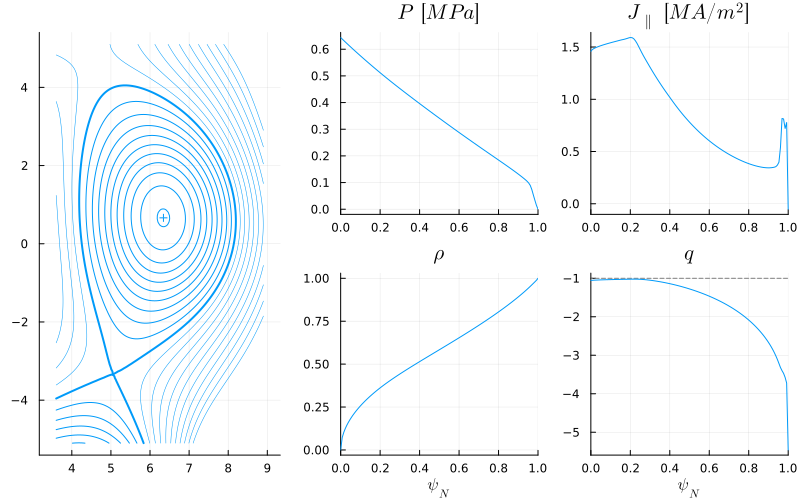
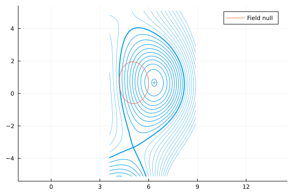
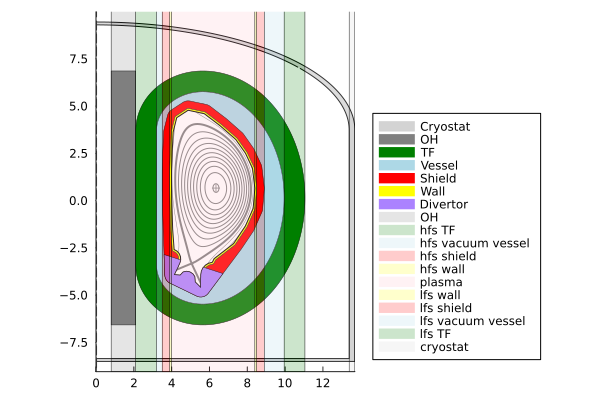
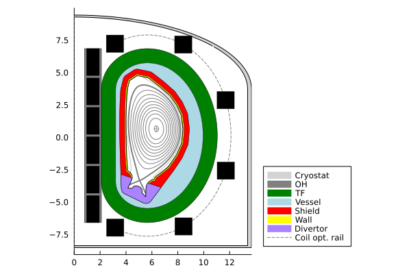
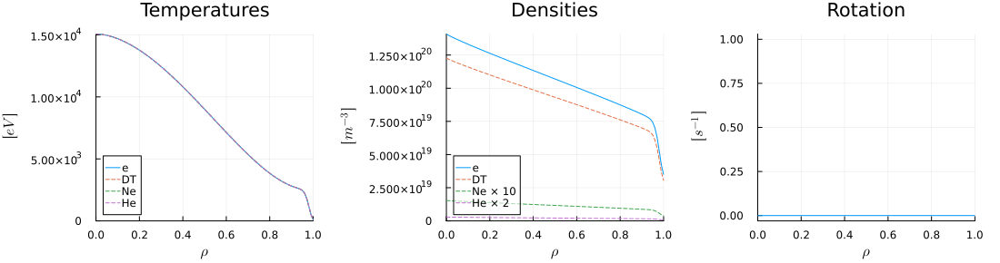
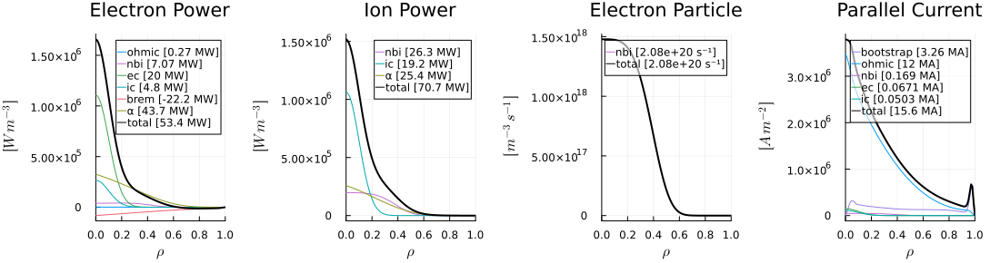
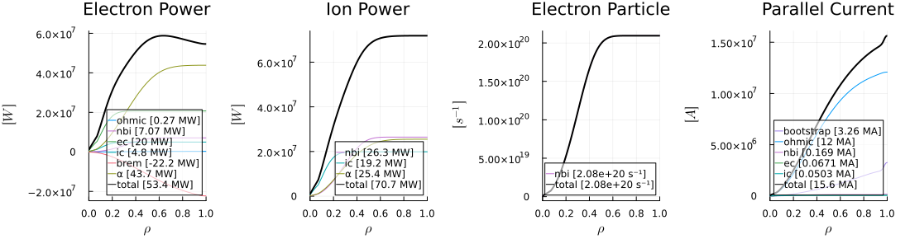

# Divertors


```@julia
using Revise
using FUSE
using Plots;
FUSE.logging(Logging.Info);
```


<div style="padding: 1em; background-color: #f8d6da; border: 1px solid #f5c6cb; font-weight: bold;">
<p>The WebIO Jupyter extension was not detected. See the
<a href="https://juliagizmos.github.io/WebIO.jl/latest/providers/ijulia/" target="_blank">
    WebIO Jupyter integration documentation
</a>
for more information.
</div>


### Initialize the ITER case case
[ITER case documentation](https://fuse.help/cases.html#ITER)


```@julia
dd, ini, act = FUSE.init(:ITER, init_from=:ods, do_plot=true);
```

    WARNING: both ImageMetadata and ImageAxes export "data"; uses of it in module Images must be qualified
    ┌ Warning: dd.dataset_description was skipped in IMAS data dictionary
    └ @ IMASDD ~/.julia/packages/IMASDD/Fh2R9/src/data.jl:1160


    

    


    

    


    

    


    13×8 DataFrame
     Row │ group   name           ΔR       R_start  R_end    material   area      volume    
         │ String  String         Float64  Float64  Float64  String     Float64   Float64   
    ─────┼──────────────────────────────────────────────────────────────────────────────────
       1 │ in                        0.8      0.0      0.8              10.7457     27.0068
       2 │ in      OH                1.3      0.8      2.1   Nb3Sn      17.4617    159.087
       3 │ hfs     TF                1.1      2.1      3.2   Nb3Sn      36.6332    483.363
       4 │ hfs     vacuum vessel     0.3      3.2      3.5   Water      20.8272    932.701
       5 │ hfs     shield            0.4      3.5      3.9   Tungsten   11.2249    406.304
       6 │ hfs     wall              0.1      3.9      4.0   Steel       2.37865    85.771
       7 │ lhfs    plasma            4.4      4.0      8.4   DT_plasma  28.8365   1070.04
       8 │ lfs     wall              0.1      8.4      8.5   Steel       2.37865    85.771
       9 │ lfs     shield            0.4      8.5      8.9   Tungsten   11.2249    406.304
      10 │ lfs     vacuum vessel     1.05     8.9      9.95  Water      20.8272    932.701
      11 │ lfs     TF                1.1      9.95    11.05  Nb3Sn      36.6332    483.363
      12 │ out                       2.34    11.05    13.39             91.9905   4777.91
      13 │ out     cryostat          0.3     13.39    13.69  Steel       8.88051   564.54


    

    


    

    


    

    


    

    


### Run Actors that will be needed for the Divertors


```@julia
FUSE.ActorEquilibriumTransport(dd, act)
#FUSE.ActorCXbuild(dd, act)
#FUSE.ActorNeutronics(dd, act; do_plot=true);
```


    FUSE.ActorEquilibriumTransport(dd{balance_of_plant, build, core_profiles, core_sources, costing, ec_launchers, equilibrium, ic_antennas, nbi, pf_active, solid_mechanics, summary, target, wall}
    , FUSE.ParametersActor(:ActorEquilibriumTransport, WeakRef(missing), Dict{Symbol, Union{FUSE.AbstractParameter, FUSE.AbstractParameters}}(:do_plot => ActorEquilibriumTransport.do_plot
    - units: 
    - description: plot
    - value: false
    - base: false
    - default: false
    - lower: missing
    - upper: missing, :iterations => ActorEquilibriumTransport.iterations
    - units: 
    - description: transport-equilibrium iterations
    - value: 1
    - base: 1
    - default: 1
    - lower: missing
    - upper: missing)), FUSE.ParametersAllActors(:act, WeakRef(missing), Dict{Symbol, Union{FUSE.AbstractParameter, FUSE.AbstractParameters}}(:ActorQEDcurrent => FUSE.ParametersActor(:ActorQEDcurrent, WeakRef(FUSE.ParametersAllActors(#= circular reference @-4 =#)), Dict{Symbol, Union{FUSE.AbstractParameter, FUSE.AbstractParameters}}()), :ActorSolovev => FUSE.ParametersActor(:ActorSolovev, WeakRef(FUSE.ParametersAllActors(#= circular reference @-4 =#)), Dict{Symbol, Union{FUSE.AbstractParameter, FUSE.AbstractParameters}}(:alpha => act.ActorSolovev.alpha
    - units: 
    - description: Initial guess of constant relating to pressure
    - value: 0.0
    - base: 0.0
    - default: 0.0
    - lower: missing
    - upper: missing, :volume => act.ActorSolovev.volume
    - units: m³
    - description: Scalar volume to match (optional)
    - value: missing
    - base: missing
    - default: missing
    - lower: missing
    - upper: missing, :verbose => act.ActorSolovev.verbose
    - units: 
    - description: verbose
    - value: false
    - base: false
    - default: false
    - lower: missing
    - upper: missing, :ngrid => act.ActorSolovev.ngrid
    - units: 
    - description: Grid size (for R, Z follows proportionally to plasma elongation)
    - value: 129
    - base: 129
    - default: 129
    - lower: missing
    - upper: missing, :qstar => act.ActorSolovev.qstar
    - units: 
    - description: Initial guess of kink safety factor
    - value: 1.5
    - base: 1.5
    - default: 1.5
    - lower: missing
    - upper: missing, :area => act.ActorSolovev.area
    - units: m²
    - description: Scalar area to match (optional)
    - value: missing
    - base: missing
    - default: missing
    - lower: missing
    - upper: missing)), :ActorNeutronics => FUSE.ParametersActor(:ActorNeutronics, WeakRef(FUSE.ParametersAllActors(#= circular reference @-4 =#)), Dict{Symbol, Union{FUSE.AbstractParameter, FUSE.AbstractParameters}}(:N => act.ActorNeutronics.N
    - units: 
    - description: Number of particles
    - value: 100000
    - base: 100000
    - default: 100000
    - lower: missing
    - upper: missing, :do_plot => act.ActorNeutronics.do_plot
    - units: 
    - description: plot
    - value: false
    - base: false
    - default: false
    - lower: missing
    - upper: missing, :step => act.ActorNeutronics.step
    - units: 
    - description: Interator stepping
    - value: 0.05
    - base: 0.05
    - default: 0.05
    - lower: missing
    - upper: missing)), :ActorBlanket => FUSE.ParametersActor(:ActorBlanket, WeakRef(FUSE.ParametersAllActors(#= circular reference @-4 =#)), Dict{Symbol, Union{FUSE.AbstractParameter, FUSE.AbstractParameters}}(:thermal_power_extraction_efficiency => act.ActorBlanket.thermal_power_extraction_efficiency
    - units: 
    - description: Fraction of thermal power that is carried out by the coolant at the blanket interface, rather than being lost in the surrounding strutures.
    - value: 1.0
    - base: 1.0
    - default: 1.0
    - lower: missing
    - upper: missing, :blanket_multiplier => act.ActorBlanket.blanket_multiplier
    - units: 
    - description: Neutron thermal power multiplier in blanket
    - value: 1.2
    - base: 1.2
    - default: 1.2
    - lower: missing
    - upper: missing)), :ActorLHsimple => FUSE.ParametersActor(:ActorLHsimple, WeakRef(FUSE.ParametersAllActors(#= circular reference @-4 =#)), Dict{Symbol, Union{FUSE.AbstractParameter, FUSE.AbstractParameters}}(:rho_0 => act.ActorLHsimple.rho_0
    - units: 
    - description: Radial location of the deposition profile
    - value: 0.6
    - base: 0.6
    - default: 0.6
    - lower: missing
    - upper: missing, :current_efficiency => act.ActorLHsimple.current_efficiency
    - units: A/W
    - description: Current drive efficiency
    - value: 0.4
    - base: 0.4
    - default: 0.4
    - lower: missing
    - upper: missing, :width => act.ActorLHsimple.width
    - units: 
    - description: Width of the deposition profile
    - value: 0.15
    - base: 0.15
    - default: 0.15
    - lower: missing
    - upper: missing)), :ActorCHEASE => FUSE.ParametersActor(:ActorCHEASE, WeakRef(FUSE.ParametersAllActors(#= circular reference @-4 =#)), Dict{Symbol, Union{FUSE.AbstractParameter, FUSE.AbstractParameters}}(:clear_workdir => act.ActorCHEASE.clear_workdir
    - units: 
    - description: Clean the temporary workdir for CHEASE
    - value: true
    - base: true
    - default: true
    - lower: missing
    - upper: missing, :rescale_eq_to_ip => act.ActorCHEASE.rescale_eq_to_ip
    - units: 
    - description: Scale equilibrium to match Ip
    - value: false
    - base: false
    - default: false
    - lower: missing
    - upper: missing, :free_boundary => act.ActorCHEASE.free_boundary
    - units: 
    - description: Convert fixed boundary equilibrium to free boundary one
    - value: true
    - base: true
    - default: true
    - lower: missing
    - upper: missing)), :ActorCosting => FUSE.ParametersActor(:ActorCosting, WeakRef(FUSE.ParametersAllActors(#= circular reference @-4 =#)), Dict{Symbol, Union{FUSE.AbstractParameter, FUSE.AbstractParameters}}(:indirect_cost_rate => act.ActorCosting.indirect_cost_rate
    - units: 
    - description: Indirect cost associated with construction, equipment, services, energineering construction management and owners cost
    - value: 0.4
    - base: 0.4
    - default: 0.4
    - lower: missing
    - upper: missing, :availability => act.ActorCosting.availability
    - units: 
    - description: availability fraction of the plant
    - value: 0.803
    - base: 0.803
    - default: 0.803
    - lower: missing
    - upper: missing, :escalation_fraction => act.ActorCosting.escalation_fraction
    - units: 
    - description: yearly escalation fraction based on risk assessment
    - value: 0.05
    - base: 0.05
    - default: 0.05
    - lower: missing
    - upper: missing, :land_space => act.ActorCosting.land_space
    - units: acres
    - description: Plant site space required in acres
    - value: 1000.0
    - base: 1000.0
    - default: 1000.0
    - lower: missing
    - upper: missing, :building_volume => act.ActorCosting.building_volume
    - units: m^3
    - description: Volume of the tokmak building
    - value: 140000.0
    - base: 140000.0
    - default: 140000.0
    - lower: missing
    - upper: missing, :blanket_lifetime => act.ActorCosting.blanket_lifetime
    - units: years
    - description: lifetime of the blanket
    - value: 6.8
    - base: 6.8
    - default: 6.8
    - lower: missing
    - upper: missing, :lifetime => act.ActorCosting.lifetime
    - units: years
    - description: lifetime of the plant
    - value: 40
    - base: 40
    - default: 40
    - lower: missing
    - upper: missing, :interest_rate => act.ActorCosting.interest_rate
    - units: 
    - description: Anual interest rate fraction of direct capital cost
    - value: 0.05
    - base: 0.05
    - default: 0.05
    - lower: missing
    - upper: missing)), :ActorPFcoilsOpt => FUSE.ParametersActor(:ActorPFcoilsOpt, WeakRef(FUSE.ParametersAllActors(#= circular reference @-4 =#)), Dict{Symbol, Union{FUSE.AbstractParameter, FUSE.AbstractParameters}}(:weight_lcfs => act.ActorPFcoilsOpt.weight_lcfs
    - units: 
    - description: Weight given to matching last closed flux surface
    - value: 1.0
    - base: 1.0
    - default: 1.0
    - lower: missing
    - upper: missing, :do_plot => act.ActorPFcoilsOpt.do_plot
    - units: 
    - description: plot
    - value: false
    - base: false
    - default: false
    - lower: missing
    - upper: missing, :green_model => act.ActorPFcoilsOpt.green_model
    - options: Dict{Any, FUSE.SwitchOption}(:realistic => FUSE.SwitchOption(:realistic, "possibly hundreds of filaments per coil (very slow!)"), :corners => FUSE.SwitchOption(:corners, "like :simple, but PF coils have filaments at the four corners"), :simple => FUSE.SwitchOption(:simple, "like :point, but OH coils have three filaments"), :point => FUSE.SwitchOption(:point, "one filament per coil"))
    - units: 
    - description: Model used for the coils Green function calculations
    - value: simple
    - base: simple
    - default: simple, :weight_null => act.ActorPFcoilsOpt.weight_null
    - units: 
    - description: Weight given to get field null for plasma breakdown
    - value: 0.001
    - base: 0.001
    - default: 0.001
    - lower: missing
    - upper: missing, :symmetric => act.ActorPFcoilsOpt.symmetric
    - units: 
    - description: Force PF coils location to be up-down symmetric
    - value: false
    - base: false
    - default: true
    - lower: missing
    - upper: missing, :weight_strike => act.ActorPFcoilsOpt.weight_strike
    - units: 
    - description: Weight given to matching the strike-points
    - value: 0.0
    - base: 0.0
    - default: 0.0
    - lower: missing
    - upper: missing, :update_equilibrium => act.ActorPFcoilsOpt.update_equilibrium
    - units: 
    - description: Overwrite target equilibrium with the one that the coils can actually make
    - value: false
    - base: false
    - default: false
    - lower: missing
    - upper: missing, :weight_currents => act.ActorPFcoilsOpt.weight_currents
    - units: 
    - description: Weight of current limit constraint
    - value: 0.5
    - base: 0.5
    - default: 0.5
    - lower: missing
    - upper: missing, :maxiter => act.ActorPFcoilsOpt.maxiter
    - units: 
    - description: Maximum number of optimizer iterations
    - value: 1000
    - base: 1000
    - default: 1000
    - lower: missing
    - upper: missing, :verbose => act.ActorPFcoilsOpt.verbose
    - units: 
    - description: verbose
    - value: false
    - base: false
    - default: false
    - lower: missing
    - upper: missing…)), :ActorPassiveStructures => FUSE.ParametersActor(:ActorPassiveStructures, WeakRef(FUSE.ParametersAllActors(#= circular reference @-4 =#)), Dict{Symbol, Union{FUSE.AbstractParameter, FUSE.AbstractParameters}}(:do_plot => act.ActorPassiveStructures.do_plot
    - units: 
    - description: plot
    - value: false
    - base: false
    - default: false
    - lower: missing
    - upper: missing)), :ActorCXbuild => FUSE.ParametersActor(:ActorCXbuild, WeakRef(FUSE.ParametersAllActors(#= circular reference @-4 =#)), Dict{Symbol, Union{FUSE.AbstractParameter, FUSE.AbstractParameters}}(:do_plot => act.ActorCXbuild.do_plot
    - units: 
    - description: plot
    - value: false
    - base: false
    - default: false
    - lower: missing
    - upper: missing, :rebuild_wall => act.ActorCXbuild.rebuild_wall
    - units: 
    - description: Rebuild wall based on equilibrium
    - value: false
    - base: false
    - default: false
    - lower: missing
    - upper: missing))…)), FUSE.ActorSteadyStateCurrent(dd{balance_of_plant, build, core_profiles, core_sources, costing, ec_launchers, equilibrium, ic_antennas, nbi, pf_active, solid_mechanics, summary, target, wall}
    , FUSE.ParametersActor(:ActorSteadyStateCurrent, WeakRef(missing), Dict{Symbol, Union{FUSE.AbstractParameter, FUSE.AbstractParameters}}())), FUSE.ActorEquilibrium(dd{balance_of_plant, build, core_profiles, core_sources, costing, ec_launchers, equilibrium, ic_antennas, nbi, pf_active, solid_mechanics, summary, target, wall}
    , FUSE.ParametersActor(:ActorEquilibrium, WeakRef(missing), Dict{Symbol, Union{FUSE.AbstractParameter, FUSE.AbstractParameters}}(:model => ActorEquilibrium.model
    - options: Dict{Any, FUSE.SwitchOption}(:CHEASE => FUSE.SwitchOption(:CHEASE, "CHEASE"), :Solovev => FUSE.SwitchOption(:Solovev, "Solovev"))
    - units: 
    - description: Equilibrium actor to run
    - value: Solovev
    - base: Solovev
    - default: Solovev)), FUSE.ActorSolovev(equilibrium{ids_properties, time, time_slice, vacuum_toroidal_field}
    , FUSE.ParametersActor(:ActorSolovev, WeakRef(missing), Dict{Symbol, Union{FUSE.AbstractParameter, FUSE.AbstractParameters}}(:alpha => ActorSolovev.alpha
    - units: 
    - description: Initial guess of constant relating to pressure
    - value: 0.0
    - base: 0.0
    - default: 0.0
    - lower: missing
    - upper: missing, :volume => ActorSolovev.volume
    - units: m³
    - description: Scalar volume to match (optional)
    - value: missing
    - base: missing
    - default: missing
    - lower: missing
    - upper: missing, :verbose => ActorSolovev.verbose
    - units: 
    - description: verbose
    - value: false
    - base: false
    - default: false
    - lower: missing
    - upper: missing, :ngrid => ActorSolovev.ngrid
    - units: 
    - description: Grid size (for R, Z follows proportionally to plasma elongation)
    - value: 129
    - base: 129
    - default: 129
    - lower: missing
    - upper: missing, :qstar => ActorSolovev.qstar
    - units: 
    - description: Initial guess of kink safety factor
    - value: 1.5
    - base: 1.5
    - default: 1.5
    - lower: missing
    - upper: missing, :area => ActorSolovev.area
    - units: m²
    - description: Scalar area to match (optional)
    - value: missing
    - base: missing
    - default: missing
    - lower: missing
    - upper: missing)), SolovevEquilibrium
      B0 = 5.05538462 [T]
      R0 = 6.192072371407994 [m]
      ϵ  = 0.323609945372304
      δ  = 0.48770942895916397
      κ  = 1.84575646782045
      α  = -0.5874877929687501
      q⋆ = 1.5840087890624965
      βp = 1.4339313055434204
      βt = 0.05984899922069422
      σ  = 1
      diverted  = true
      x_point  = (5.056965405194388, -3.324053064841625)
      symmetric = false)), FUSE.ActorTauenn(dd{balance_of_plant, build, core_profiles, core_sources, costing, ec_launchers, equilibrium, ic_antennas, nbi, pf_active, solid_mechanics, summary, target, wall}
    , FUSE.ParametersActor(:ActorTauenn, WeakRef(missing), Dict{Symbol, Union{FUSE.AbstractParameter, FUSE.AbstractParameters}}(:warn_nn_train_bounds => ActorTauenn.warn_nn_train_bounds
    - units: 
    - description: Warn if EPED-NN / TGLF-NN training bounds are exceeded
    - value: false
    - base: false
    - default: false
    - lower: missing
    - upper: missing, :temp_pedestal_ratio => ActorTauenn.temp_pedestal_ratio
    - units: 
    - description: Ion to electron temperature ratio in the pedestal
    - value: 1.0
    - base: 1.0
    - default: 1.0
    - lower: missing
    - upper: missing, :verbose => ActorTauenn.verbose
    - units: 
    - description: verbose
    - value: false
    - base: false
    - default: false
    - lower: missing
    - upper: missing, :do_plot => ActorTauenn.do_plot
    - units: 
    - description: plot
    - value: false
    - base: false
    - default: false
    - lower: missing
    - upper: missing, :eped_factor => ActorTauenn.eped_factor
    - units: 
    - description: Scaling parameter for EPED-NN prediction
    - value: 1.0
    - base: 1.0
    - default: 1.0
    - lower: missing
    - upper: missing, :T_shaping => ActorTauenn.T_shaping
    - units: 
    - description: Shaping coefficient for the temperature profile
    - value: 1.8
    - base: 1.8
    - default: 1.8
    - lower: missing
    - upper: missing, :transport_model => ActorTauenn.transport_model
    - options: Dict{Any, FUSE.SwitchOption}(:tglfnn => FUSE.SwitchOption(:tglfnn, "tglfnn"), :ds03 => FUSE.SwitchOption(:ds03, "ds03"), :tglf => FUSE.SwitchOption(:tglf, "tglf"), :h98y2 => FUSE.SwitchOption(:h98y2, "h98y2"))
    - units: 
    - description: Transport model
    - value: tglfnn
    - base: tglfnn
    - default: tglfnn, :rho_fluxmatch => ActorTauenn.rho_fluxmatch
    - units: 
    - description: Radial location where flux-macthing is done
    - value: 0.6
    - base: 0.6
    - default: 0.6
    - lower: missing
    - upper: missing, :confinement_factor => ActorTauenn.confinement_factor
    - units: 
    - description: Confinement multiplier
    - value: 1.0
    - base: 1.0
    - default: 1.0
    - lower: missing
    - upper: missing, :error => ActorTauenn.error
    - units: 
    - description: Target convergence error
    - value: 0.01
    - base: 0.01
    - default: 0.01
    - lower: missing
    - upper: missing…)), TAUENN.TauennParameters(0.01, 1.0, 0.6, 1.8, 1.0, :tglfnn, 1.0, false), TAUENN.TauennOutputs(missing, missing, missing, missing, NaN, missing, missing, missing, missing, missing, missing, missing, missing, missing, missing, missing, missing, missing, missing, missing, missing, missing, dd{balance_of_plant, build, core_profiles, core_sources, costing, ec_launchers, equilibrium, ic_antennas, nbi, pf_active, solid_mechanics, summary, target, wall}
    )))


### Some divertor metrics that should be implemented


```@julia
# Divertor gasc

# Outputs: 
#        OUT["divertor metrics"] dict:
#        "widthSOL"
#        "PR",
#        "PBR",
#        "PBpR",
#        "heatFluxParallel",
#        "heatFluxPoloidal",
#        "divDeliveredHeatFlux",
#        "qdivPeak",
#        "divRadFraction",

eq = dd.equilibrium
eqt = eq.time_slice[]
eq1d = eqt.profiles_1d
cp1d = dd.core_profiles.profiles_1d[]

major_radius = eqt.boundary.geometric_axis.r
minor_radius = eqt.boundary.minor_radius
aspect_ratio = major_radius / minor_radius
power_SOL = IMAS.total_power_source(IMAS.total_sources(dd))
power_SOL = 219.9e6
Bpol_average = eqt.global_quantities.ip * (4.0 * pi * 1e-7) / eqt.global_quantities.length_pol

widthSOL = 1.35e-3 * (power_SOL / 1e6)^(-0.02) * major_radius^0.04 * Bpol_average^(-0.92) * aspect_ratio^(-0.42) # Eich scaling (NF 53 093031)

divRadFraction = 0.004482781088966957  # is small just took the GASC calculated value

divOBQFraction = 0.8 # Fraction of total power_SOL directed to the outer strike point(s) 0.8 is gasc assumption

if length(dd.divertors.divertor) == 2
    divVertQFraction = 0.5  # Fraction of total power_SOL directed to the upper divertor (assumed to be the divertor with the larger heat flux due to gradB drifts, slight unbalance in dRsep, etc.)
else
    divVertQFraction = 1.0
end

divPoloidalFluxExpansion = 1.0 # "Poloidal flux expansion factor between outboard midplane and divertor targets", gasc_standard = 1.0
divPoloidalFieldLineAngle = 10 # "Angle between poloidal field and divertor plate at footprint" gasc standard = 10 deg
divTotFieldLineAngle = 3.0# "Total tilt angle between edge field and divertor plate at footprint" default = 3.0 deg
diverter_wetted_area = 2 * pi * (major_radius - 0.5 * minor_radius) * widthSOL * divPoloidalFluxExpansion / sin(divPoloidalFieldLineAngle / 180.0 * pi)
divRadArea = 2 * pi * (major_radius - 0.5 * minor_radius) * minor_radius

qdivPeak = power_SOL * divVertQFraction * divOBQFraction * ((1 - divRadFraction) / diverter_wetted_area + divRadFraction / divRadArea)


# calc heat fluxes at outboard midplane
heatFluxPoloidal = power_SOL / (2.0 * pi * (major_radius + minor_radius) * length(dd.divertors.divertor) * widthSOL)
heatFluxParallel = heatFluxPoloidal * eqt.global_quantities.magnetic_axis.b_field_tor / Bpol_average


# calculate unmitigated heat flux at divertor target (no radiation, no flux expansion)
divDeliveredHeatFlux = heatFluxParallel * sin(divTotFieldLineAngle * pi / 180.0)

@show widthSOL, power_SOL / 1e6, qdivPeak / 1e6, divDeliveredHeatFlux / 1e6, "MW/m^2"
@show diverter_wetted_area * divDeliveredHeatFlux / 1e6
"""
     "power_SOL": 219.92776950858612,
     "widthSOL": 0.0009726739483561888,
     "PR": 45.58624844119182,
     "PBR": 214.85581559316367,
     "PBpR": 34.99428003654665,
     "heatFluxParallel": 17809.933014915052,
     "heatFluxPoloidal": 2900.7629215688094,
     "divDeliveredHeatFlux": 932.0998749583548,
     "qdivPeak": 601.7560074909352,
     "divRadFraction": 0.004482781088966957

    "divRadFraction": 0.004482781088966957
     "magneticPoloidalField": 0.7676499214821493,

""";

# divDeliveredHeatFlux, heatFluxParallel, 

```

    (widthSOL, power_SOL / 1.0e6, qdivPeak / 1.0e6, divDeliveredHeatFlux / 1.0e6, "MW/m^2") = (0.0008320001121686866, 219.9, 1120.871804916562, -Inf, "MW/m^2")
    (diverter_wetted_area * divDeliveredHeatFlux) / 1.0e6 = -Inf


### Running the divertors actor
[ActorDivertors documentation](https://fuse.help/actors.html#Divertors)


```@julia
FUSE.ActorDivertors(dd, act)
dd.divertors
```


    divertors
    ├─ divertor
    │  └─ 1
    │     ├─ name ➡ "Lower divertor"
    │     ├─ power_incident
    │     │  ├─ data ➡ [3.58305e+08] [W]
    │     │  └─ time ➡ [0] [s]
    │     ├─ power_neutrals
    │     │  ├─ data ➡ [0] [W]
    │     │  └─ time ➡ [0] [s]
    │     ├─ power_radiated
    │     │  ├─ data ➡ [0] [W]
    │     │  └─ time ➡ [0] [s]
    │     ├─ power_recombination_neutrals
    │     │  ├─ data ➡ [0] [W]
    │     │  └─ time ➡ [0] [s]
    │     └─ power_thermal_extracted
    │        ├─ data ➡ [3.58305e+08] [W]
    │        └─ time ➡ [0] [s]
    └─ time ➡ [0] [s]


