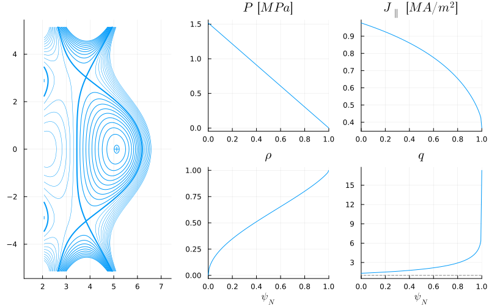
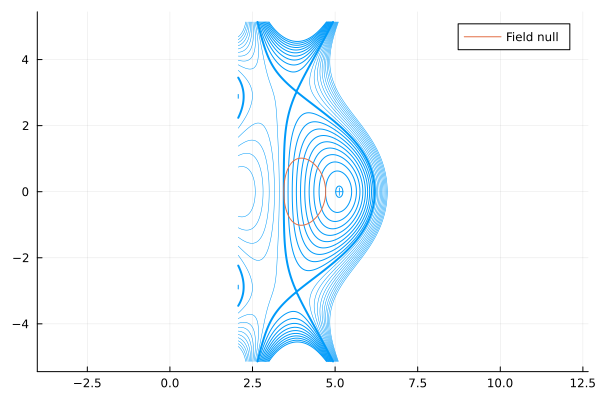
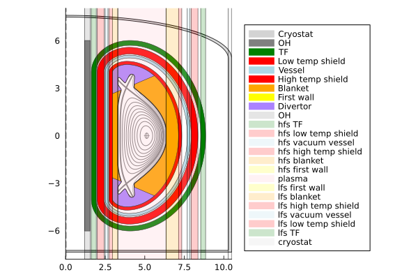
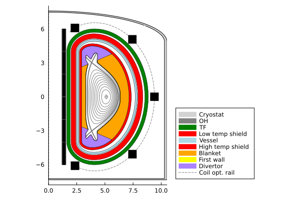
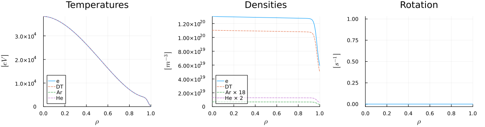
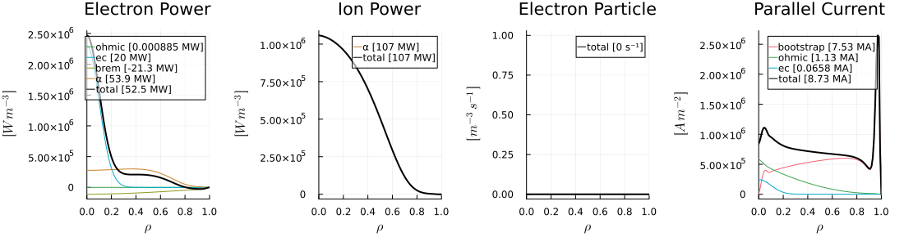
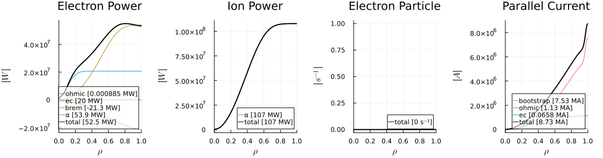
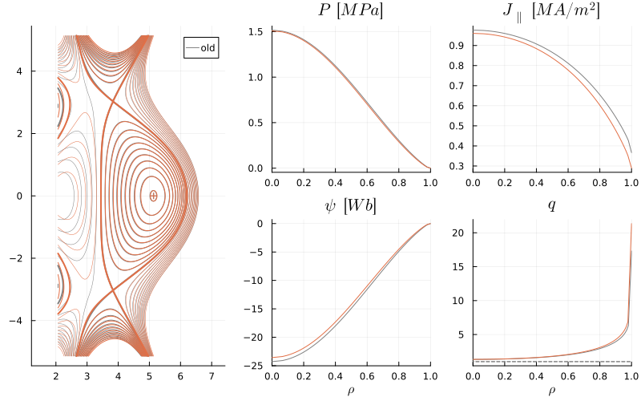
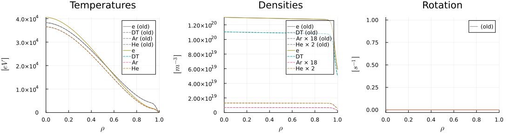
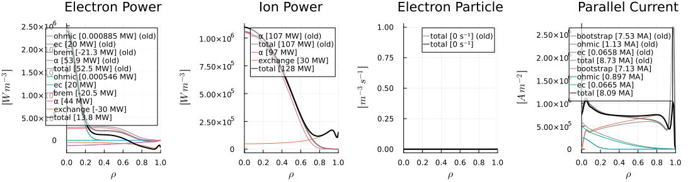

# GA's FPP use case


```@julia
using Revise
using FUSE
using Plots; gr();
FUSE.logging(Logging.Info);
```


<div style="padding: 1em; background-color: #f8d6da; border: 1px solid #f5c6cb; font-weight: bold;">
<p>The WebIO Jupyter extension was not detected. See the
<a href="https://juliagizmos.github.io/WebIO.jl/latest/providers/ijulia/" target="_blank">
    WebIO Jupyter integration documentation
</a>
for more information.
</div>


### Get `ini` and `act` for FPP use case
* [ini documentation](https://fuse.help/ini.html)
* [act documentation](https://fuse.help/act.html)


```@julia
ini, act = FUSE.case_parameters(:FPP; version=:v1_demount, init_from=:scalars);
```

    WARNING: both ImageMetadata and ImageAxes export "data"; uses of it in module Images must be qualified


### Customize `ini` (or `act`) parameters
* Changing Zeff from 1.1 to 2.0 will improve confinement significantly due to the pedestal increase!


```@julia
ini.core_profiles.zeff = 2.0
ini.core_profiles # see the content of ini.core_profiles
```


    core_profiles
    ├─ T_shaping ➡ 1.8
    ├─ bulk ➡ :DT
    ├─ ejima ➡ 0.4
    ├─ greenwald_fraction ➡ 0.9
    ├─ helium_fraction ➡ 0.05
    ├─ impurity ➡ :Ar
    ├─ ne_ped ➡ 1.1793544003862616e20 [m^-3]
    ├─ ngrid ➡ 101
    ├─ rot_core ➡ 0.0 [s^-1]
    ├─ w_ped ➡ 0.04999999999999993
    └─ zeff ➡ 2.0


### Initialize `dd` based on the `ini` and `act` parameters

* [Data structure (dd) documentation](https://fuse.help/dd.html)


```@julia
dd = IMAS.dd()
FUSE.init(dd, ini, act; do_plot=true);
```


    

    


    

    


    

    


    24×8 DataFrame
     Row │ group   name              ΔR         R_start   R_end     material      area       volume     
         │ String  String            Float64    Float64   Float64   String        Float64    Float64    
    ─────┼──────────────────────────────────────────────────────────────────────────────────────────────
       1 │ in                        1.19256     0.0       1.19256                14.3462      53.7486
       2 │ in      OH                0.359292    1.19256   1.55185  ReBCO          4.3222      37.2653
       3 │ in                        0.0696459   1.55185   1.6215                  0.837824     8.35258
       4 │ hfs     TF                0.310717    1.6215    1.93222  ReBCO          9.65204     98.3367
       5 │ hfs                       0.0696459   1.93222   2.00186                 3.62043    129.012
       6 │ hfs     low temp shield   0.428655    2.00186   2.43052  Tungsten      11.9917     359.819
       7 │ hfs                       0.0696459   2.43052   2.50016                 1.83933     55.317
       8 │ hfs     vacuum vessel     0.174115    2.50016   2.67428  Water          4.46498    134.446
       9 │ hfs                       0.0696459   2.67428   2.74392                 5.10653    185.429
      10 │ hfs     high temp shield  0.208938    2.74392   2.95286  Tungsten       4.83224    141.943
      11 │ hfs     blanket           0.33511     2.95286   3.28797  lithium-lead  15.0801     476.41
      12 │ hfs     first wall        0.0202105   3.28797   3.30818  Steel          0.398796    10.9443
      13 │ lhfs    plasma            3.0325      3.30818   6.34068  DT_plasma     15.5048     442.808
      14 │ lfs     first wall        0.0202105   6.34068   6.36089  Steel          0.398796    10.9443
      15 │ lfs     blanket           0.773458    6.36089   7.13435  lithium-lead  15.0801     476.41
      16 │ lfs     high temp shield  0.208938    7.13435   7.34329  Tungsten       4.83224    141.943
      17 │ lfs                       0.34823     7.34329   7.69152                 5.10653    185.429
      18 │ lfs     vacuum vessel     0.174115    7.69152   7.86563  Water          4.46498    134.446
      19 │ lfs                       0.0696459   7.86563   7.93528                 1.83933     55.317
      20 │ lfs     low temp shield   0.428655    7.93528   8.36393  Tungsten      11.9917     359.819
      21 │ lfs                       0.174115    8.36393   8.53805                 3.62043    129.012
      22 │ lfs     TF                0.310717    8.53805   8.84877  ReBCO          9.65204     98.3367
      23 │ out                       1.43717     8.84877  10.2859                 53.6621    2274.58
      24 │ out     cryostat          0.214328   10.2859   10.5003   Steel          5.20605    262.726


    

    


    

    


    

    


    

    


### Run the coupled equilibrium-transport actor 

* [Equilibrium Transport actor documentation](https://fuse.help/actors.html#EquilibriumTransport)


```@julia
# look at what parameters for example ActorEquilibriumTransport and ActorTauenn use
display(act.ActorEquilibriumTransport)
display(act.ActorTauenn)

# look at the details some of these parameters
display(act.ActorTauenn[:temp_pedestal_ratio])

# modify parameters
act.ActorTauenn.temp_pedestal_ratio = 0.9;
```


    ActorEquilibriumTransport
    ├─ do_plot ➡ false
    └─ iterations ➡ 1


    ActorTauenn
    ├─ T_shaping ➡ 1.8
    ├─ confinement_factor ➡ 1.0
    ├─ do_plot ➡ false
    ├─ eped_factor ➡ 1.0
    ├─ error ➡ 0.01
    ├─ rho_fluxmatch ➡ 0.6
    ├─ temp_pedestal_ratio ➡ 1.0
    ├─ transport_model ➡ :tglfnn
    ├─ verbose ➡ false
    └─ warn_nn_train_bounds ➡ false


    act.ActorTauenn.temp_pedestal_ratio
    - units: 
    - description: Ion to electron temperature ratio in the pedestal
    - value: 1.0
    - base: 1.0
    - default: 1.0
    - lower: missing
    - upper: missing


```@julia
# run the actor
FUSE.ActorEquilibriumTransport(dd, act; do_plot=true);
```


    

    


    

    


    

    

