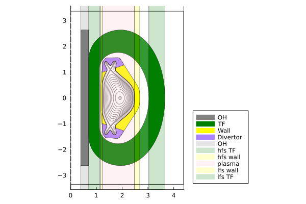

# SPARC and ARC use cases


```@julia
using Revise
using FUSE
using Plots; gr();
FUSE.logging(Logging.Info);
```


<div style="padding: 1em; background-color: #f8d6da; border: 1px solid #f5c6cb; font-weight: bold;">
<p>The WebIO Jupyter extension was not detected. See the
<a href="https://juliagizmos.github.io/WebIO.jl/latest/providers/ijulia/" target="_blank">
    WebIO Jupyter integration documentation
</a>
for more information.
</div>


### Initialize `dd`, `ini`, `act` from SPARC use case


```@julia
dd, ini, act = FUSE.init(:SPARC, do_plot=true);
```

    WARNING: both ImageMetadata and ImageAxes export "data"; uses of it in module Images must be qualified


    

    


    

    


    

    


    10×8 DataFrame
     Row │ group   name    ΔR         R_start   R_end     material   area      volume    
         │ String  String  Float64    Float64   Float64   String     Float64   Float64   
    ─────┼───────────────────────────────────────────────────────────────────────────────
       1 │ in              0.393918   0.0       0.393918              2.07251    2.56479
       2 │ in      OH      0.310988   0.393918  0.704906  ReBCO       1.63619    5.64823
       3 │ hfs     TF      0.414651   0.704906  1.11956   ReBCO       7.37752   32.6755
       4 │ hfs             0.0518314  1.11956   1.17139               2.0621    29.4909
       5 │ hfs     wall    0.0518314  1.17139   1.22322   Steel       1.30208   16.1897
       6 │ lhfs    plasma  1.25356    1.22322   2.47678   DD_plasma   2.30966   25.4428
       7 │ lfs     wall    0.207325   2.47678   2.68411   Steel       1.30208   16.1897
       8 │ lfs             0.352453   2.68411   3.03656               2.0621    29.4909
       9 │ lfs     TF      0.621976   3.03656   3.65853   ReBCO       7.37752   32.6755
      10 │ out             0.725639   3.65853   4.38417              12.6689   226.612


    

    


    

    


    

    


    

    


### Plot FUSE build on top of SPARC drawing


```@julia
CAD = FUSE.TraceCAD(:SPARC)
plot(CAD, size=(900,900))
plot!(dd.equilibrium, cx=true, color=:red)
plot!(dd.build, wireframe=true, linewidth=2, color=:black)
```


    

    


--------------

### Initialize `dd`, `ini`, `act` from ARC use case


```@julia
dd, ini, act = FUSE.init(:ARC, do_plot=true);
```


    

    


    

    


    

    


    13×8 DataFrame
     Row │ group   name      ΔR        R_start   R_end     material   area      volume   
         │ String  String    Float64   Float64   Float64   String     Float64   Float64  
    ─────┼───────────────────────────────────────────────────────────────────────────────
       1 │ in                0.814409  0.0       0.814409              6.97029   17.8338
       2 │ in      OH        0.297955  0.814409  1.11236   ReBCO       2.5501    15.4361
       3 │ hfs     TF        0.54625   1.11236   1.65861   ReBCO      11.5223    80.5316
       4 │ hfs               0.184732  1.65861   1.84335               3.47242   75.9288
       5 │ hfs     blanket   0.397273  1.84335   2.24062   FLiBe      13.5719   314.213
       6 │ hfs     wall      0.184732  2.24062   2.42535   Steel       2.41641   49.5452
       7 │ lhfs    plasma    2.0493    2.42535   4.47465   DT_plasma   6.31785  131.822
       8 │ lfs     wall      0.184732  4.47465   4.65938   Steel       2.41641   49.5452
       9 │ lfs     blanket   0.943523  4.65938   5.6029    FLiBe      13.5719   314.213
      10 │ lfs               0.184732  5.6029    5.78764               3.47242   75.9288
      11 │ lfs     TF        0.54625   5.78764   6.33389   ReBCO      11.5223    80.5316
      12 │ out               1.11137   6.33389   7.44526              32.2822   953.409
      13 │ out     cryostat  0.184732  7.44526   7.62999   Steel       3.322    122.253


    

    


    

    


    

    


    

    


### Plot FUSE build on top of ARC drawinga


```@julia
CAD = FUSE.TraceCAD(:ARC)
plot(CAD, size=(900,900))
plot!(dd.equilibrium, cx=true, color=:red)
plot!(dd.build, wireframe=true, linewidth=2, color=:black)
```


    

    


