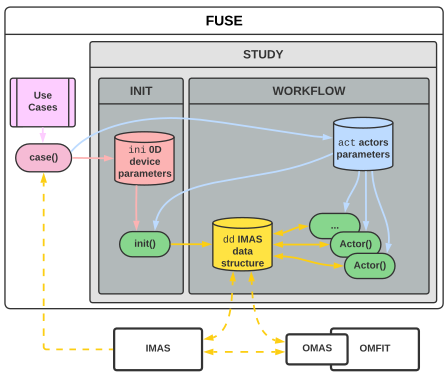

# FUSE tutorial #1: July 7th 2022
**NOTE:** Always referr to the [FUSE documentation](https://fuse.help/index.html) for most up-to-date information

----------

## Watch the [video recording of this tutorial](https://github.com/ProjectTorreyPines/FUSE_large_files/raw/master/FUSE_tutorial_1_6Jul22.mp4)

----------

FUSE (**FU**sion **S**ynthesis **E**ngine) is GA's proprietary framework for Fusion Power Plant (FPP) integrated design.

## FUSE objectives

* Couple physics, engineering, control, costing, and balance of plant
* Enable both stationary as well as time-dependent simulations
* Be generic and modular, supporting hierarcy of models
* Leverage parallelism and HPC systems for optimization studies
* Support sensitivity and uncertainty quantification analyses

## Basic concepts

FUSE is written completely in Julia, and is structured as follows:
1. Data is stored in the `dd` data structure, which is based on the ITER IMAS onthology
1. Physics and engineering `actors` are the fundamental building blocks of FUSE simulations
1. Actors functionality is controlled via `act` parameters
1. The data structure can be initialized starting from 0D `ini` parameters
1. FUSE comes with a series of template `use cases` for different machines (FPP, ITER, ARC, ...)
1. `workflows` perform self-contained studies/optimizations (typically running many FUSE simulations)
1. FUSE can interface with the existing GA ecosystem of modeling codes (GASC, OMFIT/OMAS) as well as IMAS

These concepts are illustrated in the diagram below:



## Tutorial outline
+ The objectives and concepts of FUSE
+ How to set-up a case (Fusion Power Plant v1_demount)
+ How to interact with FUSE objects (dd, ini, act)
+ How to run Actors and modify them
+ Optimization

#### NOTE:
* This is not a [Julia tutorial](https://www.youtube.com/watch?v=FntEfT8R2fY)
* This is not a [Jupyter Lab tutorial](https://jupyterlab.readthedocs.io/en/latest/user/notebook.html)

## A simple example


```@julia
@time begin # Julia is Just In Time compiled (JIT), which means the first execution takes a while (it needs to compile!), then it will be fast
    
    # Revise package for development (always import this first, will talk about this at the end)
    using Revise

    # FUSE package and logger
    using FUSE
    FUSE.logging(Logging.Info)

    # Get `ini` and `act` for a given use-case
    ini, act = FUSE.case_parameters(:FPP; version=:v1_demount, init_from=:scalars)

    # Initialize `dd` from 0D parameters
    dd = FUSE.init(ini, act; do_plot=false)

    # Run an actor
    FUSE.ActorEquilibriumTransport(dd, act; do_plot=true);

end;
```

## Handling FUSE data: `dd`, `ini`, `act`

### 1. Playing around with `dd`
* FUSE stores data according to the IMAS data schema
* The root of the data structure where FUSE stores data is generally referred to as `dd` (which stands for `Data Dictionary`)
* See the [`IMAS.dd()` documentation](https://fuse.help/dd.html)

#### Show `dd` content


```@julia
dd; # remove `;` to see the whole data structure
```


```@julia
# We take a look at only one portion of dd
dd.equilibrium.time_slice[2].boundary
```

#### Show IMAS stucture

* `dd`, `dd.equilibrium`, ... are instances of Julia `strut`s that are defined in the `IMASDD.jl` package
  * `dd = IMAS.dd()`
  * `dd.equilibrium` is of type `IMAS.equilibrium`
  * `dd.equilibrium.time_slice` is of type `IMAS.equilibrium__time_slice`
  * `dd.equilibrium.time_slice[1].boundary` is of type `IMAS.equilibrium__time_slice___boundary`
  
* The curious reader can take a look at the [IMASDD/src/dd.jl](../../../IMASDD/src/dd.jl) file to see those definitions


```@julia
# whenever things start with `IMAS.`, then this is a Julia type
IMAS.equilibrium
```


```@julia
# which is different from the instance filled with data
dd.equilibrium
```

#### Plot data in `dd`

* There are [Plots.jl recipies](https://docs.juliaplots.org/latest/recipes/) defined for different IMASDD.jl types of structs
* These recipies are defined in [IMAS/src/plot.jl](../../../IMAS/src/plot.jl)
* Plots can be [customized](https://docs.juliaplots.org/latest/generated/attributes_series)
* NOTE: use `display()` is used to force the plot to show when `plot` is not called at the end of the cell


```@julia
using Plots
plot(dd.equilibrium)
```


```@julia
plot(dd.core_profiles)
```


```@julia
plot(dd.core_sources)
```


```@julia
# plots can be composed
plot(dd.equilibrium, color=:gray)
plot!(dd.build)
plot!(dd.build, cx=false)
```


```@julia
# plot of an array ...
plot(dd.core_profiles.profiles_1d[1].pressure_thermal)
```


```@julia
# ... is different than plotting of a field in an IDS
plot(dd.core_profiles.profiles_1d[1], :pressure_thermal)
```


```@julia
# plots can be customized: https://docs.juliaplots.org/latest/generated/attributes_series
plot(dd.core_profiles.profiles_1d[1], :pressure_thermal, label="", linewidth=2, color=:red, labelfontsize=25)
```

#### Working with time series

* The IMAS data structure can accomodate time-dependent data
  
* Manually handling time in IMAS is tedius and error-prone
  
* IMAS.jl provides convenient ways to handle time
  * `dd.global_time`® sets the "current working time" throughout all of the `dd`
  * different IDSs can have time arrays of different lengths
  * data returned based on nearest neighbour


```@julia
@show dd.global_time
@show dd.equilibrium.time;
```


```@julia
# To access a time-dependent array of structures at time slice use **Integer** index
eqt = dd.equilibrium.time_slice[2]
@show eqt.time;
```


```@julia
# To access a time-dependent array of structures at `dd.globaltime` use []
eqt = dd.equilibrium.time_slice[]
@show eqt.time;
```


```@julia
# To access a time-dependent array of structures at a given time use **Float** time
eqt = dd.equilibrium.time_slice[0.0]
@show eqt.time;
```


```@julia
# To access a time-dependent array we use @ddtime macro
@show dd.equilibrium.vacuum_toroidal_field.b0; # this is a time dependent data array
```


```@julia
# GET data of time-dependent array at `dd.globaltime` (use `IMAS.get_time_array()` to access at other times)
my_b0 = @ddtime(dd.equilibrium.vacuum_toroidal_field.b0)
```


```@julia
# SET data of time-dependent array at `dd.globaltime` (use `IMAS.set_time_array()` to access at other times)
my_b0 = round(my_b0; digits=3)
@ddtime(dd.equilibrium.vacuum_toroidal_field.b0 = my_b0)
```

#### Expressions

* Many fields in the IMAS data structure are related to one another. Given some fields others can be calculated. This leads to an issue of consistency, where if some field is updated, all the fields that relies on that data should be updated too.

* IMAS.jl solves this problem by assigning expressions to certain fields. The value of these expressions are then evaluated on the fly, when the field is requested.

* Expressions are defined in [IMAS/src/expressions.jl](../../../IMAS/src/expressions.jl)


```@julia
dd.core_profiles.profiles_1d[1].electrons
```


```@julia
# accessing the field evaluates the expression
dd.core_profiles.profiles_1d[1].electrons.pressure
```


```@julia
# IMAS.freeze evaluates all expressions
e1d = IMAS.freeze(dd.core_profiles.profiles_1d[1].electrons)
```

#### Saving/loading data

* IMAS.jl can dump data in JSON format, to pass data to other codes (OMFIT/OMAS, ...)


```@julia
using Printf

# Dump data to JSON
tutorial_dir = tempdir()
save_name = "FPP_v1_starting_point.json"
filename=joinpath(tutorial_dir, save_name)
@time IMAS.imas2json(dd, filename);
@show filename
@printf("%2.2f MB\n",filesize(filename)/1024/1024)
```

* IMAS.jl can save/load data in JLD2 (JuLia Data format v2), which allows it to store/reload `dd` with all richness (expressions, `Inf`, `NaN`, complex, ...) that is not possible to capture with JSON format.


```@julia
# Save and reload from JLD2
save_name = "FPP_v1_starting_point.jld2"
filename = joinpath(tutorial_dir, save_name)
@time IMAS.save(dd, filename)
@time dd1 = IMAS.load(filename)
@show filename
@printf("%2.2f MB\n", filesize(filename)/1024/1024)
```


```@julia
# Check for differences
dd1.equilibrium.time_slice[1].time = -100.0
IMAS.diff(dd, dd1);
```

### 2. Playing around with `ini`
* See the [`ParametersInit()` documentation](https://fuse.help/ini.html)
* Organized by topical areas
* Can have multiple layers of nesting
* Most field defaulted to `missing`


```@julia
new_ini = FUSE.ParametersAllInits()
```


```@julia
# access a sub-tree
new_ini.equilibrium
```


```@julia
# access a leaf
new_ini.equilibrium.Z0
```

#### Access detailed descriptions either [online](https://fuse.help/ini_details.html#ini.tf.shape) or by accessing leaves with `[:...]`
* Notice **units**, **descriptons**
* Some fields only allow a limited set of **options**
* Each field stores three things:
    * **default**: default value when `ini = ParametersInit()` is first called
    * **base**: value when `FUSE.set_new_base!(ini)` is called
    * **value**: current value


```@julia
# take a look at the info for a leaf in the `ini`
new_ini.tf[:shape]
```


```@julia
# Error if trying to access something not initialized
try
    new_ini.equilibrium.ip
catch e
    Base.showerror(stderr, e)
end
```


```@julia
# Some ini fields only allow a limited set of options
try
    new_ini.tf.technology.material = "something"
catch e
    Base.showerror(stderr, e)
end
```


```@julia
# Making changes highlight things in *red* 
new_ini.equilibrium.B0 = 6.12
new_ini.equilibrium.R0 = 5.1
new_ini.equilibrium
```


```@julia
# setting a new `base`  (this is done at the end of use-cases definitions), highlights entries in *blue*
FUSE.set_new_base!(new_ini)
new_ini.equilibrium
```


```@julia
# Making changes highlight things in *red* 
new_ini.equilibrium.B0 = 6.123
new_ini.equilibrium
```

#### Usecases return pre-filled `ini` and `act` parameters

See for example:
* [FUSE/cases/FPP.jl](../../../FUSE/cases/FPP.jl)
* [FUSE/cases/ITER.jl](../../../FUSE/cases/ITER.jl)
* [FUSE/cases/ARC.jl](../../../FUSE/cases/ARC.jl)


```@julia
ini, act = FUSE.case_parameters(:FPP; version=:v1_demount, init_from=:scalars)
ini.equilibrium
```

### 3. Playing around with `act`
* [`FUSE.ParametersActor()` documentation](https://fuse.help/act.html)

#### Show overall organization
* Organized by Actor
* Works the same was as `ini` Parameters


```@julia
act
```

## Running actors 
* [Actors documentation](https://fuse.help/actors.html)
* We'll manually step through wht **ActorWholeFacility** does:
  * **ActorEquilibriumTransport**: transport (TAUENN) equilibrium (Solovev) and current to steady-state
  * **ActorHFSsizing**: Sizes the High Field Side of radial build (plug, OH, TF) superconductors and stresses
  * **ActorLFSsizing**: Sizes the Low Field Side of radial build
  * **ActorCXbuild**: Generate the 2D cross section of the build
  * **ActorPFcoilsOpt**: Find optimal PF coil locations and currents to match equilibrium boundary shape and a field-null region
  * **ActorNeutronics**: Calculate neutron loading on the wall
  * **ActorBlanket**: Blanket tritium breeding ration and heating
  * **ActorDivertors**: Divertor heat flux
  * **ActorBalanceOfPlant**: Calculate the net electrical power output
  * **ActorCosting**: Calculate the cost of the fusion power plant


```@julia
# Start from scratch
ini, act = FUSE.case_parameters(:FPP; version=:v1_demount, init_from=:scalars)
ini.pf_active.n_pf_coils_outside = 6;
ini.core_profiles.zeff = 2.0
dd = FUSE.init(ini, act; do_plot=false);
```


```@julia
@time FUSE.ActorEquilibriumTransport(dd, act;do_plot=true);
```


```@julia
@time FUSE.ActorHFSsizing(dd, act; do_plot=true);
display(plot(dd.solid_mechanics.center_stack.stress))
dd.build.oh
```


```@julia
@time FUSE.ActorLFSsizing(dd, act; do_plot=true);
display(dd.build.tf)
```


```@julia
@time FUSE.ActorCXbuild(dd, act; do_plot=true);
```


```@julia
# weight_currents: make smaller to force currents to fit in the limits
# update_equilibrium: overwrite the target equilibrium with what the coils can actually generate
@time FUSE.ActorPFcoilsOpt(dd, act; weight_currents=.4, do_plot=true, update_equilibrium=true);
```


```@julia
# Let's run the ActorCXbuild to update the first wall shape based on the new equilibrium
@time FUSE.ActorCXbuild(dd, act,rebuild_wall=true; do_plot=false);
plot(dd.equilibrium; cx=true)
plot!(dd.build; legend=false)
```


```@julia
@time FUSE.ActorNeutronics(dd, act; do_plot=true);
```


```@julia
@time FUSE.ActorBlanket(dd, act)#; do_plot=true);
dd.blanket
```


```@julia
@time FUSE.ActorDivertors(dd, act)#; do_plot=true);
dd.divertors
```


```@julia
@time FUSE.ActorBalanceOfPlant(dd,act)#; do_plot=true);
IMAS.freeze(dd.balance_of_plant)
```


```@julia
@time FUSE.ActorCosting(dd, act)#; do_plot=true);
IMAS.freeze(dd.costing)
```


```@julia
# Save `dd` to Json, so we can share our results with others
IMAS.imas2json(dd,"fpp_v1_FUSE.json")

# NOTE: can be loaded in OMFIT this way
# OMFIT["FUSE"] = ODS().load(".../fpp_v1_FUSE.json", consistency_check=False)
```

## Worfklows (ie. studies)
Perform self-contained studies/optimizations (typically running many FUSE simulations)
 
* [HDB5 validation of ActorEquilibriumTransport](https://fuse.help/example_workflows__transport_equilibrium_validation.html)

  [](workflow_hdb5.png)

* [Multi objective optimization](https://fuse.help/example_workflows__multi_objective_optimization.html)

  [](workflow_moopt.png)

## Install Julia and FUSE
* Julia comes with its own [package manager](https://blog.devgenius.io/the-most-underrated-feature-of-the-julia-programming-language-the-package-manager-652065f45a3a)
* Refer to online documentation https://fuse.help/install.html
  * How to install Julia/FUSE
  * How to update FUSE

## Development
* Refer to online documentation https://fuse.help/develop.html
* Use of `Revise`
* Illustrate example development workflow using VScode
* Commit
* Tracking [issues actross different repositories](https://github.com/orgs/ProjectTorreyPines/projects/2/views/1)
