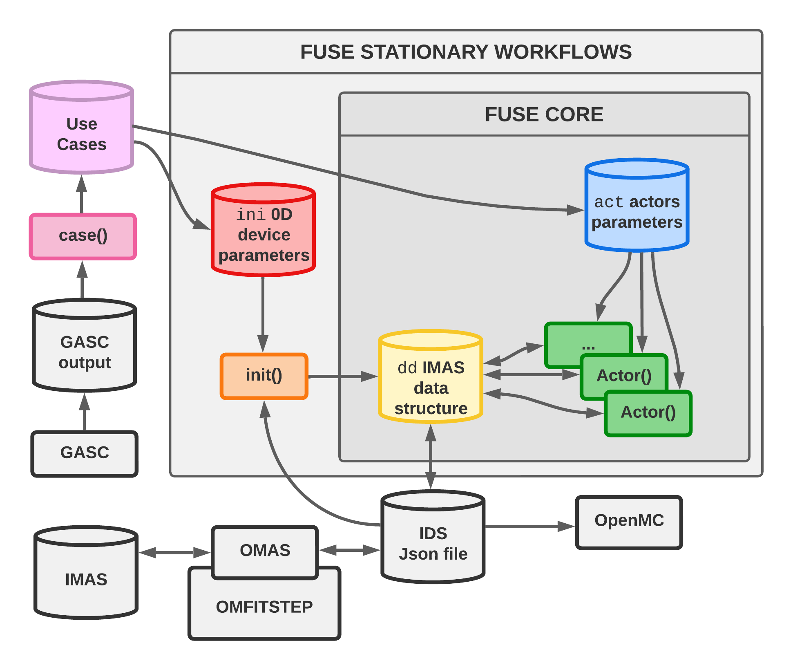

#   FUSE (**FU**sion **S**ynthesis **E**ngine)

FUSE (**FU**sion **S**ynthesis **E**ngine) is GA's proprietary framework for Fusion Power Plant (FPP) integrated design.

## FUSE objectives

* Couple physics, engineering, control, costing, and balance of plant
* Enable both stationary as well as time-dependent simulations
* Be generic and modular, supporting hierarcy of models
* Leverage parallelism and HPC systems for optimization studies
* Support sensitivity and uncertainty quantification analyses

## Basic concepts

FUSE is written completely in Julia, and is structured as follows:
1. Data is stored in the `dd` data structure, which is based on the ITER IMAS onthology
1. Physics and engineering `actors` are the fundamental building blocks of FUSE simulations
1. Actors functionality is controlled via `act` parameters
1. The data dictionary can be initialized starting from 0D `ini` parameters
1. FUSE comes from series of template `use cases` for different machines (FPP, ITER, ARC, ...)
1. `workflows` perform self-contained studies/optimizations, typically running many FUSE simulations
1. FUSE can interface with the existing GA ecosystem of modeling codes, as well as IMAS

Here is an example, demonstrating how a simple FUSE simulation can be setup and run:
```julia
using FUSE
ini, act = FUSE.case_parameters(:FPP; version=:v1_demount, init_from=:scalars)
dd = IMAS.dd()
FUSE.init(dd, ini, act; do_plot=true)
FUSE.ActorEquilibriumTransport(dd, act; do_plot=true)
```

These concepts are illustrated in the diagram below:
